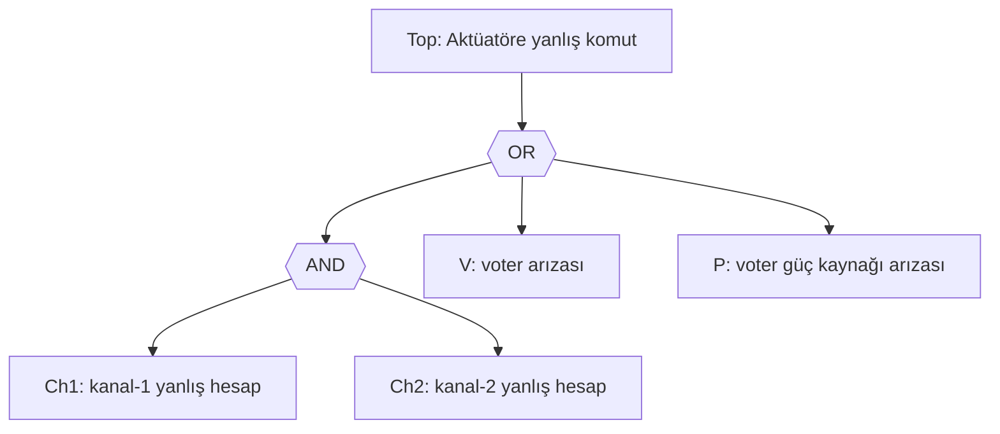

Aviyonik sertifikasyon dünyasında "10⁻⁹ per flight hour" cümlesi çok rahat söylenir. *Catastrophic* sınıfı bir kaybın uçuş saati başına olasılığının bu mertebenin altında kalması beklenir; gereksinim seviyesi olan **Development Assurance Level A** da büyük ölçüde bu sayıdan türetilir. Peki bir mühendis, henüz uçmamış bir sistemin "uçuş saati başına 10⁻⁹" olasılıkta arızalandığını gerçekten **nasıl** gösterir?

Cevap büyük ölçüde tek bir yöntemin etrafında döner: **Fault Tree Analysis (FTA)**. Ve FTA'nın kalbi, yıllardır kazandığım izlenime göre Türkçe kaynaklarda neredeyse hiç anlatılmayan bir adımdır — **minimal cut set** hesabı. Bu yazıda fault tree'nin niteliksel iskeletini hızlıca kurup büyük bölümü minimal cut set'lerin Boole cebriyle nasıl çıkarıldığına, MOCUS algoritmasının nasıl ilerlediğine ve "rare event" yaklaşımının nerede çuvalladığına ayıracağız. Somut bir örnek üzerinde elle ve `pip install cutsets` ile sayısal olarak doğrulayacağız.

---

## FTA Neden Bir "Yöntem", Bir "Şema" Değildir?

Çok kişi fault tree'yi sadece "ters çevrilmiş bir akış şeması" olarak görüyor: en üstte istenmeyen olay, altında AND/OR kapıları, en altta temel olaylar. Bu görüntü doğru ama eksiktir; çünkü FTA aslında dört aşamanın birleşimidir:

1. **Top event** tanımı — analiz edilen *belirli* bir sistem arızası. *"Uçak düşer"* değil, *"otomatik pilot tüm uçuş kontrol yüzeylerini eşzamanlı olarak komutlayamaz"* gibi mühendislik düzeyinde tanımlanmış bir olay.
2. **Niteliksel inşa** — top event'i AND/OR kapıları ve ara olaylarla temel olaylara kadar parçalamak. Burada amaç hiyerarşi değil, *mantıksal yeterlilik*: her ara olay, hemen üstündeki olayı tek başına (OR) veya birlikte (AND) tetiklemeye yetmeli.
3. **Niteliksel çözümleme** — ağacın eşdeğer bir Boole ifadesine indirgenmesi ve buradan **minimal cut set**'lerin çıkarılması.
4. **Niceliksel çözümleme** — temel olayların olasılık veya hata oranlarının cut set'ler üzerinden top event olasılığına çevrilmesi.

Aviyonik tarafta üst kaynak **SAE ARP4761A (Aralık 2023)** ve onun EUROCAE eşdeğeri **ED-135**'tir; ARP4761A, ARP4754B ile birlikte kullanılır ve FHA → PSSA → SSA zincirinin omurgasını çizer. Süreç bağımsız jenerik referans olarak **IEC 61025:2006 Ed. 2.0** kullanılır; sembol ve kapı tanımları oradaki kanonik şemadır. Yöntemin "kuramsal kitabı" hâlâ NRC'nin **NUREG-0492 Fault Tree Handbook (Ocak 1981, Vesely-Goldberg-Roberts-Haasl)** klasiğidir — 170 sayfalık bu doküman alanda hâlâ atıf alır, çünkü temeli oturtan kitap odur.

Bu yazıda standartların yorumuna girmeyeceğim — onlar uzun başka bir yazı konusu. Asıl ilgi alanım 3. ve 4. adımlar: ağaç çizildikten *sonra* ne oluyor?

---

## Niteliksel İskelet: Küçük Bir Örnek

İki kanallı bir aviyonik fonksiyon hayal edelim. İki bağımsız hesap kanalı (`Ch1`, `Ch2`) aynı veriyi üretir, bir voter (`V`) sonucu seçer ve aktüatöre gönderir. Voter ve onun güç kaynağı (`P`) tek noktalardır.



Niteliksel okuma sezgisel:

- Tek bir hesap kanalının arızalanması yetmez (AND). Yanlış komut için **iki kanal birlikte** hata yapmalı.
- Voter arızası tek başına yeter (OR).
- Voter besleme kaybı da tek başına yeter (OR).

Bu üç dal, sistemin **kuvveti**ni ve **zayıflığını** belirleyen üç farklı **cut set**'tir. Cut set, gerçekleştiğinde top event'i tetiklemeye yeten temel olay kümesidir. Minimal cut set ise, içinden herhangi bir olay çıkarıldığında artık top event'i tetiklemeye yetmeyen, *en küçük* böyle kümedir. Yukarıdaki örnekte üç adettir: `{Ch1, Ch2}`, `{V}`, `{P}`.

İki gözlem önemli:

1. **Cut set boyutu, sistemin kırılganlığını tek bir sayıya indirir.** Tek elemanlı bir cut set, single point of failure demektir. ARP4761A çerçevesinde *Catastrophic* sınıfı bir fonksiyon için tek elemanlı bir cut set görüldüğü an analiz durur; tasarım değişmek zorundadır.
2. **Voter dalı, çoğunlukla *common cause* analiziyle birlikte değerlendirilir.** İki kanal "bağımsız" diye işaretlendiğinde gerçekten bağımsız olduklarını kanıtlamak başka bir iştir — ARP4761A'nın CCA (Common Cause Analysis) bölümünün varlık sebebi tam olarak budur.

Niteliksel düzeyde ilerlemek görece kolay. Asıl iş, ağaç birkaç düzine kapıdan oluştuğunda başlıyor: minimal cut set'leri *insan gözü* artık çıkaramaz.

---

## Boole Cebrine Çevirmek

FTA'nın matematiksel iskeleti, aslında basit bir gözleme dayanır: her fault tree, yapraklardaki temel olayların boole değişkenleri (`1 = oldu`, `0 = olmadı`) olduğu bir **Boole ifadesi**dir. AND kapısı çarpım (·), OR kapısı toplam (+), NOT seyrektir ama vardır. Top event'in fonksiyonu T(b₁, …, bₙ) olarak yazılır.

Yukarıdaki örnek için:

$$
T \;=\; (Ch_1 \cdot Ch_2) \;+\; V \;+\; P
$$

Bu ifadeyi **DNF**'e (disjunctive normal form — birleşim toplamı olarak çarpımlar) indirgemek FTA'nın çekirdek operasyonudur. Çünkü DNF terimleri tam olarak cut set'lerdir; ve **absorpsiyon** ile **idempotans** uygulayarak fazla terimleri attığımızda elimizde kalan minimal cut set'lerdir.

İki temel kural:

- **Absorpsiyon:** `A + A·B = A`. Eğer A tek başına top event'i tetikliyorsa, A ile birlikte bir başka olay gerektiren terim gereksizdir.
- **İdempotans:** `A·A = A` ve `A + A = A`. Tekrarlanan temel olaylar bir kez sayılır.

Üçüncü kural, çoğu pratik fault tree'nin "soğanı"nı kaldırır: **dağılım (distribution).** `A·(B + C) = A·B + A·C`. AND içine giren OR'lar, kombinasyon patlamasını üreten asıl mekanizmadır.

Bir senaryo deneyelim. Voter'ın iki ayrı arıza modu olsun: `V = V_hw + V_sw` (donanım veya yazılım arızası). Güç kaynağı yedekli olsun: `P = P_a · P_b` (her iki güç kanalı birden gitmeli). Ağaç şimdi:

$$
T \;=\; Ch_1 \cdot Ch_2 \;+\; (V_{hw} + V_{sw}) \;+\; P_a \cdot P_b
$$

Bu ifade zaten DNF'tedir. Minimal cut set'ler:

$$
\{Ch_1, Ch_2\}, \;\{V_{hw}\}, \;\{V_{sw}\}, \;\{P_a, P_b\}
$$

Şimdi senaryoyu biraz daha "kirli" yapalım. Diyelim ki yazılım voter'ı `V_sw`, kanal yazılımlarındaki ortak bir kütüphane hatasından (`L`) tetiklenebiliyor; ve kanal hesaplarının "yanlış" olması da aynı kütüphane çağrısını içeriyor olabilir. Bağımsızlık artık görünüştedir. Modeli güncellersek:

$$
Ch_1 = h_1 + L, \quad Ch_2 = h_2 + L, \quad V_{sw} = v_{sw} + L
$$

Burada `h_1`, `h_2`, `v_{sw}` her bileşene özgü "bağımsız" hatalar, `L` ise üçünü de etkileyen ortak nedendir. Substitüsyon:

$$
T = (h_1 + L)(h_2 + L) + V_{hw} + (v_{sw} + L) + P_a P_b
$$

Birinci terimi açarsak:

$$
(h_1 + L)(h_2 + L) = h_1 h_2 + h_1 L + L h_2 + L \cdot L
$$

İdempotansla `L·L = L`. Absorpsiyonla `h_1 L + L h_2 + L = L (h_1 + h_2 + 1) = L`. Yani:

$$
(h_1 + L)(h_2 + L) = h_1 h_2 + L
$$

Tüm ifade:

$$
T = h_1 h_2 + L + V_{hw} + v_{sw} + L + P_a P_b
$$

Tekrarlı `L`'lerden biri düşer. Sonuçta minimal cut set listesi:

$$
\{h_1, h_2\}, \;\{L\}, \;\{V_{hw}\}, \;\{v_{sw}\}, \;\{P_a, P_b\}
$$

Sistemde **tek elemanlı üç cut set** belirdi: `{L}`, `{V_{hw}}`, `{v_{sw}}`. Bir saniye önce "iki kanal bağımsız" göründüğü için göğsümüzü kabartan tasarım, kütüphane modellendiğinde tek noktalı bir hataya dönüştü. *Bu* sebeple FTA, sertifikasyon ekibi tarafından çizilen şema değil **bağımsızlık varsayımlarının test edildiği** yöntemdir.

---

## MOCUS: İnsan Eli Pes Edince

Yukarıdaki örnek küçük olduğu için Boole sadeleştirmesi elle yapılabildi. Gerçek bir aviyonik fault tree binlerce yaprağa, on binlerce ara olaya çıkar. 1972'de Fussell ve Vesely bu işi otomatize eden **MOCUS** (*Method of Obtaining Cut Sets*) algoritmasını önerdiler; bugün hâlâ ticari araçların (Isograph, ITEM Toolkit, RiskSpectrum, OpenFTA) çekirdeğinde MOCUS veya türevi vardır.

Temel fikir tek satıra sığar:

> **OR kapıları cut set sayısını çoğaltır; AND kapıları cut set boyutunu büyütür.**

MOCUS yukarıdan aşağı çalışır. Top event'i tek satırlı, tek elemanlı bir "matris"e koyar:

```
Satır 1: [T]
```

Sonra her satırda en sondaki olayı, onu üreten kapıya göre genişletir. Kural:

- **OR kapısı:** girdiğin satırı, kapının her bir girdisi için bir satıra **böl**.
- **AND kapısı:** girdiğin satıra, kapının tüm girdilerini **ekle**.

Önceki örneğimizdeki (basit, common cause'suz) ağaç için adım adım:

```
[T]                              # T = (Ch1·Ch2) + V + P, OR ile genişlet
[Ch1·Ch2], [V], [P]              # birinci satırı AND'le genişlet
[Ch1, Ch2], [V], [P]             # zaten yapraklar, dur.
```

Sonuç üç satır: `{Ch1, Ch2}`, `{V}`, `{P}`. Bunlar **cut set**'lerdir. Minimallik için son bir geçiş yaparız: hiçbir cut set başka bir cut set'in **süperseti** olmamalı; varsa atılır. (Örnekte yok.)

Common-cause'lu sürümü deneyelim. `Ch1 = h_1 + L`, `Ch2 = h_2 + L` olduğunu hatırlayalım:

```
[T]
[Ch1·Ch2], [V], [P_a·P_b]
[Ch1, Ch2], [V_hw], [V_sw], [P_a, P_b]
[h_1·L? hayır, OR] genişlet: [h_1, Ch2], [L, Ch2], [V_hw], [V_sw], [P_a, P_b]
sonra Ch2'yi genişlet: [h_1, h_2], [h_1, L], [L, h_2], [L, L], [V_hw], [V_sw], [P_a, P_b]
```

Şimdi minimalizasyon — `L·L = L` indirgemesi cut set'i `{L}`'ye düşürür; ve `{L} ⊂ {h_1, L}` olduğu için `{h_1, L}` atılır; aynı şekilde `{L, h_2}` da atılır. Geriye kalan:

$$
\{h_1, h_2\}, \;\{L\}, \;\{V_{hw}\}, \;\{V_{sw}\}, \;\{P_a, P_b\}
$$

Boole cebriyle elle yaptığımızla bire bir aynı. Algoritmanın güzelliği, bu mekanik adımları kapı sayısı ne olursa olsun çalıştırabilmesidir. Çirkin yanıysa **kombinatoryel patlama**: OR'ların altındaki AND'ler iç içe geçtiğinde satır sayısı `O(2^n)` mertebesinde büyür. Bu yüzden modern araçlar saf MOCUS yerine **BDD** (Binary Decision Diagrams), **ZBDD** (Zero-suppressed BDD) ve **SAT** tabanlı modern varyantlar kullanır; ancak çıktısı hâlâ "minimal cut set listesi"dir.

---

## Niceliksel Adım: Olasılığa Geçiş

Cut set'leri çıkardığımıza göre asıl soruyu sorabiliriz: top event olasılığı nedir?

Top event T, cut set'lerinin **birleşimi**dir:

$$
T = C_1 \cup C_2 \cup \cdots \cup C_m
$$

Her cut set ise, içindeki olayların **kesişimi**dir. Olaylar bağımsız varsayılırsa:

$$
P(C_i) = \prod_{e \in C_i} P(e)
$$

Top event olasılığı için tam ifade *inclusion-exclusion* formülüdür:

$$
P(T) = \sum_i P(C_i) - \sum_{i<j} P(C_i \cap C_j) + \cdots
$$

Aviyonik tarafta olaylar nadirdir (P(e) ≈ 10⁻⁴ ile 10⁻⁹ arasında); inclusion-exclusion açılımı çok hızlı söner. Pratikte iki yaklaşım kullanılır:

- **Rare Event Approximation (REA):** Yalnız birinci terimi al. `P(T) ≈ Σ P(C_i)`.
- **Minimal Cut Set Upper Bound (MCUB):** `P(T) ≈ 1 − Π (1 − P(C_i))`. REA'dan biraz daha sıkı bir üst sınır verir.

REA her zaman **üst sınır**dır (Bonferroni eşitsizliğinden). Olasılıklar küçükken iki yaklaşım numerik olarak hemen hemen örtüşür. Nükleer santral PSA çalışmalarında temel olay olasılıkları 10⁻³ mertebesine çıkabildiği için ek "ACUBE" gibi yöntemler doğmuştur; ama aviyonikte REA'nın muhafazakârlığı genellikle yeterlidir.

Önceki örneğimize tipik rakamlar verelim:

| Olay | Açıklama | P (1 uçuş saati başına) |
|------|----------|-------------------------|
| h₁, h₂ | Kanal bağımsız hesap hatası | 1·10⁻⁵ |
| L | Ortak kütüphane hatası | 1·10⁻⁸ |
| V_hw | Voter donanım arızası | 5·10⁻⁷ |
| v_sw | Voter yazılım hatası (bağımsız) | 1·10⁻⁸ |
| P_a, P_b | Güç kanalı arızası | 1·10⁻⁴ |

Cut set katkıları:

- `{h₁, h₂}` → 10⁻⁵ · 10⁻⁵ = **10⁻¹⁰**
- `{L}` → **10⁻⁸**
- `{V_hw}` → **5·10⁻⁷**
- `{v_sw}` → **10⁻⁸**
- `{P_a, P_b}` → 10⁻⁴ · 10⁻⁴ = **10⁻⁸**

Toplam (REA): 5·10⁻⁷ + 10⁻⁸ + 10⁻⁸ + 10⁻⁸ + 10⁻¹⁰ ≈ **5.30 · 10⁻⁷ /uçuş saati**.

Sonuç, görsel olarak çok şey öğretir:

1. Top event'e **`{V_hw}` baskın katkı** veriyor. İki bağımsız kanal kullanmamızın getirdiği 10⁻¹⁰ avantaj, tek voter donanımı yüzünden 5·10⁻⁷ tarafından gölgeleniyor. Sertifikasyon hedefi 10⁻⁷ ise, kanal yedeklemesini düşürüp voter'a iki ek yedek koymak çok daha verimli olur.
2. **Common cause `L` katkısı `v_sw` ile aynı mertebede ve `{h₁,h₂}`'den 100 kat büyük.** Bağımsız varsaydığımız iki kanalın "ortak kütüphane" yüzünden kaybettiği bağımsızlık, mimaride yapılan tüm yedekleme yatırımını silebiliyor. Bu, kâğıt üzerinde mimari kararı doğrulamak için yapılan FTA'nın *gerçek* sürpriz değeridir.
3. **Fussell-Vesely importance** (her cut set'in toplam katkıdaki payı) yaklaşık şöyle olur: V_hw ≈ %94.3, L ≈ %1.9, v_sw ≈ %1.9, {P_a,P_b} ≈ %1.9, {h₁,h₂} ≈ %0.019. Yedek mühendislik bütçesi varsa **önce voter'a yatırılmalı**; kanal yedeklemesinin yarattığı kazanç, tek voter darboğazı ortadan kalkmadıkça görünmüyor bile.

Bu yorum, fault tree olmadan da "biliriz" sanılır — bilmeyiz. Numerik olarak yaptığımız anda, *hangisi 100 kat baskın, hangisi sapma içinde* sorusu nesnel cevap kazanır.

---

## Hesabı Otomatik Doğrulayalım

Elle yaptığımız hesabı sayısal olarak doğrulamak için Python'da `cutsets` paketi (PyPI'de yayınlanmış küçük bir MOCUS implementasyonu) kullanışlıdır. Paketin API'si `(düğüm, kapı, çocuklar)` üçlülerinden oluşan bir liste alır ve `cutsets.mocus(...)` ile minimal cut set listesini döndürür.

```python
# pip install cutsets
import cutsets
from functools import reduce

# Fault tree'yi tuple listesi olarak tanımla.
# Ch_i = h_i OR L  (ortak kütüphane L her iki kanalı da etkiliyor)
# Vsw  = vsw OR L
# V    = Vhw OR Vsw
# Pwr  = Pa  AND Pb
# Top  = (Ch1 AND Ch2) OR V OR Pwr
ft = [
    ("TOP", "Or",  ["AND_Ch", "V", "Pwr"]),
    ("AND_Ch", "And", ["Ch1", "Ch2"]),
    ("Ch1", "Or",  ["h1", "L"]),
    ("Ch2", "Or",  ["h2", "L"]),
    ("V",   "Or",  ["Vhw", "Vsw"]),
    ("Vsw", "Or",  ["vsw", "L"]),
    ("Pwr", "And", ["Pa", "Pb"]),
]

mcs = cutsets.mocus(ft)
for cs in sorted(mcs, key=lambda s: (len(s), sorted(s))):
    print(sorted(cs))

# Temel olay olasılıkları (1 uçuş saati başına)
P = {
    "h1": 1e-5, "h2": 1e-5,
    "L":  1e-8,
    "Vhw": 5e-7,
    "vsw": 1e-8,
    "Pa": 1e-4, "Pb": 1e-4,
}

def p_cut(cs): return reduce(lambda a, b: a*b, (P[e] for e in cs))
rea  = sum(p_cut(cs) for cs in mcs)
mcub = 1 - reduce(lambda a, b: a*(1-p_cut(b)), mcs, 1.0)
print(f"REA  = {rea:.3e}")
print(f"MCUB = {mcub:.3e}")
```

Beklenen çıktı (cut set'ler):

```
['L']
['Vhw']
['vsw']
['h1', 'h2']
['Pa', 'Pb']
REA  = 5.301e-07
MCUB = 5.301e-07
```

REA ve MCUB'un örtüşmesi olasılıkların gerçekten "rare" olduğunu doğruluyor. `L` olasılığını 10⁻⁸'den 10⁻³'e çıkarsanız ikisi arasındaki fark görünür hale gelir — bu, "rare event yaklaşımı her zaman güvenli mi?" sorusunun cevabıdır: olasılıklar büyüdükçe REA aşırı muhafazakâr olmaktan çıkıp **yanıltıcı** olabilir, MCUB'a veya inclusion-exclusion'un tam haline geçmek gerekir.

---

## Cut Set Olmadan Görülmeyen Tasarım Hataları

Birkaç pratik gözlem — kaç projedir aynı tuzaklara bakıyorum:

**Tek elemanlı cut set'ler, niceliksel hedeflerden önce niteliksel "stop" işareti verir.** ARP4761A çerçevesinde *Catastrophic* (DAL A) bir top event için tek elemanlı cut set görüldüğü an analiz biter. Olasılığın 10⁻¹⁵ olması da ona ulaşılabilirliği değiştirmez — common mode, common cause ve bağımsızlık ihlali ihtimali her zaman senin altından yastığı çekecektir. Tek elemanlı cut set politik bir karardır, sayısal değil.

**`{A, B}` yazıyorsanız A ile B'nin gerçekten bağımsız olduğunu kanıtlamalısınız.** Sanki bağımsızmış gibi görünen iki olay (iki ayrı kanal, iki ayrı CPU, iki ayrı şasi) bir paylaşılan kaynaktan tetiklendiğinde — ortak güç, ortak saat, ortak yazılım, ortak operatör, ortak sıcaklık — gerçekte tek bir cut set olduklarını ARP4761A'nın CCA modülü ortaya çıkarır. CCA olmadan yapılan FTA, kâğıt üzerinde 10⁻⁹, sahada 10⁻⁵'tir.

**Cut set'in *boyutu* tasarımın olgunluğunu söyler.** İyi tasarlanmış bir DAL A fonksiyonunda minimal cut set'lerin çoğu üç veya dört elemanlıdır; tek elemanlı varsa tehlike sinyalidir; ikincilerin sayısı sınırlıdır ve genellikle her biri "common cause yok" analizine bağlıdır. Sertifikasyon ekibi ilk istediği listeyi hep boyut-1 ve boyut-2 cut set'lerden başlar.

**Fault tree'yi yazılım hatalarına uygulamak özen ister.** Yazılım hatası bir donanım hatası gibi tek bir olasılık sayısı değildir; tetikleme koşullarına bağlıdır. Modern pratikte yazılım katkısı FTA'ya genellikle "bu fonksiyon DAL X seviyesinde geliştirilmiştir, ek aktivitelerle X seviyesinde objective sağlanmıştır" şeklinde *kategorik* girilir; sayısal `P_sw = 10⁻⁹` koymak ciddiye alınmaz. Bu, ARP4754B/ARP4761A'nın "software does not have a failure rate" yorumudur.

**Otomatik araçların çıkardığı cut set listesinin uzunluğu kalitenin göstergesi değildir.** İyi kurulmuş bir ağaçta cut set sayısı yüzlerdedir; on binlerce cut set çıkarıyorsanız büyük olasılıkla ya OR kapısı patlaması var (sentaktik), ya da gerçek mimari aşırı karmaşık (semantik). İlki düzeltilir, ikincisi tasarımı değiştirir.

---

## İki Açık Soru

Yazıyı bitirirken iki konu açık bırakıyorum:

İlki, **dynamic fault tree**'ler — sıra (sequence) ve zaman bağımlı bağımlılıkları olan PAND, SPARE, FDEP gibi kapılar. Klasik MOCUS bu yapıları çözmek için yetersizdir; Markov dönüşümü veya stokastik simülasyon gerekir. Dynamic FTA, modern fly-by-wire mimarilerinde özellikle "primary kanal arızalansa yedek devreye girer ama 50 ms gecikme olur" türü senaryolarda çok daha gerçekçi sonuç verir; ama matematiği ve özellikle "rare event" simülasyonu (importance sampling) ayrı bir derinliği hak ediyor.

İkincisi, **fault tree'lerin doğrulanması**. Cut set çıkardık, sayı bulduk — ama ağacın "tüm önemli yolları yakalayıp yakalamadığını" kim doğruluyor? Pratikte FMEA + FTA çift yönlü kontrol gibi kullanılır: FMEA aşağıdan yukarı tek-nokta arızaları üretir, FTA yukarıdan aşağı kombinasyonları üretir. İki listenin örtüşmediği yer, gözden kaçırılmış arıza yolu adayıdır. Bunu yazılım araçlarıyla otomatize etmek çok az ekipte mevcut — gelecek bir yazı konusu.

---

## Kaynaklar

- [SAE ARP4761A (2023): Guidelines for Conducting the Safety Assessment Process on Civil Aircraft, Systems, and Equipment — ANSI Webstore](https://webstore.ansi.org/standards/sae/saearp4761a2023)
- [ARP4761A Introduction — AFuzion özet notu](https://afuzion.com/rp-4761a-introduction-avionics-safety-ad/)
- [Understanding ARP4761A — Jama Software](https://www.jamasoftware.com/requirements-management-guide/aerospace-and-defense/understanding-arp4761a-guidelines-for-system-safety-assessment-in-aerospace/)
- [IEC 61025:2006 Ed. 2.0 — Fault tree analysis (FTA)](https://webstore.iec.ch/en/publication/4311)
- [NUREG-0492 Fault Tree Handbook (NRC, 1981) — tam PDF](https://www.nrc.gov/docs/ml1007/ml100780465.pdf)
- [Rauzy & Dutuit, "Toward an efficient implementation of the MOCUS algorithm" — IEEE TR 2003](https://ieeexplore.ieee.org/document/1211108/)
- [Cut Set Analysis — openreliability.org özet](http://www.openreliability.org/cut-set-analysis/)
- [Jung, "A method to improve cutset probability calculation in probabilistic safety assessment of NPPs" (RESS 2015) — ACUBE arka planı](https://www.sciencedirect.com/science/article/abs/pii/S0951832014002609)
- [`cutsets` paketi — PyPI](https://pypi.org/project/cutsets/)
- [Volk, Junges, Katoen, "Automated Rare Event Simulation for Fault Tree Analysis via Minimal Cut Sets" — Springer 2020](https://link.springer.com/chapter/10.1007/978-3-030-43024-5_16)
