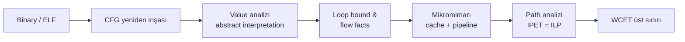

Hard real-time bir sistemde sorulan en sinir bozucu soru şudur: *"Bu görev en kötü ihtimalle ne kadar sürede biter?"* Cevap "ortalama 1.2 ms, en kötü gördüğümüz 1.7 ms" değildir — çünkü "gördüğümüz" kelimesi sertifikasyonda hiçbir şey ifade etmez. Bir uçuş kontrol döngüsü 100 Hz'de koşuyorsa, görevin 10 ms içinde bitmesi *garanti edilmek* zorundadır. Gözlemleme değil, **kanıt** gerekir.

Bu kanıtı üretme işine **WCET analizi** (Worst-Case Execution Time analysis) denir. Konuyu Türkçede bulmak şaşırtıcı biçimde zor: literatür üç ayrı disiplinin kesişiminde yaşar — mikromimarı modelleme, derleyici/IR analizi ve tam sayı doğrusal programlama (ILP). Çoğu Türkçe kaynak "bir döngüde ölç, üzerine güvenlik marjı koy" düzeyinde kalır. Oysa DO-178C §6.3.4.f, derleyici seçeneklerinin, linker seçeneklerinin ve donanım özelliklerinin etkisinin WCET incelemesinde dikkate alınmasını [açıkça ister](https://www.rapitasystems.com/blog/do-178b-do-178c-and-worst-case-execution-time); "ortalama + %30" yaklaşımı bu objective'i karşılamaz.

Bu yazıda WCET probleminin neden ölçümle çözülmediğini, statik analizin nasıl yapıldığını (özellikle IPET formülasyonu ve cache abstract interpretation), Lundqvist–Stenström'ün 1999'da gösterdiği şaşırtıcı **timing anomaly**'nin neden modern işlemcileri WCET için zorlaştırdığını, sahadaki araçların (aiT, RapiTime, OTAWA, Heptane) ne yaptığını ve multi-core'un işi nasıl bambaşka bir yere taşıdığını inceleyeceğiz.

---

## Neden Sadece Ölçmüyoruz?

İlk refleks haklı görünür: *"Görevi 10 000 kez koştur, en uzun süreyi al, üzerine biraz koy."* Sorun şu — gözlemlediğin süre, gözlemleyebildiğin girdi uzayı kadardır. Bir mantıksal kararı tetikleyen girdi kombinasyonu test setinde yoksa, onun yarattığı uzun yol asla görünmez. Üstelik birkaç ek zorluk daha vardır:

- **Cache başlangıç durumu.** Aynı görev, aynı girdiyle, ama cache başlangıçta "soğuk" iken çok daha yavaş koşar. CI ortamında ölçtüğünüz değer, devamlı koşan bir sistemde geçerli olmayabilir.
- **Çevrebirimi gecikmeleri.** Bir DMA transferi ya da ETH kontrolör status okuması başka bir master'ın bus'ı kullandığı süreye bağlıdır; tek başına ölçüldüğünde bu çakışma görülmez.
- **Derleyici versiyonu.** Aynı kaynak kodun GCC 10 ile 14 çıktısı farklı CFG üretebilir. Bir compiler upgrade'i sertifikasyon kanıtınızın altında zemini kaydırır.
- **Branch prediction ve speculative execution.** Modern Cortex-A çekirdeklerinde aynı dal komutu, yanlış tahmin gördüğünde 15+ cycle ceza yer; doğru tahminde 1 cycle'da geçer. Hangi durumun "kötü ihtimal" olduğu o anki history'ye bağlıdır.

Bu yüzden hard real-time topluluğu, ölçümün yerine — ya da yanında — **statik analiz** dediği şeyi koyar: programın *her olası* yürütmesinin maliyetinin **üst sınırını** matematiksel olarak hesaplar. "Gördüğüm en uzun süre" değil; "olası en uzun süreden büyük olduğu kanıtlanmış bir sayı" üretir.

---

## Üç Aile: Statik, Ölçüm Tabanlı, Hibrit

WCET analizi pratiğinde üç yaklaşım vardır:

| Yaklaşım | Çıktı türü | Güvenlik | Pesimizm | Tipik kullanım |
|---|---|---|---|---|
| Statik (SBA — Static-Based Analysis) | Kanıtlanmış üst sınır | Yüksek (sound) | Yüksek olabilir | DO-178C DAL A/B, ISO 26262 ASIL D |
| Ölçüm tabanlı (MBTA) | İstatistiksel kestirim | Düşük (unsound) | Düşük | Geliştirme döngüsü, soft RT |
| Hibrit (HMBT) | Olasılıksal / kombine | Orta | Orta | DO-178C DAL B/C, multi-core sistemler |

**Statik analiz** programın bütün olası yollarını "soyutlayarak" gezer. Hiçbir girdi koşmaz; ne CPU'ya yükleme yapılır ne de osiloskopa bakılır. Sonuç matematiksel olarak doğru bir üst sınırdır — ama mimarinin tüm pesimist varsayımlarını kabul ettiği için gerçek WCET'in 1.3× ila 3× üstüne çıkabilir.

**Ölçüm tabanlı analiz** klasik test yaklaşımıdır: girdi seti üret, hedef donanımda koştur, end-to-end süreyi ölç, kalan belirsizliği bir güvenlik marjıyla kapat. Hızlıdır, kolay anlaşılır, ama yukarıdaki nedenlerden dolayı *sound* değildir.

**Hibrit yaklaşım** (RapiTime'ın yaptığı) iki ucu birleştirir: basic block düzeyinde ölçüm yapılır (instrumentation veya hardware trace ile), sonra bu ölçümler IPET ile birleştirilir. Statik analizin tüm-yolları-gezme garantisi korunur, ama maliyet kestirimi gerçek donanımdan gelir; mikromimarı modeline ihtiyaç azalır. Multi-core ve modern out-of-order pipeline'larda statik analizin pratikliği azaldıkça hibrit yaklaşımlar yükseliyor.

---

## Statik Analiz Boru Hattı

Klasik statik WCET analizörü ([Wilhelm et al. 2008](https://dl.acm.org/doi/10.1145/1347375.1347389) standart referans) beş aşamadan geçer:



Her aşama, bir önceki aşamanın çıktısının üzerine inşa edilir; herhangi birinin yanlış davranması — örneğin loop bound'un olduğundan küçük çıkması — son sayının *unsound* olmasına sebep olur.

**Kaynak seviyesinde değil, binary seviyesinde çalışır.** Bu önemli: source-level analiz yapsanız derleyici loop unrolling, function inlining, dead-code elimination, instruction scheduling gibi onlarca dönüşümle sizi tanımadığınız bir CFG'ye götürür. Bu yüzden ciddi araçlar (aiT, OTAWA) ELF binary'sini okur ve oradan başlar.

**Value analizi**, abstract interpretation çerçevesinde, her bellek adresi ve register için *olası değer aralıklarını* tutar. Bu olmadan dolaylı dallanmaların hedeflerini bulamazsınız ve memory access pattern'ını çıkartamazsınız — ki cache analizi tam olarak bunu gerektirir.

**Loop bound analizi** her döngünün maksimum iterasyon sayısını üretmeye çalışır. Otomatik bulamadığı yerlere analist manuel "flow fact" ekler. Bir tek bağlanmamış döngü tüm WCET'i sonsuza taşır; pratikte bu en sık karşılaşılan blocker'dır.

---

## IPET: WCET'i Bir ILP Problemi Olarak Yazmak

[Li & Malik 1995](https://dl.acm.org/doi/10.1145/217474.217570)'in ortaya attığı **Implicit Path Enumeration Technique** bugün hâlâ kullanılan standart yöntemdir. Fikir basit: programın tüm yollarını tek tek saymak yerine (kombinatoryal patlama), Control Flow Graph üzerinde bir doğrusal program yaz.

Şu C parçasını ele alalım:

```c
int siniflandir(int x) {
    int kategori;
    if (x < 0) {              // B1
        kategori = NEGATIF;   // B2
    } else if (x < 10) {      // B3
        kategori = KUCUK;     // B4
    } else {                  // B5
        kategori = BUYUK;     // B6
    }
    for (int i = 0; i < N; i++) {  // B7 (header)
        islem(i);                  // B8
    }
    return kategori;          // B9
}
```

Bu fonksiyonun CFG'si yedi basic block içerir (`B1`–`B9`, koşullar dahil). Her bloğa derleyici çıktısından bir maliyet `c_i` (cycle olarak) atayalım — örneğin:

| Blok | İçerik | c_i (cycle) |
|---|---|---:|
| B1 | x < 0 testi | 3 |
| B2 | kategori = NEGATIF | 1 |
| B3 | x < 10 testi | 3 |
| B4 | kategori = KUCUK | 1 |
| B6 | kategori = BUYUK | 1 |
| B7 | döngü başı + i karşılaştırma | 4 |
| B8 | islem(i) çağrısı | 50 |
| B9 | return | 2 |

Her blok için bir yürütme sayısı değişkeni `x_i ∈ ℤ⁺` tanımlarız. Hedef:

```
maximize  3·x1 + 1·x2 + 3·x3 + 1·x4 + 1·x6 + 4·x7 + 50·x8 + 2·x9
```

Kısıtlar **akış korunumu** kuralından gelir. Fonksiyon bir kez çağrılır:

```
x1 = 1           (giriş)
x9 = 1           (çıkış)
x1 = x2 + x3     (B1'den çıkan kontrol B2 veya B3'e gider)
x3 = x4 + x6
x2 + x4 + x6 = x7   (üç koldan biri döngü başına ulaşır)
x7 ≥ x8          (döngü 0 kez de çalışabilir)
x8 ≤ N · x7      (loop bound — manuel veya analizden)
```

`N = 100` flow fact'i ile ILP çözücü maksimumu bulur. En kötü yolu *enumerate etmeden* keşfeder: `B1 → B3 → B6 → B7 → (B8 × 100) → B9`. WCET üst sınırı 3 + 3 + 1 + 4 + 100·(4+50) + 2 ≈ 5413 cycle.

Burada güzel olan şey, IPET'in **N tane yolu tek tek üretmemesi**. ILP çözücüsü "üst sınırın hangi blok dağılımına denk geldiği"ni soruyor; yolların kendisini değil. Bu yüzden onlarca dallanma içeren büyük fonksiyonlarda bile pratik kalıyor.

Maliyetler nereden geliyor? Mikromimarı analizinden. Tek başına aritmetik komutların datasheet cycle'ı yetmez — cache miss penaltisi, pipeline stall, branch mispredict ek olarak modellenmek zorunda.

---

## Cache: Üç Soyutlama, Bir Karanlık Köşe

Modern cache'ler WCET analizinin en güçsüz olduğu yer. [Ferdinand & Wilhelm 1999](https://dl.acm.org/doi/10.1023/A:1008186323068)'un kurduğu çerçeve hâlâ standart: her bellek erişimini üçe ayırır.

- **Always Hit (AH):** Cache'te kesinlikle var. Penalti: 0.
- **Always Miss (AM):** Cache'te kesinlikle yok. Penalti: cache fill latency'si.
- **Not Classified (NC):** Bilinmiyor — analizör pesimist davranıp AM kabul eder.

Bu sınıflandırmaları üretmek için iki abstract analiz koşturulur:

**Must analizi.** Her basic block girişinde "bu adreslerden hangileri *kesinlikle* cache'te?" diye sorulur. İki kontrol akışı bir noktada birleştiğinde (join), abstract state'lerin **kesişimi** alınır ve yaşları **maksimum**a çekilir. Bir adres still must-set'te kalıyorsa AH garanti edilebilir.

**May analizi.** "Bu adres olası mı?" sorusu için tam tersi: join'lerde **birleşim**, yaş **minimum**. Bir adres may-set'te yoksa AM garanti edilir.

**Persistence analizi.** Döngülerde özel bir durum: ilk iterasyondaki erişim miss olur, sonrakiler hit. Bu örüntüye "First Miss" (FM) denir ve IPET'e ek bir kısıt olarak girer.

Bu güzel teori bir varsayıma dayanır: **LRU replacement**. LRU matematiksel olarak güzel davranır — abstract states join'lendiğinde bilgi monoton azalır. Ama gerçek dünyadaki cache'ler çoğunlukla LRU değildir:

- Cortex-A53 L1 D-cache: pseudo-random replacement.
- Üst-uç Cortex-A çekirdeklerinin L2/L3 cache'leri tipik olarak pseudo-LRU veya benzeri yaklaşımlar; tam policy implementasyona göre değişir.
- Birçok performans odaklı MCU'da tree-PLRU yaygındır.

PLRU, FIFO, random gibi politikalar için must/may analizinin precision'ı dramatik biçimde düşer; bazı durumlarda *hiç* must garantisi üretilemez. Bu yüzden ciddi DAL A projelerinde tasarım kararları şöyle gider:

- **Lockable cache:** Belli bellek bölgeleri cache'e kilitlenir. Analiz bu bölgeyi her zaman AH varsayabilir.
- **Scratchpad memory (TCM):** Cache yerine deterministik, tek-cycle SRAM. Cortex-R5'in TCM'i, AURIX'in PSPR/DSPR'ı bu amaçla vardır.
- **Cache devre dışı:** En kötü çözüm — yavaş ama tahmin edilebilir. Bazı eski emniyet kritik flight computer mimarilerinde cache'in tamamen kapatılarak deterministik bir bellek erişimi tercih edildiği bilinir.

---

## Timing Anomaly — Sezgilerin Çöktüğü Yer

[Lundqvist ve Stenström'ün 1999 RTSS makalesi](https://ieeexplore.ieee.org/document/818828) WCET dünyasında küçük bir deprem yarattı. Gösterdikleri şey şu: out-of-order, çoklu fonksiyonel birimli işlemcilerde **bir cache miss, toplam yürütme süresini kısaltabilir**. Yani "yerel en kötü senaryo ⇒ küresel en kötü senaryo" sezgisi yanlıştır.

Basit bir kurgu:

```
Komut A: LOAD R1, [adres]   (cache miss → 100 cycle)
Komut B: ADD  R2, R3, R4    (A'ya bağımsız)
Komut C: MUL  R5, R2, R6    (B'ye bağımlı)
Komut D: SUB  R7, R5, R8    (C'ye bağımlı)
```

İki senaryoyu kıyaslayalım:

**Senaryo 1 — A cache hit (1 cycle).** A bir cycle'da biter; B–C–D sıralı işlenir, register file'da bağımlılıklar belirir, pipeline forwarding ile ardışık akar. Toplam: ~5 cycle.

**Senaryo 2 — A cache miss (100 cycle).** A 100 cycle bekleyecek, ama bu süre içinde out-of-order scheduler B'yi çalıştırır, C'yi başlatır, D'yi de kuyruğa alır. A miss'i tamamlandığında, B–D zaten kısmen bitmiş olur. Toplam: ~102 cycle.

Sezgi 102 > 5 diyor; matematik de öyle. Anomali burada **değil** — anomali, başka kombinasyonlarda ortaya çıkar. Reineke vd. ([WCET 2006](https://www.rw.cdl.uni-saarland.de/people/reineke/private/publications/TimingAnomaliesWCET06.pdf))'nin formal tanımıyla: bir mikromimarı `timing-anomaly-free` (compositional) ise, yerel olarak daha pahalı bir başlangıç durumu (örn. cache miss) global olarak daha pahalı bir yürütmeye sebep olur. Lundqvist–Stenström sonrasıysa bunun çoğu modern işlemcide *garanti olmadığını* gösterdi.

Pratik sonuç çok keskin: analizörler "her local seçimde en kötüyü kabul edip global toplamı pesimist tutma" optimizasyonunu yapamaz — çünkü yerel-kötü her zaman küresel-kötüye götürmüyor. Saarbrücken grubunun çözümü, mikromimarı modelini "non-deterministic" hale getirmek ve durum uzayını fan-out etmek; ama bu da state explosion'a yol açıyor.

Bu yüzden emniyet kritik projelerde işlemci seçimi WCET kanıtının başına oturuyor. ARM Cortex-R5 — dual-issue, in-order, deterministik — DAL A'da Cortex-A7'ye tercih edilir. AURIX TC3xx ailesi compositional olacak şekilde tasarlanmıştır; datasheet'inde "predictable execution" özellikleri öne çıkarılır. Bir Cortex-A72 üzerinde sound WCET kanıtlamak, dürüst olmak gerekirse, hâlâ bir araştırma problemidir.

---

## Sahadaki Araçlar

Pratikte birkaç araç dışında ciddi seçenek yok:

**[aiT (AbsInt)](https://www.absint.com/ait/).** Saarbrücken grubunun ticarileştirdiği statik WCET analizörü. PowerPC e200, ARM Cortex-M/R, AURIX, LEON3 dahil onlarca mimari için pipeline ve cache modeli içerir. Airbus A380'in fly-by-wire yazılımının sertifikasyonunda kullanıldığı [açıkça anılır](https://www.absint.com/ait/). DO-178B/C, ISO 26262 ASIL D, EN 50128 için qualification kit'i mevcut.

**[RapiTime (Rapita Systems)](https://www.rapitasystems.com/products/rapitime).** Hibrit yaklaşımın referansı: kaynak koda hafif instrumentation enjekte eder veya hardware trace (ETM, NEXUS) kullanır, basic block ölçümlerini IPET ile birleştirir. DO-330 qualification pack sayesinde DO-178B/C projelerinde delil olarak kullanılabilir. Multi-core senaryolarda statik analizden daha pratik bulunduğu için son on yılda payı arttı.

**[OTAWA](http://www.otawa.fr/).** IRIT Toulouse'dan açık kaynak (LGPL) bir framework. ARM Cortex-A8 dahil çeşitli mimariler için modüller, kendi pipeline modelinizi C++ ile yazabilme imkânı. Akademik araştırmaların büyük bölümü OTAWA üzerinde yapılır.

**[Heptane](https://team.inria.fr/pacap/software/heptane/).** INRIA Rennes'dan, eğitim odaklı, hâlâ aktif geliştirilen açık kaynak araç. WCET dersi vermek isteyenler için iyi bir başlangıç.

**Bound-T** (Tidorum) bir dönem önemliydi ama 2010'lardan sonra terk edildi.

Açık kaynak ile ticari araçlar arasında en büyük fark *qualification dosyası* — yani tool kalifikasyonu için gerekli DO-330 deliverable'ları. Akademik araçlar teknik olarak çalışsa da bir sertifikasyon kanıtının altına imza atılabilen bir tool olmadıkları için endüstride statik WCET denildiğinde pratik anlamda iki ad sayılıyor: aiT veya RapiTime.

---

## Multi-core: Hikâyenin Bütün Kuralları Değişiyor

Single-core WCET analizinde her şey iyi tanımlanmış: tek bir bellek hiyerarşisi, tek bir bus master, tek bir görev. Multi-core'da bu varsayımların hepsi düşer.

Üç ana sorun:

**Shared cache interference.** İki çekirdek aynı L2'yi paylaşıyorsa, core A'nın yürütmesi core B'nin cache satırlarını boşaltabilir. Sonuçta core B üzerindeki bir görevin WCET'i, *core A üzerinde başka hangi görev koştuğuna* bağlı hale gelir. Bu "interference budget" denilen ek bir terimi WCET'e ekler.

**Bus / NoC contention.** AXI matris veya NoC üzerinden paylaşılan slave'lere (DDR, paylaşılan SRAM, peripheral) erişen tüm master'lar bir arbiter üzerinden geçer. Round-robin arbitrasyon en kötü ihtimalle `(N-1) × max_burst` kadar bekleme demektir. Bu sayı multi-core sistem büyüdükçe doğrusal şişer.

**FAA CAST-32A pozisyon dokümanı** (sonradan AMC 20-193 olarak EASA tarafında resmîleşti) tam olarak bu sorunları adresler. DO-178C'nin kendisi multi-core hakkında sessizdir; CAST-32A ek deliverable'lar ister: interference channel'larının tanımlanması, her interference channel için bir azaltma stratejisi, ve azaltmanın doğrulanması.

Saha gözlemim: tam SMP yerine **AMP partition** (her core'a sabit görevler, çapraz erişim yok) çok daha pratik bir mimari. ARINC 653 hipervizörü altında her partition tek core'a sabitlenir; cache partitioning ile shared L2 fiziksel olarak bölünür; DDR bandwidth'i memory throttling ile garanti altına alınır. Bu çerçeve içinde her partition single-core WCET problemine geri indirgenir.

---

## DO-178C ile Bağ

Standardın metnine girersek, WCET adı geçen yer çok değil ama dolaylı olarak bütün §6'yı yönetiyor:

- **§6.3.4 (Reviews and Analyses of Source Code).** Source code'un "accurate and consistent" olduğunun gösterilmesi gereken objective'leri içerir. DO-178C revizyonunda **6.3.4.f** "stack usage, arithmetic overflow, fixed point arithmetic overflow ve **execution timing**" alt başlıklarıyla genişledi; derleyici, linker ve donanım seçeneklerinin etkisinin gözetilmesi şart koşuldu.
- **§6.4.3 (Test Coverage).** WCET tek başına yetmez; integration test'lerinde gerçek hedef üzerinde timing margin gözlemlenmesi de istenir. Statik analiz "bu görev en kötü 8.2 ms" diyorsa, test ortamında 8.2 ms'lik ölçümün de **mümkün olduğunun** gösterilmesi (worst-case input bulunabilirliği) DAL A'da makul bir talep olarak gelir.
- **§11.20 (Software Accomplishment Summary).** Teslim paketinin özet dökümünde WCET sonuçlarının ve metodolojisinin belgelendiği yer.

CAST (Certification Authorities Software Team) pozisyon dokümanları — özellikle [CAST-32A](https://www.faa.gov/aircraft/air_cert/design_approvals/air_software/cast/cast_papers) (multi-core) ve eski CAST-12 (sertifikasyonda kullanılan araç) — DO-178C metninin boş bıraktığı pratik yorumları doldurur.

---

## Sahadan Pratik Notlar

Birkaç yıllık WCET çalışmalarından çıkan kişisel gözlemler:

**Mimari kararı en başta verin.** Bir uçuş yazılımı projesinin başlangıcında "hangi işlemci?" sorusu donanım takımına bırakılır. WCET kanıtı gereken DAL A sistemde bu yanlış — yazılım takımı da masaya oturup *kanıtlanabilir* bir işlemci seçmek için lobi yapmalı. Cortex-R5/R7, AURIX TC3xx, LEON3/4, e200z (PowerPC) "WCET-friendly" olarak bilinir; Cortex-A53'ten yukarısı için cidden iyi bir argüman gerekir.

**Optimizasyon seviyesini ve compiler versiyonunu kilitleyin.** GCC `-O2`'nin ürettiği binary, `-Os`'in ürettiğiyle CFG seviyesinde farklıdır. Bir kez WCET analiz edip onayladığınız binary'yi üreten *tüm parametreleri* (compiler tag, libc versiyonu, linker map dosyası) configuration management altında tutun. Build sistemini deterministik (`SOURCE_DATE_EPOCH`, sabit kütüphane patikası) yapın.

**Recursive fonksiyonu yasaklayın.** Loop bound'u bilinmeyen her şey analiz edilemez. MISRA C:2025 Rule 17.2 de "no recursion" der; bu kural WCET analizini mümkün kılmak içindir, "estetik" değil.

**Dinamik bellek tahsisi yok.** `malloc/free` çağrılarının cycle maliyeti girdiye bağlıdır (fragmentation'a göre değişir) ve içleri "soft" davranır. ARINC 653 ve `MISRA C:2025` zaten yasaklar — sebebi WCET'tir.

**Inline assembly bloklarını markayın.** Statik analizörlerin pek çoğu inline asm'i opak kabul edip pesimist sınır koyar veya manuel annotation ister. Mümkünse intrinsic ya da derleyici-builtin tercih edin.

**Worst-case bir kez değil sürekli ölçülür.** Compiler upgrade, kernel yamaları, library güncellemeleri WCET'i bozar. CI'da her gece "regression WCET" koşturmak — değişimi %5'in üzerinde tutuyorsa build'i kırmak — sertifikasyondan önce sürprizleri yakalar.

---

## Açık Sorular ve Daha Derine Gitmek İstersen

Pratikte hâlâ çözülmemiş şeyler var:

- **Speculative execution side-channel'larının WCET'e etkisi** (Spectre/Meltdown sonrası mitigation kodu ne yapıyor?).
- **GPU/NPU üzerinde WCET** — autonomous flight'taki perception zincirinde gündeme gelen taze bir konu.
- **Probabilistic WCET (pWCET).** Extreme Value Theory ile istatistiksel üst sınır üretme — sertifikasyonda kabul edilebilir mi?
- **AI-asisted flow fact extraction** — büyük kod tabanlarında manuel annotation darboğazı.

Daha derine inmek için iki giriş noktası öneririm: [Wilhelm vd. 2008 TECS makalesini](https://dl.acm.org/doi/10.1145/1347375.1347389) konunun haritası olarak okumak, sonra [OTAWA](http://www.otawa.fr/) ile küçük bir ARM binary'si üzerinde elle deney yapmak. IPET'in nasıl çalıştığını gerçekten anlamak için ILP çıktısının sayılarına bakmak — kitap okumaktan kat kat daha öğreticidir.

---

## Kaynaklar

- Wilhelm, R., Engblom, J., Ermedahl, A., et al. (2008). [*The Worst-Case Execution-Time Problem—Overview of Methods and Survey of Tools*](https://dl.acm.org/doi/10.1145/1347375.1347389). ACM Transactions on Embedded Computing Systems, 7(3), Article 36.
- Li, Y.-T. S., & Malik, S. (1995). [*Performance Analysis of Embedded Software Using Implicit Path Enumeration*](https://dl.acm.org/doi/10.1145/217474.217570). DAC '95.
- Lundqvist, T., & Stenström, P. (1999). [*Timing Anomalies in Dynamically Scheduled Microprocessors*](https://ieeexplore.ieee.org/document/818828). IEEE RTSS 1999.
- Reineke, J., Wachter, B., Thesing, S., et al. (2006). [*A Definition and Classification of Timing Anomalies*](https://www.rw.cdl.uni-saarland.de/people/reineke/private/publications/TimingAnomaliesWCET06.pdf). WCET Workshop 2006.
- Ferdinand, C., & Wilhelm, R. (1999). [*Efficient and Precise Cache Behavior Prediction for Real-Time Systems*](https://dl.acm.org/doi/10.1023/A:1008186323068). Real-Time Systems Journal, 17(2/3).
- AbsInt. [*aiT Worst-Case Execution Time Analyzers*](https://www.absint.com/ait/).
- Rapita Systems. [*RapiTime — Measurement-Based WCET Analysis*](https://www.rapitasystems.com/products/rapitime). Ayrıca: [*DO-178B/C and Worst-Case Execution Time*](https://www.rapitasystems.com/blog/do-178b-do-178c-and-worst-case-execution-time).
- IRIT Toulouse. [*OTAWA — Open Tool for Adaptive WCET Analysis*](http://www.otawa.fr/).
- INRIA Rennes. [*Heptane WCET Analyzer*](https://team.inria.fr/pacap/software/heptane/).
- FAA / CAST. [*Position Papers (CAST-32A, multi-core)*](https://www.faa.gov/aircraft/air_cert/design_approvals/air_software/cast/cast_papers).
- RTCA DO-178C *Software Considerations in Airborne Systems and Equipment Certification*, 2011. (Kapalı standart — RTCA üzerinden satın alınır.)
