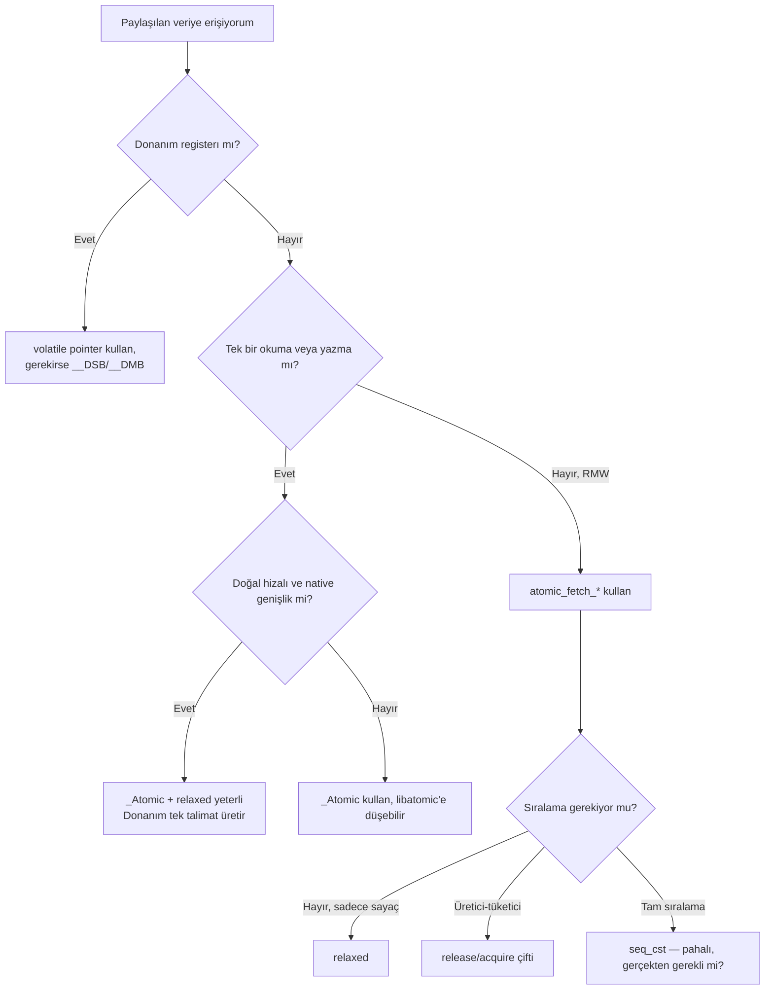

Gömülü dünyada en sık tekrarlanan yanılgılardan biri şudur: "değişkeni `volatile`
yaparsam ISR ile main loop arasında güvenle paylaşabilirim". Bu cümle, yıllarca süren
sahada-buluşan hata raporlarının, gece nöbetlerinin ve "ama lab'da çalışıyordu"
ifadelerinin temel sebebidir. Yazının iddiası net: `volatile` ne C standardı ne de
ARM mimarisi açısından bir eşzamanlılık (synchronization) ilkesi değildir; bunun için
C11'in `<stdatomic.h>` başlığı, derleyici bariyerleri ve mimariye özgü bellek
bariyerleri vardır.

Bu yazıda önce `volatile`'ın gerçekte neyi garanti edip etmediğini standart
diliyle çıkaracağız, sonra Cortex-M4 üzerinde aynı operasyonun `volatile` ve
`_Atomic` versiyonlarının ürettiği assembly'yi yan yana koyup farkı göreceğiz.
Ardından memory ordering meselesini (derleyici reordering + CPU reordering) ele
alıp Cortex-M ailesinin tek çekirdek ve çok çekirdek senaryolarında ne gerekip ne
gerekmediğine bakacağız. Son olarak Cortex-M0/M0+ ve M23'te `_Atomic`'in neden
sessizce libatomic'e fallback ettiğini ve bunun gerçek maliyetini ortaya koyacağız.

---

## Bir Olay Yeri: Kaybolan Artırımlar

Aşağıdaki kod parçası, internette bulunan onlarca "tutorial"in özüdür:

```c
volatile uint32_t pulse_count;

void TIM2_IRQHandler(void) {
    if (TIM2->SR & TIM_SR_UIF) {
        TIM2->SR &= ~TIM_SR_UIF;
        pulse_count++;
    }
}

void main_loop(void) {
    if (pulse_count >= 1000) {
        pulse_count = 0;
        trigger_event();
    }
}
```

Lab'da timer'ı 1 kHz'te koşturursunuz; her saniye `trigger_event()` çağrılır,
LED yanar, herkes mutlu. Tek bir şey hariç: birkaç saatlik koşumdan sonra
`trigger_event()` çağrılma oranı saniyede tam olarak bir değildir — bazen 1.001,
bazen 0.998. Birkaç gün sonra müşteri sahadan "sayım kayıyor" bildirir.

Sebep, Cortex-M4'ün `pulse_count++` için ürettiği makine kodudur:

```text
ldr  r3, [r2]      ; r3 <- pulse_count
adds r3, r3, #1    ; r3 = r3 + 1
str  r3, [r2]      ; pulse_count <- r3
```

Bu üç talimatın **arasına** bir kesme girerse — örneğin `LDR` ile `STR` arasına —
main loop'un sıfırlama yazısı veya başka bir ISR'ın artırması kaybolur. `volatile`
derleyiciye "bu değişkeni cache'leme, her erişimi bellekten yap" der; **ama tek
talimatla yap** demez. Çünkü demez ki: C dili `volatile` için zaten böyle bir şey
söylemez.

---

## `volatile`'ın C Standardındaki Anlamı

ISO/IEC 9899:2011 §6.7.3p7'de `volatile` şöyle tanımlanır (öz Türkçeyle): *"Bir
`volatile` nitelikli nesneye yapılan her erişim, gerçekleştirme tarafından
soyut makinenin (abstract machine) kuralları uyarınca tam olarak ortaya çıkmalıdır.
Aksini gerektiren herhangi bir nedenin yokluğunda, `volatile` nesneye yapılan
erişimler kaynak kodda göründükleri sıralamada gerçekleşmelidir."*

Bu cümle iki şey söyler:

1. Her okuma ve yazma **gerçekten olur** — derleyici onu yutamaz, başka
   okumayla birleştiremez.
2. Aynı `volatile` nesneye yapılan erişimler, kaynak kodda göründükleri sıralamada
   görünür.

Bu cümlenin söylemediği üç şey vardır ve hata kaynağı tam olarak burasıdır:

1. **Atomicity yok.** Tek bir okuma veya yazmanın tek talimatta yapılacağına
   dair garanti yoktur. `volatile uint64_t` Cortex-M üzerinde iki `LDR` ile
   okunur; aralarına kesme girer.
2. **Diğer nesnelere göre sıralama yok.** `volatile a` ile yapılan okumanın,
   sıradan bir `b` değişkenine yapılan yazmadan önce bitmesi garanti değildir —
   derleyici onları rahatlıkla değiştirir.
3. **Çekirdekler arası görünürlük yok.** Multi-core sistemde bir çekirdeğin
   yaptığı `volatile` yazı, diğerinin önbelleğine kendiliğinden ulaşmaz; bunun
   için cache maintenance + bellek bariyeri gerekir.

Linus Torvalds ve Jonathan Corbet Linux çekirdeği belgesi
[volatile-considered-harmful.rst](https://www.kernel.org/doc/html/next/process/volatile-considered-harmful.html)
içinde durumu sert özetler (özet çeviri): "Çekirdek kodunda `volatile`'a
neredeyse hiç ihtiyaç yoktur; ortaya çıkıyorsa, neredeyse her zaman daha derin
bir eşzamanlılık hatasının semptomudur." SEI CERT C kuralı
[CON02-C](https://wiki.sei.cmu.edu/confluence/x/utYxBQ) ise tek cümleyle özetler:
"Do not use volatile as a synchronization primitive."

`volatile`'ın **gerçek** ve haklı kullanım alanları şunlardır:

- Bellek-eşlenikli (memory-mapped) donanım registerları (`*((volatile uint32_t*)
  0x40020000) = 0xA5;`).
- `setjmp`/`longjmp` arasında değeri korunan otomatik değişkenler.
- POSIX `sigatomic_t` veya `_Atomic`'siz ortamlarda, signal handler ile
  iletilen **tek bayraklar** (yalnızca yazılır/okunur, RMW yapılmaz).

Bu liste kasıtlı olarak kısadır. ISR'a sayaç paylaşmak, mesaj kuyruğunu yönetmek,
durum makinesini iki çekirdek arasında senkronlamak — hiçbiri bu listede yoktur.

---

## Cortex-M4 Üzerinde Assembly Karşılaştırması

`arm-none-eabi-gcc 13.2` ile `-O2 -mcpu=cortex-m4 -mthumb` bayrakları altında iki
fonksiyonu derleyip üretilen kodu karşılaştıralım.

### Tek artırım — `volatile` versiyon

```c
#include <stdint.h>

volatile uint32_t v_counter;

void v_inc(void) {
    v_counter++;
}
```

Üretilen kod:

```text
v_inc:
    ldr     r3, .L2          ; r3 = &v_counter
    ldr     r2, [r3]         ; r2 = v_counter
    adds    r2, r2, #1
    str     r2, [r3]         ; v_counter = r2
    bx      lr
.L2:
    .word   v_counter
```

Üç bellek/aritmetik talimat. Kesme `LDR` ile `STR` arasına düşerse artırım
kaybolur. Bu kodun atomik olduğuna dair hiçbir varsayım yapılamaz.

### Aynı artırım — C11 `_Atomic` versiyon

```c
#include <stdint.h>
#include <stdatomic.h>

atomic_uint a_counter;

void a_inc(void) {
    atomic_fetch_add_explicit(&a_counter, 1, memory_order_relaxed);
}
```

Üretilen kod (aynı bayraklarla):

```text
a_inc:
    ldr     r3, .L5
1:  ldrex   r2, [r3]         ; exclusive load, monitor "watch" set
    adds    r2, r2, #1
    strex   r1, r2, [r3]     ; exclusive store; r1 = 0 başarı
    cmp     r1, #0
    bne     1b               ; başarısızsa baştan dene
    bx      lr
.L5:
    .word   a_counter
```

Fark görünür: LDREX/STREX çifti, ARMv7-M'in **exclusive monitor**'ünü kullanarak
"oku — değiştir — yaz" döngüsünü güvenli hale getirir. Eğer LDREX ile STREX
arasında başka bir context (ISR, başka bir CPU) aynı adrese yazarsa STREX
başarısız olur (`r1 = 1`), kod döngünün başına döner ve yeniden dener. Bu
desen, ARM mimarisinde **LL/SC** (load-linked / store-conditional) ailesinden
gelir ve karşılıklı dışlama (mutual exclusion) için temeldir.

Cortex-M4 tek çekirdekli bir mimari olduğu için "diğer çekirdekten yazma"
ihtimali yoktur; LDREX/STREX burada **yalnızca local monitor**'ü kullanır ve
asıl koruma kesmeye karşıdır. ISR `STREX`'in çalışmasından önce devreye girerse
local monitor temizlenir, STREX başarısız olur, döngü tekrar dener — sayım
kaybolmaz.

`-O2 -mcpu=cortex-m0` ile aynı kodu derlerseniz manzara değişir: ARMv6-M'de
LDREX/STREX **yok**. GCC `a_inc` için `__atomic_fetch_add_4` çağrısı üretir;
bu sembol libatomic'tedir. Libatomic'in M0+ implementasyonu tipik olarak
`__sync` kütüphanesi arkasında PRIMASK'i set/clear ederek kesmeleri kapatır.
Yani aynı kaynak kodu, hedefe göre 8 talimatlık inline döngüye veya bir
fonksiyon çağrısı + IRQ disable/enable köprüsüne dönüşür. Bunu bilmeden kullanan
ekipler, yumuşak gerçek-zaman sistemlerinde beklenmedik **kesme gecikmesi**
(interrupt latency) ile karşılaşır.

---

## Memory Ordering: İki Katmanlı Yeniden Sıralama

`volatile`'ın yapamadığı ikinci kategori, **sıralama** garantisidir. Modern
sistemlerde sıralamayı bozan iki bağımsız mekanizma vardır:

```text
Kaynak kod sıralaması
        |
        v   (1) Derleyici yeniden sıralaması
        |
Makine kodu sıralaması
        |
        v   (2) CPU yeniden sıralaması
        |
Belleğe görünen sıralama
```

### (1) Derleyici reordering

Modern bir C derleyicisi, `as-if` kuralının izin verdiği her yerde komutları
yeniden sıralar:

```c
flag = 0;
buffer[0] = 0xDE;
buffer[1] = 0xAD;
flag = 1;
```

Derleyici, `flag = 0` ve `flag = 1` yazılarını birleştirip yalnızca sonuncusunu
bırakabilir veya `flag = 1`'i buffer yazılarından önceye taşıyabilir (eğer
`flag` ile `buffer` arasında veri bağımlılığı görmüyorsa). `flag`'i `volatile`
yapmak bu işin yarısını çözer (yazıyı yutamaz), ama `flag = 1`'in `buffer`
yazılarından önce gelmemesini **garanti etmez** — `buffer` `volatile` değilse
derleyicinin önünde engel yoktur.

İki klasik koruma vardır:

- `asm volatile ("" ::: "memory")` — GCC'ye özgü tam derleyici bariyeri.
  Hiçbir talimat üretmez, ama compiler'a "memory bu noktada değişti, hiçbir
  varsayımı taşıma" der.
- C11 atomik operasyonu uygun `memory_order` ile çağırmak. `atomic_store_explicit
  (&flag, 1, memory_order_release)` hem derleyiciye hem CPU'ya "önceki tüm
  yazıların görünür olduğundan emin ol" der.

### (2) CPU reordering

CPU tarafı, mimariye göre çok farklıdır. ARM ailesi **weakly-ordered**'dir;
yani CPU, veri bağımlılığı olmayan okuma ve yazmaları kendi başına yeniden
sıralayabilir. Yayınlanan koşum sırası, yazıldığı sırayla aynı olmak zorunda
değildir.

ARM bunu üç bariyer talimatıyla kontrol eder:

| Talimat | Anlamı | Tipik kullanım |
|---|---|---|
| `DMB` | Data Memory Barrier — bu noktadan önceki tüm bellek erişimleri sonrakilerden önce görünür olur | Spinlock al/bırak; çekirdekler arası paylaşılan veri |
| `DSB` | Data Synchronization Barrier — DMB + öndeki tüm bellek erişimleri tamamlanmadan sonraki talimat başlamaz | Cache maintenance sonrası; MPU/MMU konfigürasyonu |
| `ISB` | Instruction Synchronization Barrier — pipeline'ı temizler; sonraki talimatlar yeniden fetch edilir | Vector tablosu/SCB yapılandırma sonrası |

Burada kritik bir nokta var: **Cortex-M ailesi tek çekirdeklidir** (klasik
konfigürasyonda). Tek çekirdek üzerinde aynı çekirdeğin yaptığı yazıları kendi
sonraki okumaları **her zaman** sıralı görür — bu mimari garantidir. O zaman
DMB neden gerekir?

İki sebep:

1. **DMA ile paylaşılan tampon.** CPU'nun yazısı henüz write buffer'da olabilir;
   DMA controller'a "başla" yazmadan önce DSB ile yazıların gerçekten belleğe
   ulaşması garantilenir.
2. **Çok çekirdekli sistem.** Heterojen Cortex-M+M (STM32H7'nin M7+M4
   konfigürasyonu, NXP i.MX RT1170 M7+M4 gibi) ve tüm Cortex-A SMP
   sistemlerinde DMB şarttır; aksi halde diğer çekirdek yazıları yanlış sırayla
   görür.

Yani tek çekirdek Cortex-M üzerinde **thread + ISR** senaryosunda DMB
**gereksizdir**. LDREX/STREX local monitor'ı yeterlidir. Bu, çok sayıda örnek
kodun gereksiz `__DMB()` çağrısı içermesinin temel sebebidir — büyük ölçüde
"copy-paste'tan multi-core kod" mirasıdır.

---

## C11 `<stdatomic.h>`: Doğru Aracın Anatomisi

C11 atomicleri üç katman sunar:

1. **Tür belirteci/niteleyici:** `_Atomic int`, `_Atomic(int)`, `atomic_int`
   (typedef). Aynı şey için üç yazım vardır.
2. **Generic fonksiyonlar:** `atomic_load`, `atomic_store`, `atomic_fetch_add`,
   `atomic_compare_exchange_weak`/`_strong`, `atomic_exchange`. Bunlar default
   olarak `memory_order_seq_cst` kullanır.
3. **`_explicit` varyantlar:** Aynı fonksiyonların `_explicit` sonekli halleri,
   `memory_order` parametresi alır.

Memory order seçenekleri ve ne işe yaradıkları:

| Order | Garanti | Tipik kullanım |
|---|---|---|
| `relaxed` | Sadece atomicity; sıralama yok | İstatistik sayaçları, telemetri |
| `consume` | Bağımlılık zinciri korunur | Nadir; çoğu derleyici `acquire`'a eşitler |
| `acquire` | Bu okumadan sonra gelen erişimler önce sıçramaz | Lock alma, üretici-tüketici tüketici tarafı |
| `release` | Bu yazıdan önceki erişimler sonra sıçramaz | Lock bırakma, üretici-tüketici üretici tarafı |
| `acq_rel` | İkisi birden | `fetch_add`/`exchange` ile lock-free yapı |
| `seq_cst` | Total sıralama; tüm thread'ler aynı sırayı görür | Varsayılan; en pahalı |

Pratik bir örnek — üretici-tüketici flag'i:

```c
#include <stdatomic.h>

static uint8_t  buffer[64];
static atomic_int ready = 0;       /* 0: boş, 1: dolu */

void producer(void) {
    fill_buffer(buffer);
    atomic_store_explicit(&ready, 1, memory_order_release);
}

bool consumer(void) {
    if (atomic_load_explicit(&ready, memory_order_acquire) == 1) {
        process_buffer(buffer);
        atomic_store_explicit(&ready, 0, memory_order_release);
        return true;
    }
    return false;
}
```

Burada `release` ve `acquire` çifti hem derleyiciye hem CPU'ya şunu söyler:
"Üretici'nin `fill_buffer` içindeki tüm yazıları, `ready = 1`'i gören bir
tüketici tarafından **mutlaka** görülmüş olmalıdır." `volatile` ile bu garanti
elde edilemez; çünkü `volatile` ne derleyici reordering'ini diğer değişkenlere
karşı engeller, ne de CPU bariyeri üretir.

Cortex-M4'te `release` store, derleyiciye bir `DMB` talimatı ürettirir
(multi-core veya DMA paylaşımı varsa anlamlıdır; tek-core thread+ISR
senaryosunda bile derleyici bariyeri kazancı vardır). Cortex-A SMP'de ise gerçek bir CPU bariyeri olur.

---

## Tek Çekirdek vs Çok Çekirdek: Karar Matrisi

| Senaryo | Atomicity | Derleyici bariyeri | CPU bariyeri | Doğru araç |
|---|---|---|---|---|
| Tek `volatile uint8_t` bayrağı, ISR yazar, main okur, Cortex-M | `uint8_t` zaten tek talimat, OK | Aynı değişken için OK | Tek-core: gereksiz | `volatile` *yetebilir* — ama `_Atomic` daha güvenli |
| `pulse_count++`, ISR + main, Cortex-M4 | LDREX/STREX şart | Var | Gereksiz | `atomic_fetch_add_explicit(..., relaxed)` |
| Üretici-tüketici buffer, ISR + main, Cortex-M4 | flag için OK | Şart | Gereksiz (single-core) | `atomic_store/load_explicit(..., release/acquire)` |
| DMA tampon, CPU yazar, DMA okur | Yazı OK | Şart | `DSB` şart (DMA başlatma öncesi) | `__DSB()` + `volatile` register |
| Dual M7 / Cortex-A SMP, paylaşılan kuyruk | Şart | Şart | `DMB` şart | `_Atomic` + `release/acquire` |
| Bellek-eşlenikli register (UART, GPIO) | Genelde tek talimat | Şart | Mimariye göre | `volatile` (atomic değil, **donanım yan etkisi**) |

Tek satıra indirgersek: **Kayıt (register) erişiminde `volatile`; paylaşılan
veri erişiminde `_Atomic`.** Bu iki kavram aynı isim değildir, aynı mekanizma
hiç değildir.

---

## Cortex-M0/M0+ ve M23: `_Atomic`'in Sessiz Bedeli

ARMv6-M (M0, M0+, M1) ve ARMv8-M Baseline (M23) ailesi exclusive monitor
içermez. Bu hedeflerde GCC `<stdatomic.h>`'i koruyabilmek için libatomic
kullanır. Tipik bir `atomic_fetch_add` çağrısı şuna benzer:

```text
a_inc:
    push    {r4, lr}
    movs    r2, #5            ; memory_order_seq_cst (5)
    movs    r1, #1            ; ekleme miktarı
    ldr     r0, .L3           ; &a_counter
    bl      __atomic_fetch_add_4
    pop     {r4, pc}
.L3:
    .word   a_counter
```

Fonksiyon çağrısının arkasında, libatomic'in M0+ implementasyonu PRIMASK'i
kaydeder, kesmeleri kapatır, RMW yapar, PRIMASK'i geri yükler. Bu yaklaşımın
iki bedeli vardır:

1. **Kesme gecikmesi.** Critical section, dış fonksiyon çağrısı + iki PRIMASK
   manipülasyonu boyunca aktiftir. Yumuşak gerçek-zaman sistemlerde her atomik
   operasyon ~10-20 cycle pin daha yüksek interrupt jitter doğurur.
2. **Link zamanı bağımlılığı.** Bare-metal projelerde libatomic her zaman link
   edilemez; `-latomic` ihtiyacı vardır ve newlib-nano ile çakışmalar olabilir.

Bu nedenle gömülü ekipler ARMv6-M hedeflerinde sık sık alternatif bir yol
seçer: kritik bölge etrafında elle `__disable_irq()`/`__enable_irq()` veya
ARM'ın "atomic register access" pattern'i. Bu seçim, "küçük çip, küçük araç
seti" pragmatizmidir; ama gerçek `volatile` ile aynı şey değildir — sadece
implementasyon detayıdır.

---

## Sık Yapılan Beş Hata

1. **`volatile` bayrak ile spinlock kurmak.** `while (locked) {}` ile beklemek
   atomik gibi görünse de iki çekirdek arasında yarış vardır. Doğrusu:
   `atomic_flag_test_and_set_explicit(&lock, memory_order_acquire)`.
2. **`_Atomic struct` ile büyük yapı kullanmak.** C11 izin verir, ama
   derleyici `sizeof` belirli eşiklerin üstünde tüm yapıyı libatomic'in lock
   tablosuna yönlendirir. Sonuç: her erişim hash-locked. Büyük yapıları açıkça
   bir mutex ile koruyun.
3. **64-bit `_Atomic` ARMv7-M üzerinde.** LDREXD/STREXD var ama derleyici hep
   üretmez; -O ayarlarına göre libatomic'e düşülebilir. `__atomic_always_lock_free
   (8, 0)` ile derleme zamanında kontrol edin.
4. **`memory_order_consume` kullanmak.** Standart tanımı pratik derleyicilerin
   doğru uygulayamadığı kadar karmaşıktır; tüm yaygın derleyiciler bunu
   `acquire`'a yükseltir. C++ komitesi 2017'den beri yeniden tanımlamayı
   tartışıyor. Kullanmayın.
5. **Cortex-M tek-core'da gereksiz `__DMB()` serpiştirmek.** Performans
   maliyeti küçük ama sıfır değil, ve daha kötüsü kodun çok-core'a taşındığı
   yanılgısını yaratır. Asıl koruma `_Atomic` + uygun memory order'dır;
   bariyer talimatı bunun **yan ürünüdür**.

---

## Bir Karar Akışı



Bu akış, "önce mimari, sonra araç" disiplinini dayatır. `volatile`'a karar
verirken sorduğumuz tek soru "bu adres bir cihaz registerı mı?" olmalıdır.
Bir `_Atomic`'e karar verirken sorduğumuz soru "bu veriyi başka bir context
de görüyor mu, ve görmesi gereken sırada görmek zorunda mı?" olmalıdır.

---

## Bir Sahte Çözüm: "Tek baytlık değişken atomiktir"

İnternette tekrarlanan bir başka mit: "`uint8_t` veya `bool` zaten tek talimatta
yazılır, `volatile` yeterli". Bu kısmen doğrudur — tek baytlık doğal hizalı
yazı ARM'da gerçekten tek `STRB` ile yapılır, dolayısıyla atomicity sorunu
**yoktur**. Ama:

- Yazma atomiktir, **okuma + yazma atomik değildir.** `flag = !flag;` üç
  talimattır.
- Yazma diğer değişkenlerle sıralama garanti **etmez.** Üretici-tüketici
  senaryosunda buffer yazıları bayraktan sonra görünebilir.
- Multi-core sistemde diğer çekirdek bu yazıyı kendi cache'i nedeniyle eski
  görebilir.

Yani "tek baytlık `volatile` yeterli" cümlesi, "kesinlikle bir bayrak okuyup
yazıyorum, başka değişkene bağlamıyorum, tek çekirdekteyim" kısıtının altında
doğrudur. Bu kısıtın hayatınızdaki ömrü kısadır; kodun yarın multi-core'a
taşınma ihtimali yüksektir. Doğru alışkanlık baştan `_Atomic` yazmaktır;
ek maliyeti tek-core hedefte çoğu durumda sıfırdır.

---

## Sonuç

`volatile` C dilinin önemli ama dar bir aracıdır: derleyicinin "bu değişken
bana göre değişmez" varsayımını kıran bir niteleyici. Donanım registerı
erişiminde, signal handler'la basit bayrak alışverişinde, `setjmp`/`longjmp`
arasında değer korumada yeri vardır. Hiçbirinin adı "eşzamanlılık" değildir.

Eşzamanlılık kelimesi C dilinde C11 ile birlikte gelmiştir: `_Atomic` türleri,
`<stdatomic.h>` fonksiyonları, ve `memory_order` enum'u. Bunlar atomicity,
sıralama ve çekirdekler arası görünürlüğü tek bir tutarlı modelde birleştirir.
ARM mimarisi üzerinde bu modelin altyapısı LDREX/STREX, DMB/DSB/ISB ve
ARMv8'in load-acquire/store-release talimatlarıyla sağlanır.

Yazılım emniyet kritik olduğunda ve özellikle DO-178C DAL-A gibi seviyelerde
bu ayrımın belgelenmesi de önemlidir. Statik analiz araçları (Polyspace,
Astrée, Coverity) `volatile` ile korunmaya çalışılan paylaşımları "data race"
olarak işaretler ve haklıdır. Standart sürecin "MC/DC kapsama" gibi sıkı kuralı
varsa, eşzamanlılık modelinin doğru olduğunu kanıtlamak da aynı disiplinin
parçasıdır.

Bir sonraki ISR sayacınızı `volatile uint32_t` ile yazmadan önce iki kere
düşünün. `atomic_uint` ek bir satır değildir; arkasında yarım yüzyıllık
mimari kararların ve bir dil standardının düşünülmüş yanıtı vardır.

---

## Kaynaklar

- ISO/IEC 9899:2011, "Programming languages — C" — §6.7.3 ("volatile"), §7.17
  ("Atomics"). (Standart taslağı: <https://www.open-std.org/jtc1/sc22/wg14/www/docs/n1570.pdf>)
- [The Linux Kernel Documentation — Why the "volatile" type class should not be
  used](https://www.kernel.org/doc/html/next/process/volatile-considered-harmful.html)
- [SEI CERT C Coding Standard — CON02-C. Do not use volatile as a
  synchronization primitive](https://wiki.sei.cmu.edu/confluence/x/utYxBQ)
- [cppreference — `<stdatomic.h>` (C11)](https://en.cppreference.com/w/c/header/stdatomic.html)
- [LWN — The trouble with volatile (Jonathan Corbet, 2007)](https://lwn.net/Articles/233479/)
- [Embedded.com — Jack Ganssle, "C keywords: Don't flame out over
  volatile"](https://www.embedded.com/c-keywords-dont-flame-out-over-volatile/)
- ARM Architecture Reference Manual ARMv7-M, DDI 0403E.e — Bölüm A3.4
  ("Synchronization and semaphores") ve A4.5 ("Memory barriers").
- ARM Architecture Reference Manual ARMv6-M, DDI 0419E.
- Hans-J. Boehm, "Threads Cannot Be Implemented as a Library", PLDI 2005 — C
  bellek modelinin neden dil seviyesinde gerekli olduğunu açıklayan kurucu makale.
- [ARM Community — LDREX/STREX on M3, M4, M7](https://community.arm.com/support-forums/f/architectures-and-processors-forum/10361/ldrex-strex-on-the-m3-m4-m7)
- [SoC.org — How to implement atomic operations on multi-core Cortex-M0/M0+?](https://s-o-c.org/how-to-implement-atomic-operations-on-multi-core-cortex-m0-m0/)
