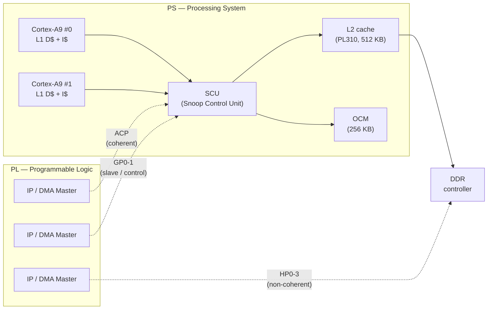
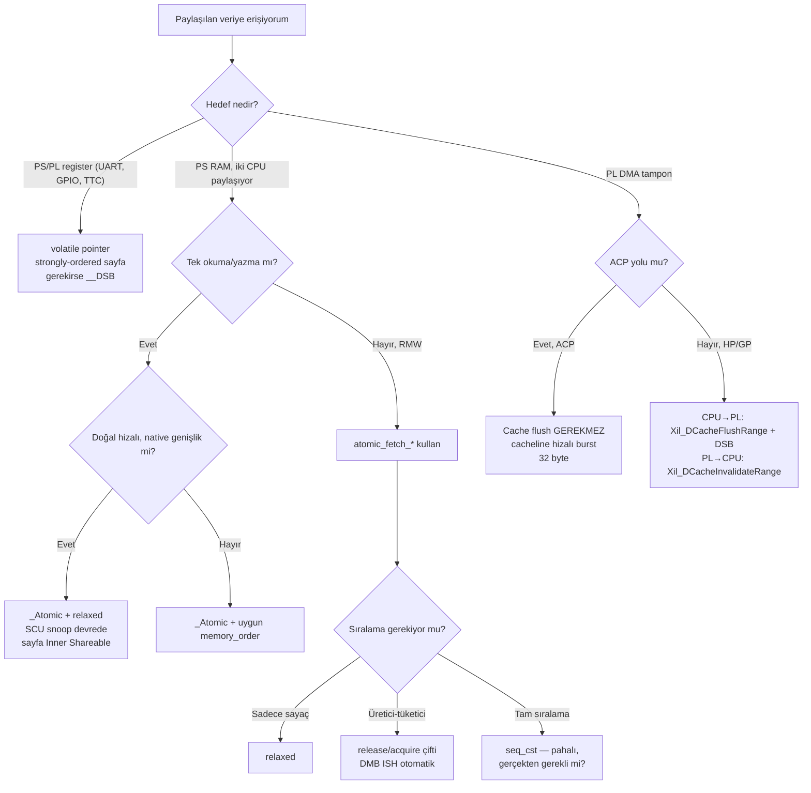

Gömülü dünyada en sık tekrarlanan yanılgılardan biri şudur: "değişkeni `volatile`
yaparsam iki Cortex-A9 çekirdeği veya PS ile PL arasında güvenle paylaşabilirim".
Bu cümle, yıllarca süren sahada-buluşan hata raporlarının, gece nöbetlerinin ve
"ama tek çekirdekte çalışıyordu" ifadelerinin temel sebebidir. Yazının iddiası net:
`volatile` ne C standardı ne de ARMv7-A mimarisi açısından bir eşzamanlılık
(synchronization) ilkesi değildir; bunun için C11'in `<stdatomic.h>` başlığı,
derleyici bariyerleri ve mimariye özgü bellek bariyerleri vardır.

Bu yazıda örnek platformu Zynq-7000 olarak seçiyoruz. Sebebi pedagojiktir: tek bir
çipte hem klasik ARM SMP (iki Cortex-A9 çekirdeği, ortak L2 önbellek, SCU ile
cache coherency), hem programlanabilir mantık (PL) tarafından gelen DMA, hem de
ACP (Accelerator Coherency Port) üzerinden cache-snoop'lu PL transferleri vardır.
Yani eşzamanlılık probleminin neredeyse bütün canlı varyasyonları aynı SoC'de
karşımıza çıkar. (Renode ile bu sistemin nasıl simüle edileceğini daha önce
[Renode ile Zynq7000 Simülasyonu](/2026/05/14/renode-ile-zynq7000-simulasyonu.html)
yazısında ele almıştım; bu yazı onun yazılım eşzamanlılığı yanını tamamlar.)

İlk önce `volatile`'ın gerçekte neyi garanti edip etmediğini standart diliyle
çıkaracağız, sonra Cortex-A9 üzerinde aynı RMW operasyonunun `volatile` ve
`_Atomic` versiyonlarının ürettiği assembly'yi yan yana koyup farkı göreceğiz.
Ardından memory ordering meselesini (derleyici reordering + CPU reordering) ele
alıp Zynq-7000'in iki çekirdeği arasında SCU'nun, PS-PL arasında ACP'nin ve
HP/GP portlarının ne yapıp ne yapmadığını ortaya koyacağız. Son olarak Cortex-A9
özelinde `_Atomic`'in `LDREX/STREX` + `DMB ISH` ürettiği tipik kalıbı ve bunun
shareability domain seçimine bağlı maliyetini inceleyeceğiz.

---

## Bir Olay Yeri: Kaybolan Artırımlar

Aşağıdaki kod parçası, internette bulunan onlarca Zynq "tutorial"in özüdür.
Zynq-7000 PS tarafında AMP modunu varsayalım: iki çekirdek aynı OCM bloğunu
paylaşıyor; TTC0 (Triple Timer Counter) Cortex-A9 #0'a kesme üretir; ana iş
döngüsü Cortex-A9 #1'de koşmaktadır:

```c
volatile uint32_t pulse_count;          /* OCM içinde paylaşılan */

void TTC0_IRQHandler(void)              /* CPU0 üzerinde */
{
    XTtcPs_ClearInterruptStatus(&Ttc0, XTTCPS_IXR_INTERVAL_MASK);
    pulse_count++;
}

void main_loop_cpu1(void)               /* CPU1 üzerinde */
{
    if (pulse_count >= 1000) {
        pulse_count = 0;
        trigger_event();
    }
}
```

Lab'da timer'ı 1 kHz'te koşturursunuz; her saniye `trigger_event()` çağrılır,
LED yanar, herkes mutlu. Tek bir şey hariç: birkaç saatlik koşumdan sonra
`trigger_event()` çağrılma oranı saniyede tam olarak bir değildir — bazen 1.001,
bazen 0.998. Birkaç gün sonra müşteri sahadan "sayım kayıyor" bildirir.

Sebep iki katmanlıdır. İlk olarak Cortex-A9'un `pulse_count++` için ürettiği
makine kodu:

```text
ldr  r3, [r2]      ; r3 <- pulse_count
add  r3, r3, #1    ; r3 = r3 + 1
str  r3, [r2]      ; pulse_count <- r3
```

Bu üç talimatın **arasına** CPU1'in okuması/yazısı girer — SCU L1 önbellek
satırlarını koherent tutmaya çalışsa bile sıralama bozulur; bir tarafın
artırması diğerinin sıfırlamasına çarpar. İkinci olarak `volatile` derleyiciye
"bu değişkeni register'a cache'leme" der; ama "tek talimatla yap" demez ve
"diğer çekirdeğe görünür kıl" hiç demez. C dili `volatile` için böyle bir şey
söylemez.

---

## `volatile`'ın C Standardındaki Anlamı

ISO/IEC 9899:2011 §6.7.3p7'de `volatile` şöyle tanımlanır (öz Türkçeyle): *"Bir
`volatile` nitelikli nesneye yapılan her erişim, gerçekleştirme tarafından
soyut makinenin (abstract machine) kuralları uyarınca tam olarak ortaya çıkmalıdır.
Aksini gerektiren herhangi bir nedenin yokluğunda, `volatile` nesneye yapılan
erişimler kaynak kodda göründükleri sıralamada gerçekleşmelidir."*

Bu cümle iki şey söyler:

1. Her okuma ve yazma **gerçekten olur** — derleyici onu yutamaz, başka
   okumayla birleştiremez.
2. Aynı `volatile` nesneye yapılan erişimler, kaynak kodda göründükleri sıralamada
   görünür.

Bu cümlenin söylemediği üç şey vardır ve hata kaynağı tam olarak burasıdır:

1. **Atomicity yok.** Tek bir okuma veya yazmanın tek talimatta yapılacağına
   dair garanti yoktur. `volatile uint64_t` Cortex-A9 üzerinde ya iki ardışık
   `LDR` ya da `LDRD` ile okunur; `LDRD`'nin atomik olmadığı (iki
   tek-word bus transferine bölünebildiği) ARM ARM tarafından açıkça belirtilir.
2. **Diğer nesnelere göre sıralama yok.** `volatile a` ile yapılan okumanın,
   sıradan bir `b` değişkenine yapılan yazmadan önce bitmesi garanti değildir —
   derleyici onları rahatlıkla değiştirir.
3. **Çekirdekler arası görünürlük yok.** SMP sistemde bir çekirdeğin yaptığı
   `volatile` yazı, diğerinin önbelleğine kendiliğinden ulaşmaz. Zynq-7000'de
   SCU iki Cortex-A9'un L1 D-cache'lerini snoop ederek koherans sağlar; ama bu
   ancak ilgili sayfa **inner shareable** olarak işaretliyse devreye girer ve
   yine de **sıralama** bir bellek bariyeri olmadan garanti edilemez.

Linus Torvalds ve Jonathan Corbet Linux çekirdeği belgesi
[volatile-considered-harmful.rst](https://www.kernel.org/doc/html/next/process/volatile-considered-harmful.html)
içinde durumu sert özetler (özet çeviri): "Çekirdek kodunda `volatile`'a
neredeyse hiç ihtiyaç yoktur; ortaya çıkıyorsa, neredeyse her zaman daha derin
bir eşzamanlılık hatasının semptomudur." SEI CERT C kuralı
[CON02-C](https://wiki.sei.cmu.edu/confluence/x/utYxBQ) ise tek cümleyle özetler:
"Do not use volatile as a synchronization primitive."

`volatile`'ın **gerçek** ve haklı kullanım alanları şunlardır:

- Bellek-eşlenikli (memory-mapped) donanım registerları (`*((volatile uint32_t*)
  0x40020000) = 0xA5;`).
- `setjmp`/`longjmp` arasında değeri korunan otomatik değişkenler.
- POSIX `sigatomic_t` veya `_Atomic`'siz ortamlarda, signal handler ile
  iletilen **tek bayraklar** (yalnızca yazılır/okunur, RMW yapılmaz).

Bu liste kasıtlı olarak kısadır. ISR'a sayaç paylaşmak, mesaj kuyruğunu yönetmek,
durum makinesini iki çekirdek arasında senkronlamak — hiçbiri bu listede yoktur.

---

## Cortex-A9 Üzerinde Assembly Karşılaştırması

`arm-none-eabi-gcc 13.2` ile `-O2 -mcpu=cortex-a9 -marm` bayrakları altında iki
fonksiyonu derleyip üretilen kodu karşılaştıralım. (Zynq-7000'in bare-metal SDK'sı
olan Xilinx Vitis aynı toolchain'i kullanır.)

### Tek artırım — `volatile` versiyon

```c
#include <stdint.h>

volatile uint32_t v_counter;

void v_inc(void) {
    v_counter++;
}
```

Üretilen kod:

```text
v_inc:
    ldr     r3, .L2          ; r3 = &v_counter
    ldr     r2, [r3]         ; r2 = v_counter
    add     r2, r2, #1
    str     r2, [r3]         ; v_counter = r2
    bx      lr
.L2:
    .word   v_counter
```

Üç bellek/aritmetik talimat. Kesme `LDR` ile `STR` arasına düşerse veya CPU1
araya aynı adrese yazarsa artırım kaybolur. Bu kodun atomik olduğuna dair
hiçbir varsayım yapılamaz; bariyer talimatı da yok, dolayısıyla yazının diğer
çekirdek tarafından ne zaman görüleceği de tanımsızdır.

### Aynı artırım — C11 `_Atomic` versiyon

```c
#include <stdint.h>
#include <stdatomic.h>

atomic_uint a_counter;

void a_inc(void) {
    atomic_fetch_add_explicit(&a_counter, 1, memory_order_relaxed);
}
```

Üretilen kod (aynı bayraklarla, `memory_order_relaxed` ile — yani derleyici
yalnızca atomicity sağlamak zorunda, sıralama bariyeri eklememeli):

```text
a_inc:
    ldr     r3, .L5
1:  ldrex   r2, [r3]         ; exclusive load, monitor "watch" set
    add     r2, r2, #1
    strex   r1, r2, [r3]     ; exclusive store; r1 = 0 başarı
    cmp     r1, #0
    bne     1b               ; başarısızsa baştan dene
    bx      lr
.L5:
    .word   a_counter
```

Aynı fonksiyonu `memory_order_seq_cst` ile yazarsanız (yani `atomic_fetch_add`
varyantı) GCC RMW döngüsünün öncesine ve sonrasına `dmb ish` ekler:

```text
a_inc_seq:
    ldr     r3, .L7
    dmb     ish              ; önceki yazıların görünürlüğünü garanti et
1:  ldrex   r2, [r3]
    add     r2, r2, #1
    strex   r1, r2, [r3]
    cmp     r1, #0
    bne     1b
    dmb     ish              ; sonraki okumalar bunu görmeli
    bx      lr
.L7:
    .word   a_counter
```

Fark görünür: LDREX/STREX çifti, ARMv7-A'nın **exclusive monitor**'ünü
kullanarak "oku — değiştir — yaz" döngüsünü güvenli hale getirir. Eğer LDREX
ile STREX arasında başka bir context (kesme veya CPU1) aynı adrese yazarsa
STREX başarısız olur (`r1 = 1`), kod döngünün başına döner ve yeniden dener.
Bu desen, ARM mimarisinde **LL/SC** (load-linked / store-conditional) ailesinden
gelir ve karşılıklı dışlama (mutual exclusion) için temeldir.

Zynq-7000 dual Cortex-A9 olduğu için bu örnek hayati önem taşır. Tek bir A9'da
çalışan ISR-thread senaryosunda local monitor yeterli olurdu; ama burada CPU1'in
de aynı adrese eriştiği bir SMP koşumumuz var. SCU (Snoop Control Unit) iki
çekirdeğin exclusive monitor durumlarını **global olarak** koordine eder: CPU0
`LDREX` çekip `STREX`'e gelmeden CPU1 `STREX` yaparsa, CPU0'ın monitor'ü
temizlenir ve onun `STREX`'i başarısız olur. Bu garanti yalnızca ilgili sayfa
**inner shareable** olarak işaretliyse geçerlidir; non-shareable sayfada SCU
bypass olur ve LDREX/STREX iki çekirdek arasında **çalışmaz**. Linux ve bare-metal
Xilinx BSP'leri OCM (On-Chip Memory) ile DDR'ı varsayılan olarak inner-shareable
işaretler; ama elle yazılmış MMU tablolarında bu ayrıntı atlanırsa atomicity
sessizce bozulur.

---

## Memory Ordering: İki Katmanlı Yeniden Sıralama

`volatile`'ın yapamadığı ikinci kategori, **sıralama** garantisidir. Modern
sistemlerde sıralamayı bozan iki bağımsız mekanizma vardır:

```text
Kaynak kod sıralaması
        |
        v   (1) Derleyici yeniden sıralaması
        |
Makine kodu sıralaması
        |
        v   (2) CPU yeniden sıralaması
        |
Belleğe görünen sıralama
```

### (1) Derleyici reordering

Modern bir C derleyicisi, `as-if` kuralının izin verdiği her yerde komutları
yeniden sıralar:

```c
flag = 0;
buffer[0] = 0xDE;
buffer[1] = 0xAD;
flag = 1;
```

Derleyici, `flag = 0` ve `flag = 1` yazılarını birleştirip yalnızca sonuncusunu
bırakabilir veya `flag = 1`'i buffer yazılarından önceye taşıyabilir (eğer
`flag` ile `buffer` arasında veri bağımlılığı görmüyorsa). `flag`'i `volatile`
yapmak bu işin yarısını çözer (yazıyı yutamaz), ama `flag = 1`'in `buffer`
yazılarından önce gelmemesini **garanti etmez** — `buffer` `volatile` değilse
derleyicinin önünde engel yoktur.

İki klasik koruma vardır:

- `asm volatile ("" ::: "memory")` — GCC'ye özgü tam derleyici bariyeri.
  Hiçbir talimat üretmez, ama compiler'a "memory bu noktada değişti, hiçbir
  varsayımı taşıma" der.
- C11 atomik operasyonu uygun `memory_order` ile çağırmak. `atomic_store_explicit
  (&flag, 1, memory_order_release)` hem derleyiciye hem CPU'ya "önceki tüm
  yazıların görünür olduğundan emin ol" der.

### (2) CPU reordering

CPU tarafı, mimariye göre çok farklıdır. ARMv7-A **weakly-ordered**'dır; yani
CPU, veri bağımlılığı olmayan okuma ve yazmaları kendi başına yeniden
sıralayabilir. Yayınlanan koşum sırası, yazıldığı sırayla aynı olmak zorunda
değildir. Cortex-A9 üzerinde write buffer ve load forwarding bu yeniden
sıralamayı her gün gerçekleştirir.

ARM bunu üç bariyer talimatıyla kontrol eder; her bariyer ayrıca bir
**shareability domain** seçimiyle gelir:

| Talimat | Anlamı | Tipik kullanım |
|---|---|---|
| `DMB` | Data Memory Barrier — bu noktadan önceki tüm bellek erişimleri sonrakilerden önce görünür olur | Spinlock al/bırak; çekirdekler arası paylaşılan veri |
| `DSB` | Data Synchronization Barrier — DMB + öndeki tüm bellek erişimleri tamamlanmadan sonraki talimat başlamaz | Cache maintenance sonrası; MMU TLB invalidate sonrası |
| `ISB` | Instruction Synchronization Barrier — pipeline'ı temizler; sonraki talimatlar yeniden fetch edilir | Vector tablosu / system control register yapılandırma sonrası |

Shareability domain seçenekleri:

| Domain | Kapsama | Zynq-7000 karşılığı |
|---|---|---|
| `SY` (full system) | Bütün observers (CPU'lar + DMA + GPU vs.) | En geniş; konservatif |
| `ISH` (inner shareable) | "Inner" domain — Zynq'te iki Cortex-A9 + L2 + ACP girişi | SMP veri paylaşımı için doğru seçim |
| `OSH` (outer shareable) | Daha geniş outer domain | Zynq-7000'de pratikte ISH ile aynı sonucu verir |
| `NSH` (non-shareable) | Yalnızca yerel çekirdek | Tek-CPU veri için |

GCC'nin Cortex-A9 hedefi için bir `release` veya `seq_cst` atomik operasyonu
ürettiği bariyer **her zaman `dmb ish`**'dir. `__DMB()` makrosunu elle çağıran
BSP kodu çoğunlukla `dmb sy` üretir; bu daha pahalıdır ama "ne yaptığını
bilmeden de doğru" davranır. İki çekirdek SMP'sinde tipik olarak `ish` yeterli;
DMA donanımı veya non-shareable bölgeyle alışveriş varsa `sy`'ye geçilir.

Burada Zynq-7000'in iki çekirdeğinin **inner shareable domain** içinde
olduğunu ve SCU'nun bu domain'de cache snoop yaptığını hatırlatmak gerekir.
Yani `DMB ISH` "iki A9'a da görünürlük garanti et" demektir; bunu DDR sayfası
inner-shareable ve cacheable işaretliyse derleyici ve donanım birlikte taşır.
Sayfa yanlış işaretliyse `DMB ISH` ne yapacağını bilemez ve yarış aynen
sürer — bu, BSP'lerde en sık atlanan sessiz hatalardan biridir.

---

## C11 `<stdatomic.h>`: Doğru Aracın Anatomisi

C11 atomicleri üç katman sunar:

1. **Tür belirteci/niteleyici:** `_Atomic int`, `_Atomic(int)`, `atomic_int`
   (typedef). Aynı şey için üç yazım vardır.
2. **Generic fonksiyonlar:** `atomic_load`, `atomic_store`, `atomic_fetch_add`,
   `atomic_compare_exchange_weak`/`_strong`, `atomic_exchange`. Bunlar default
   olarak `memory_order_seq_cst` kullanır.
3. **`_explicit` varyantlar:** Aynı fonksiyonların `_explicit` sonekli halleri,
   `memory_order` parametresi alır.

Memory order seçenekleri ve ne işe yaradıkları:

| Order | Garanti | Tipik kullanım |
|---|---|---|
| `relaxed` | Sadece atomicity; sıralama yok | İstatistik sayaçları, telemetri |
| `consume` | Bağımlılık zinciri korunur | Nadir; çoğu derleyici `acquire`'a eşitler |
| `acquire` | Bu okumadan sonra gelen erişimler önce sıçramaz | Lock alma, üretici-tüketici tüketici tarafı |
| `release` | Bu yazıdan önceki erişimler sonra sıçramaz | Lock bırakma, üretici-tüketici üretici tarafı |
| `acq_rel` | İkisi birden | `fetch_add`/`exchange` ile lock-free yapı |
| `seq_cst` | Total sıralama; tüm thread'ler aynı sırayı görür | Varsayılan; en pahalı |

Pratik bir örnek — üretici-tüketici flag'i:

```c
#include <stdatomic.h>

static uint8_t  buffer[64];
static atomic_int ready = 0;       /* 0: boş, 1: dolu */

void producer(void) {
    fill_buffer(buffer);
    atomic_store_explicit(&ready, 1, memory_order_release);
}

bool consumer(void) {
    if (atomic_load_explicit(&ready, memory_order_acquire) == 1) {
        process_buffer(buffer);
        atomic_store_explicit(&ready, 0, memory_order_release);
        return true;
    }
    return false;
}
```

Burada `release` ve `acquire` çifti hem derleyiciye hem CPU'ya şunu söyler:
"Üretici'nin `fill_buffer` içindeki tüm yazıları, `ready = 1`'i gören bir
tüketici tarafından **mutlaka** görülmüş olmalıdır." `volatile` ile bu garanti
elde edilemez; çünkü `volatile` ne derleyici reordering'ini diğer değişkenlere
karşı engeller, ne de CPU bariyeri üretir.

Cortex-A9 SMP'de `release` store derleyiciye `DMB ISH` ürettirir; bu hem
derleyici bariyeridir hem de SCU'nun snoop kuyruğunun boşaltılmasını tetikler.
Bu bariyer atılırsa CPU1 mesajı asla görmez, ya da buffer içeriğinden önce
flag'i görür ve **mantıken imkânsız** bir hatayla karşılaşır. Zynq-7000'in PS
tarafında çalışan bir Linux veya FreeRTOS SMP yapılandırması, atomik
operasyonların `DMB ISH` üretip üretmediğini sürekli denetler — kernel'in
spin_lock implementasyonu da aynı kalıp üzerinedir.

---

## Zynq-7000'in Üç Koherans Bölgesi

Zynq-7000'i diğer ARM SoC'lardan ayıran şey, PS ile PL arasında üç farklı
koherans davranışı sergileyen yolun bulunmasıdır. Her birinin `volatile` /
`_Atomic` / cache bariyeri sorumluluğu farklıdır.



**1. SCU + inner-shareable bölge.** İki Cortex-A9'un L1 D-cache'leri ve L2
cache, SCU tarafından otomatik snoop edilir. MMU sayfasını `Normal Memory,
Cacheable, Inner-Shareable` olarak işaretlerseniz, CPU0'ın yazısı CPU1'in
okumasında otomatik olarak doğru değeri verir; arada **manuel cache flush
gerekmez**. SCU bir cache satırına başka çekirdeğin yazdığını fark eder, ilgili
satırı diğer çekirdekte invalidate eder, yeni veriyi gerektiğinde okur.
LDREX/STREX da bu domain üzerinde global olarak çalışır.

İşte gizli tuzak: SCU yalnızca **Inner Shareable** işaretli sayfalarda devreye
girer. Yanlış sayfa attribute (örn. "Strongly Ordered" veya "Device") veya
non-shareable cacheable sayfa, snoop'un dışında kalır. Bu durumda `_Atomic`
hatasız derlenir, LDREX/STREX talimatları üretilir, ama çekirdekler arasında
hiçbir koherans yoktur — her biri kendi L1'ine yazar, diğeri yanlış değeri
okur. Xilinx standalone BSP'nin `translation_table.S` dosyası DDR'ı varsayılan
olarak Normal, Cacheable, Shareable işaretler; ama runtime'da
`Xil_SetTlbAttributes()` çağırarak attribute değiştiren kod bu garantiyi kolayca
bozar.

**2. ACP (Accelerator Coherency Port) — koherent PL→PS yolu.** ACP, PL'deki
bir DMA master'ın isteklerini SCU'ya bağlar. ACP üzerinden PL'nin yaptığı
yazı L1/L2 üzerinde snoop edilir ve CPU'lar manuel cache invalidate çağırmadan
güncel veriyi okur. ACP'nin verimli çalışması için iki kısıt vardır:

- AxCACHE sinyali write-back, write-allocate okunabilir/yazılabilir
  (`0b1111`) olarak işaretlenmeli; AxPROT non-secure data (genelde `0b010`)
  olmalıdır. Bu kombinasyon, PL master'ın işleminin SCU tarafından koherent
  kabul edilmesini sağlar.
- Transfer büyüklüğü tercihen tam bir L1/L2 cacheline (Zynq-7000'in Cortex-A9
  ve PL310 yapılandırmasında **32 byte**) hizalı olmalıdır; küçük veya
  hizasız transferler SCU'da read-modify-write doğurur ve performansı düşürür.

ACP'nin pratik faydası, **ARM üzerinde pahalı olan cache flush/invalidate
çağrılarını tamamen ortadan kaldırmasıdır.** Bare-metal BSP'de
`Xil_DCacheFlushRange()` büyük tampon başına mikrosaniye mertebesi
gecikme ekler — ACP yolu bu adımı tamamen atlar ve transferi cache'in içine
sokar.

**3. HP/GP portları — non-coherent PL→PS yolu.** HP (High Performance) ve GP
(General Purpose) AXI portları DDR'a doğrudan erişir; SCU bypass olur. Burada
yazılım sorumlulukları net biçimde değişir:

- **CPU yazdı, PL okuyacak:** `Xil_DCacheFlushRange()` ile L1/L2'yi DDR'a
  geri yaz, ardından `__DSB()` ile yazıların gerçekten controller'a ulaşmasını
  bekle, sonra PL'e "başla" sinyali ver.
- **PL yazdı, CPU okuyacak:** PL transferin bittiğini bildirdikten sonra
  `Xil_DCacheInvalidateRange()` ile L1/L2'deki bayat satırları at, sonra oku.
  Bu çağrı içeriğinde DSB barındırır.

Bu noktada `volatile`'ın tek doğru kullanımı, PL'in **status/control
register'ına** erişen pointer'dır. Tampon belleğine `volatile` koymak ne cache
maintenance'ı yapar ne de tutarlı bir senkronizasyon kurar; sadece derleyici
optimizasyonunu bastırır ve sorunu gizler.

Sonuç pratiktir: Zynq-7000'de bir PL IP'sini tasarlarken **ACP'yi tercih
edebiliyorsanız edin** — yazılım tarafı çok daha basitleşir. Edemiyorsanız
cache maintenance + bariyer disiplininize kanıtlanabilir biçimde uyun;
"unutmadık herhalde" iyi bir mühendislik argümanı değildir.

---

## Zynq-7000 Senaryoları İçin Karar Matrisi

Üç koherans bölgesini ele aldıktan sonra, tipik senaryoları tek bir tabloda
özetleyebiliriz:

| Senaryo | Atomicity | Derleyici bariyeri | CPU bariyeri | Doğru araç |
|---|---|---|---|---|
| `volatile uint8_t` bayrağı, CPU0 ISR yazar, CPU0 main okur | `uint8_t` tek `STRB`, OK | OK | Aynı CPU: gereksiz | `_Atomic` yine daha güvenli (kod yarın CPU1'e taşınabilir) |
| `pulse_count++`, CPU0 ISR + CPU0 main, aynı çekirdek | LDREX/STREX local monitor | Var | Gereksiz | `atomic_fetch_add_explicit(..., relaxed)` |
| `pulse_count++`, CPU0 ISR + CPU1 main (SMP) | LDREX/STREX + SCU snoop şart | Şart | `DMB ISH` şart | `atomic_fetch_add_explicit(..., seq_cst)` |
| Üretici-tüketici buffer, CPU0 → CPU1, OCM/DDR (cacheable, inner-shareable) | flag için OK | Şart | `DMB ISH` çifti | `release/acquire` çifti |
| PS → PL DMA, GP/HP port (non-coherent) | Yazı OK | Şart | `DSB SY` + L1/L2 clean şart | `Xil_DCacheFlushRange()` + `__DSB()` + `volatile` register |
| PS → PL DMA, ACP üzerinden (coherent) | Yazı OK | Şart | `DMB ISH` yeterli; cache clean **gereksiz** | `volatile` register; ACP master cacheline-hizalı burst |
| PL → PS DMA, GP/HP port | DMA bitince L1/L2 invalidate şart | Şart | `DSB SY` invalidate öncesi | `Xil_DCacheInvalidateRange()` + bariyer |
| Bellek-eşlenikli register (UART, GPIO, TTC) | Genelde tek talimat | Şart | Strongly-ordered sayfada otomatik | `volatile` (atomic değil, **donanım yan etkisi**) |

Tek satıra indirgersek: **Kayıt (register) erişiminde `volatile`; paylaşılan
veri erişiminde `_Atomic`; PL ile DMA paylaşımında cache maintenance + DSB
veya ACP.** Bu üç kavram aynı isim değildir, aynı mekanizma hiç değildir.

---

## Zynq-7000'de Sık Yapılan Altı Hata

1. **`volatile` bayrak ile spinlock kurmak.** Cortex-A9 SMP'de `while (locked)
   {}` ile beklemek iki çekirdek arasındaki yarışa karşı bir şey yapmaz.
   Doğrusu: `atomic_flag_test_and_set_explicit(&lock, memory_order_acquire)`.
   GCC bunu `LDREX`/`STREX` + `DMB ISH` ile derler ve SCU üzerinden CPU1'e
   doğru sırada görünür.
2. **`_Atomic struct` ile büyük yapı kullanmak.** C11 izin verir, ama derleyici
   `sizeof` belirli eşiklerin üstünde (Cortex-A9'da tipik olarak 8 byte'tan
   büyük) tüm yapıyı libatomic'in global lock tablosuna yönlendirir. Sonuç:
   her erişim hash-locked. Büyük yapıları açıkça bir mutex ile koruyun.
3. **64-bit `_Atomic` üzerinde LDREXD/STREXD varsayımı.** Cortex-A9 LDREXD ve
   STREXD'yi destekler, ama derleyici her zaman üretmez; `-O0` veya hizalama
   problemi varsa libatomic'e düşülür. `__atomic_always_lock_free(8, 0)` ile
   derleme zamanında kontrol edin.
4. **`memory_order_consume` kullanmak.** Standart tanımı pratik derleyicilerin
   doğru uygulayamadığı kadar karmaşıktır; tüm yaygın derleyiciler bunu
   `acquire`'a yükseltir. C++ komitesi 2017'den beri yeniden tanımlamayı
   tartışıyor. Kullanmayın.
5. **DMA tamponuna `volatile` koyup cache yönetimini atlamak.** Bu, gömülü
   dünyasındaki en yaygın silent-corruption sebebidir. `volatile` derleyiciye
   "register'a cache'leme" der; cache controller'a "L1/L2'yi flush et" demez.
   PS↔PL DMA için ya ACP yolunu seçin ya da `Xil_DCacheFlushRange` /
   `Xil_DCacheInvalidateRange` çağrılarını ihmal etmeyin.
6. **MMU sayfa attribute'unu yanlış kurup `_Atomic`'in sessizce çökmesine izin
   vermek.** SCU sadece **Inner Shareable + Cacheable** sayfalarda snoop yapar.
   "Strongly Ordered" veya non-shareable cacheable işaretli bir bölgede LDREX/
   STREX iki çekirdek arasında çalışmaz; her CPU kendi yarışını kaybeder.

---

## Zynq-7000 İçin Karar Akışı



Bu akış, "önce mimari, sonra araç" disiplinini dayatır. Zynq-7000'de doğru
soru sırası: (1) hedef nerede yaşıyor — PS register, PS RAM, PL DMA tampon?
(2) eğer PS RAM ise, sayfa attribute'u doğru mu (Inner Shareable + Cacheable)?
(3) eğer PL DMA ise, ACP yolu açık mı? `volatile` cevabı sadece "PS veya PL
register" branşında doğrudur; gerisi `_Atomic` veya cache maintenance işidir.

---

## Bir Sahte Çözüm: "Tek baytlık değişken atomiktir"

İnternette tekrarlanan bir başka mit: "`uint8_t` veya `bool` zaten tek talimatta
yazılır, `volatile` yeterli". Bu kısmen doğrudur — tek baytlık doğal hizalı
yazı ARM'da gerçekten tek `STRB` ile yapılır, dolayısıyla atomicity sorunu
**yoktur**. Ama:

- Yazma atomiktir, **okuma + yazma atomik değildir.** `flag = !flag;` üç
  talimattır.
- Yazma diğer değişkenlerle sıralama garanti **etmez.** Üretici-tüketici
  senaryosunda buffer yazıları bayraktan sonra görünebilir.
- Zynq-7000 gibi SMP sistemde CPU1 bu yazıyı kendi L1 cache'i nedeniyle eski
  görebilir; sayfa Inner Shareable işaretli değilse SCU snoop bile devreye
  girmez.

Yani "tek baytlık `volatile` yeterli" cümlesi, "kesinlikle bir bayrak okuyup
yazıyorum, başka değişkene bağlamıyorum, tek çekirdekteyim" kısıtının altında
doğrudur. Zynq-7000'de bu kısıtın hayatınızdaki ömrü kısadır; bayrak bugün
sadece CPU0'da kullanılıyor olsa bile yarın CPU1'e taşınma ihtimali yüksektir.
Doğru alışkanlık baştan `_Atomic` yazmaktır; ek maliyet çoğu durumda görünmez.

---

## Sonuç

`volatile` C dilinin önemli ama dar bir aracıdır: derleyicinin "bu değişken
bana göre değişmez" varsayımını kıran bir niteleyici. Donanım registerı
erişiminde, signal handler'la basit bayrak alışverişinde, `setjmp`/`longjmp`
arasında değer korumada yeri vardır. Hiçbirinin adı "eşzamanlılık" değildir.

Eşzamanlılık kelimesi C dilinde C11 ile birlikte gelmiştir: `_Atomic` türleri,
`<stdatomic.h>` fonksiyonları, ve `memory_order` enum'u. Bunlar atomicity,
sıralama ve çekirdekler arası görünürlüğü tek bir tutarlı modelde birleştirir.
ARMv7-A üzerinde — Zynq-7000'in PS tarafı — bu modelin altyapısı LDREX/STREX,
DMB/DSB/ISB (özellikle ISH shareability domain'i) ve SCU snoop coherency
mekanizmasıyla sağlanır. PS ile PL arasında ise üç ayrı yol vardır: SCU'ya
bağlanan ACP koherent, HP/GP portları non-koherent. Hangisini seçtiğiniz
yazılım tarafının cache disiplininin sınırını belirler.

Yazılım emniyet kritik olduğunda ve özellikle DO-178C DAL-A gibi seviyelerde
bu ayrımın belgelenmesi de önemlidir. Statik analiz araçları (Polyspace,
Astrée, Coverity) `volatile` ile korunmaya çalışılan paylaşımları "data race"
olarak işaretler ve haklıdır. Standart sürecin "MC/DC kapsama" gibi sıkı kuralı
varsa, eşzamanlılık modelinin doğru olduğunu kanıtlamak da aynı disiplinin
parçasıdır.

Bir sonraki Zynq projenizde CPU0 ile CPU1 arasında bir sayaç paylaşmadan önce
iki kere düşünün. `volatile uint32_t` yazıp `__DMB()` serpiştirmek "her şey
gözüm önündeyken yarış olamaz" hissi verir, ama mimari bu hissi onaylamaz.
`atomic_uint` ek bir satır değildir; arkasında C11 standardının, ARMv7-A bellek
modelinin ve SCU'nun düşünülmüş yanıtı vardır. Doğru aracı kullanın; yarın
sahaya çıkmış sistemde hata avlayan siz olacaksınız.

---

## Kaynaklar

- ISO/IEC 9899:2011, "Programming languages — C" — §6.7.3 ("volatile"), §7.17
  ("Atomics"). (Standart taslağı: <https://www.open-std.org/jtc1/sc22/wg14/www/docs/n1570.pdf>)
- [The Linux Kernel Documentation — Why the "volatile" type class should not be
  used](https://www.kernel.org/doc/html/next/process/volatile-considered-harmful.html)
- [SEI CERT C Coding Standard — CON02-C. Do not use volatile as a
  synchronization primitive](https://wiki.sei.cmu.edu/confluence/x/utYxBQ)
- [cppreference — `<stdatomic.h>` (C11)](https://en.cppreference.com/w/c/header/stdatomic.html)
- [LWN — The trouble with volatile (Jonathan Corbet, 2007)](https://lwn.net/Articles/233479/)
- [Embedded.com — Jack Ganssle, "C keywords: Don't flame out over
  volatile"](https://www.embedded.com/c-keywords-dont-flame-out-over-volatile/)
- ARM Architecture Reference Manual ARMv7-A and ARMv7-R, DDI 0406C.d — Bölüm
  A3.4 ("Synchronization and semaphores") ve A3.8 ("Memory barriers").
- [ARM Cortex-A9 MPCore Technical Reference Manual, DDI 0407](https://www.cl.cam.ac.uk/research/srg/han/ACS-P35/zynq/Cortex-A9-MPCore-TRM.pdf)
  — özellikle SCU davranışı ve LDREX/STREX'in MPCore'da çalışma şekli.
- Xilinx UG585, "Zynq-7000 SoC Technical Reference Manual" — Bölüm 3 (PS),
  Bölüm 5 (Interconnect), Bölüm B.4 (ACP).
- [AMD/Xilinx Wiki — Zynq-7000 AP SoC Performance: Ethernet Packet Inspection,
  Redirecting Headers to PL and Cache Tech Tip](https://xilinx-wiki.atlassian.net/wiki/display/A/Zynq-7000+AP+SoC+-+Performance+-+Ethernet+Packet+Inspection+-+Bare+Metal+-+Redirecting+Headers+to+PL+and+Cache+Tech+Tip)
- [Xillybus Forum — Guidance for using the ACP port on the Zynq SoC](https://forum.xillybus.com/viewtopic.php?f=4&t=415)
- [SLAC Confluence — Zynq-7000 notes (SCU, coherency, atomic instructions)](https://confluence.slac.stanford.edu/display/CCI/Zynq-7000+notes)
- Hans-J. Boehm, "Threads Cannot Be Implemented as a Library", PLDI 2005 — C
  bellek modelinin neden dil seviyesinde gerekli olduğunu açıklayan kurucu makale.
- [Renode ile Zynq7000 Simülasyonu](/2026/05/14/renode-ile-zynq7000-simulasyonu.html)
  — bu yazıdaki SMP koşumlarını simülatörde yeniden üretmek için.
