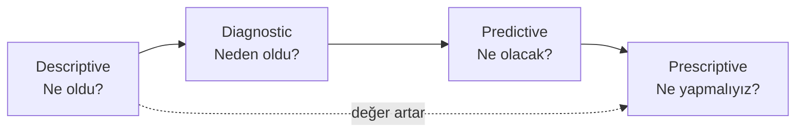

Veri analitiğinin Gartner tarafından popülerleştirilmiş klasik bir hiyerarşisi var: **tanımlayıcı (descriptive), tanısal (diagnostic), öngörücü (predictive) ve kuralcı (prescriptive)**. Kurumsal raporlarda sürekli karşımıza çıkan dört kutucuklu o güzel piramit, sıkça yönetici slaytı seviyesinde kalır. Oysa bu sınıflama mühendislik sahasında ciddi bir yol haritasıdır — bir takımın *gözlemlemek*ten *karar verdirmek*e doğru olgunlaşma seviyesini ölçer.

[Gartner'ın "Analytic Ascendancy Model"](https://learningdiscourses.com/subdiscourse/analytics-maturity-gartner-analytic-ascendancy-model/) iki ekseni birlikte koyar: dikey eksende **değer** (insightful → optimizing), yatay eksende **insan müdahalesi**. Yukarı çıktıkça hem değer artar hem de kararı *otomatik* veren bileşen büyür. Mühendislik takımlarının çoğu birinci basamakta tıkanır; nedenlerini ve yukarı çıkmanın somut araçlarını bu yazıda inceleyeceğiz.

---

## 1. Tanımlayıcı (Descriptive) — "Ne Oldu?"

En temel ve en yaygın katman. Geçmiş veriyi özetler: ortalamalar, sayımlar, trendler, dashboard'lar, KPI raporları. Soru çok masum görünür: *"Geçen sprintte kaç build kırıldı?"* — ama bu sorunun cevabını üretmek başlı başına bir iştir.

Mühendislikte tanımlayıcı analitiğin tipik tezahürleri:

- **Uçuş veri kaydedici (FDR/CVR) çıktıları.** Uçak inişten sonra QAR (Quick Access Recorder) verisi yer sistemlerine indirilir, parametre seviyesinde özetlenir: tırmanış oranları, motor parametrelerinin ortalamaları, hard landing eşik aşımları. Bu hiçbir şeyi açıklamaz; sadece *ne olduğunu* gösterir.
- **MTBF/MTTR panoları.** Filo bazlı arıza-arası ortalama süre, onarım süresi histogramları. RAMS (Reliability/Availability/Maintainability/Safety) ekibinin başlangıç noktası.
- **CI build/test metrikleri.** Geçen haftaki test pass rate, coverage yüzdesi, build süreleri. Hemen her geliştirme takımının ilk kurduğu pano.
- **Telemetri özetleri.** Cihaz başına saatlik ortalama sıcaklık, CPU yükü, paket kaybı.

Pratik tuzak: bu katmanda kalmak. Bir takım yıllarca Grafana ekranına bakar, "ortalama %5 arttı"ya tepki verir ama *neden* arttığını anlamadan parametre değiştirmeye başlar. Tanımlayıcı analitik bir başlangıçtır, çözüm değil.

**Araç dünyası:** Grafana, Power BI, Tableau, Kibana; gömülü tarafta `gnuplot` ve Python `pandas` ile özet betikleri; QAR analizinde Teledyne AID ve benzeri yer istasyonu yazılımları.

---

## 2. Tanısal (Diagnostic) — "Neden Oldu?"

İkinci basamak korelasyon, drill-down ve kök neden analizidir. Tanımlayıcı katmandaki bir anomalinin *kaynağına* iner. Mühendislik bu basamağı çoğu zaman "veri analitiği" olarak adlandırmaz; biz buna *root cause analysis* veya *post-mortem* deriz — ama soyut olarak aynı şeydir.

Sahada birkaç tipik örnek:

- **Olay sonrası (post-incident) analiz.** Bir uçuşta autopilot beklenmedik biçimde disengage olmuş. FDR verisinde o anki tüm parametrelere — IAS, altitude, autopilot mode, vertical speed — bir arada bakılır; aday hipotezler eleminasyonla daraltılır.
- **Fault Tree Analysis (FTA).** "Sistem X kullanılamaz hale geldi" tepe olayından AND/OR kapılarıyla aşağı inilerek minimal cut set bulunur. FTA bir geleceği tahmin etmez; geçmişteki ya da hipotetik bir arızanın *neden olabileceğini* anlatır.
- **Log korelasyonu.** Üretimdeki bir microservice'in p99 latency'si yükselmiş. Loglar, metrikler, dağıtık trace'ler bir araya getirilip "şu sürümle birlikte şu DB sorgusu yavaşladı" sonucuna varılır. Elasticsearch + Kibana, Honeycomb, Datadog APM, OpenTelemetry bu işin standart araçları.
- **Drill-down dashboard.** Filo geneli yakıt sarfiyatı 2% artmış. Hava şirketi tipi, rota, kuyruk numarası, kaptan, hava koşulu boyutlarına ayrılır — "artış sadece Boeing 738 + LIS-AYT rotasında, dik tırmanış faz'ında" gibi bir teşhise inilir.

Tanısal analitiğin asıl zorluğu **istatistik değil**, doğru *boyutsal modelleme*. Verinin hangi etiketlerle (rota, kuyruk, faz, sürüm, sıcaklık aralığı) zenginleştirildiği belirlenmemişse, drill-down yapamazsınız. Bu yüzden tanısal katmana çıkmak için önce data warehouse / veri modeli işine giriş gerekir — Kimball tarzı star schema, "fact + dimension" mimarisi.

Mühendislikte özel bir alt kategori: **kontrollü reprodüksiyon**. Üretimdeki bir bug'ı gerçekten anlamak için onu CI ortamında bilinçli olarak tetiklemek. Renode gibi tam-SoC simülatörleri tam burada işe yarar (bkz. [Renode ile Zynq7000 Simülasyonu]()) — tanısal analitiğin lab kolu.

---

## 3. Öngörücü (Predictive) — "Ne Olacak?"

Üçüncü basamak geleceğe bakar: regresyon, zaman serileri, klasik istatistiksel modeller veya makine öğrenmesi. Hard real-time gömülü tarafında öngörücü analitik adı duyulmaz ama *prognostik* deriz; havacılık olgunluk modelinde bu işin kendine ait bir disiplin adı bile vardır: **Prognostics and Health Management (PHM)**. [NASA Prognostics Center of Excellence](https://www.nasa.gov/intelligent-systems-division/discovery-and-systems-health/pcoe/pcoe-data-set-repository/) bu alanın referans veri kümelerinden (C-MAPSS turbofan, PHM 2012 bearing) sorumludur.

Öngörücü mühendislik analitiğinin başlıca örnekleri:

- **Remaining Useful Life (RUL) kestirimi.** Bir rulmanın titreşim spektrumundaki kurtosis ve RMS değerleri zaman içinde nasıl gelişiyor? Hangi noktada bearing failure'a `N` saat kalmıştır? Klasik yaklaşım: bir degradation indicator hesaplanır, eşik geçişine kalan süre extrapolasyonla bulunur. Modern yaklaşım: LSTM / TCN tabanlı modeller doğrudan RUL'u regress eder. NASA bearing dataset'leri tam bunun için kullanılır.
- **Filo bazlı arıza tahmini.** [Airbus Skywise](https://services.airbus.com/en/aircraft-availability/digital-solutions-for-aircraft-availability/skywise-fleet-performance/skywise-health-monitoring.html) ve [Rolls-Royce TotalCare / IntelligentEngine](https://www.rolls-royce.com/products-and-services/civil-aerospace/services/totalcare.aspx) bu işin endüstri ölçeğindeki tezahürleridir. Rolls-Royce 13 000+ uçuş motorunu gerçek zamanlı izlediğini açıklıyor; IntelligentEngine programı (2018) sensör verisini bir digital twin'e besleyerek parça bazında kalan ömrü tahmin ediyor.
- **Yazılım tarafında değişim etkisinin tahmini.** Bir commit'in regresyon riskini, geçmiş test-failure örüntülerinden tahmin etmek. Facebook'un Sapienz, Microsoft'un FastPass test seçimi gibi çalışmaları bu kovaya girer.
- **Kapasite planlama.** Bir ground station'un üç ay sonraki link bütçesinin hangi geçişlerde marjinde kalacağını orbital mekanik + payload telemetri trendleriyle önceden hesaplamak.

Öngörücü modelin tek başına bir cevap olmadığını unutmamak lazım: **belirsizlik aralığı** çıkmazsa, çıkan tek noktasal kestirim mühendislik kararı için neredeyse değersizdir. RUL tahmini ile birlikte "%90 güven aralığında 280–520 saat" demek; "tam olarak 400 saat" demekten kat kat değerlidir. Belirsizlik kantifikasyonu (UQ — uncertainty quantification) PHM literatürünün son on yılda en çok büyüyen alt-dalı. [Ölçüm Belirsizliği yazısındaki]() GUM mantığı burada da geçerli; sadece "ölçtüğümüz şey" yerine "tahmin ettiğimiz şey" var.

---

## 4. Kuralcı (Prescriptive) — "Ne Yapmalıyız?"

En üst basamak. Sadece *ne olacağını* söylemekle kalmaz, *en iyi aksiyonun ne olduğunu* önerir. Sorun bir optimizasyon problemi olarak formüle edilir, çözücü çalıştırılır, çıkan plan ya doğrudan uygulanır ya da insana önerilir. [Yöneylem Araştırması Yöntemleri yazısında]() anlatılan tüm yöntemler aslında kuralcı analitiğin teorik temelini oluşturuyor.

Mühendislik / havacılık kuralcı analitiği örnekleri:

- **Bakım çizelgeleme.** PHM tarafından üretilmiş RUL kestirimleri (öngörücü çıktı) + uçak operasyon planı + hangar kapasitesi + mekanik vardiyaları → MILP olarak yazılır, "her uçak için bir sonraki C-check tarihi" çıktısı alınır. Karar verici insanı tek tek uçaklara değil, sadece çelişen kısıtlara odaklanmaya iter.
- **Rota ve kapı (gate) atama.** Havalimanı operasyonlarında her uçuşun hangi gate'e, hangi taxi yoluna, hangi runway'e atanacağı; gecikme + yakıt + müşteri memnuniyetini birlikte minimize edecek şekilde optimize edilir.
- **Otonom sistemde gerçek zamanlı karar.** Bir İHA'nın mission planner'ı, sensör belirsizliği ve görev kısıtları altında "şu an sola dönmeli mi, manevra yapmalı mı, görevi iptal etmeli mi" sorusunu MPC (Model Predictive Control) çerçevesinde çözer. Kuralcı analitiğin saniyelik karar tarafı.
- **Spare parts dağıtımı.** Uluslararası bir filoda hangi yedek parçanın hangi MRO üssünde, hangi adetle bulunması gerektiği; arıza dağılımı + lojistik gecikme + depo maliyeti birlikte hesaplanır.
- **CI test seçimi & sıralaması.** Sınırlı CI bütçesi altında en yüksek "bug bulma olasılığını" üretecek test alt-kümesi ve sıralaması bir optimizasyon problemidir.

Kuralcı analitiğin teknik araç dünyası: lineer / tam-sayı programlama için Gurobi, CPLEX, [OR-Tools](https://developers.google.com/optimization); kısıt programlama için MiniZinc; simülasyon tabanlı karar için AnyLogic veya doğrudan Monte Carlo. Pratik kuralcı sistem hiç açıkça "machine learning" demese de, yapılan iş budur.

---

## Olgunluk Merdiveni — Çoğu Takım Neden Birinci Basamakta Tıkanır?

Sahada gözlemim şu: pek çok mühendislik takımı tanımlayıcı katmanı kurar (Grafana panoları, haftalık raporlar), bir adım yukarı çıkmaya cesaret edemez. Sebepleri çok mistik değil:

| Engel | Tanısala geçişte | Öngörücüye geçişte | Kuralcıya geçişte |
|---|---|---|---|
| Veri modeli yok | Drill-down boyutu yok | Feature engineering imkansız | Karar değişkeni tanımsız |
| Etiket / kalite | Eksik konfigürasyon log'u | Train veri seti üretilemez | Kısıt fonksiyonu kalitesiz |
| Hesap altyapısı | Sorgular yavaş, ad hoc | Eğitim/inference pipeline yok | Çözücü altyapısı (CPLEX vs.) yok |
| Organizasyon | "Kim sorumlu?" belirsiz | Veri bilimi ≠ mühendislik | İnsan-makine güven sınırı net değil |

İyi haber: her basamak bir öncekinin üzerine inşa edilir. Tanısal analitik yapmayan bir takımın öngörücü model eğitmesi neredeyse imkansız — çünkü hangi sinyalin "anormal" sayıldığını bilmez. Öngörücü çıktı üretmeyen bir takımın kuralcı sistem kurması da boş — çünkü optimize edeceği belirsiz bir geleceği yok.

Olgunluk modelinin bana göre en önemli ima'sı: **insan kararının dozu azalır, ama insanın *anlama* yükü artar.** Kuralcı sistem otomatik karar verebilir, ama o kararın doğruluğunu denetleyebilen biri olmazsa felaketle sonuçlanır. Uçuş kontrol yazılımındaki "envelope protection" tartışması (Air France 447 sonrası) tam olarak bu ekseni işliyor: makine her zaman doğru kararı vermez; insan operatör hem yetkin hem hesaplı kalmalı.

---

## Anti-Pattern'ler

Birkaç tekrarlayan sahada görülen tuzak:

**"Önce ML modeli, sonra altyapı."** Bir takım hiç tanımlayıcı pano kurmadan, veri ambarı modellemeden, doğrudan "ML ile arıza tahmini" projesine girişir. Sonuç: eğitim verisi tutarsız, label'lar gürültülü, üretim çıktısı kimse tarafından anlaşılamıyor. Önce *Ne oldu?* sorusunu güvenle cevaplayın.

**Belirsizlik üretmeyen tahmin.** "Bu rulman 312 saat sonra arızalanacak." Sayı tek başına yararsız. Mühendislik kararı için interval (örn. 200–450 saat, %90 güven) ve kullanılan model varsayımları gerekir.

**Optimize edilen yanlış metrik.** Kuralcı sistemin objective function'ı operasyon gerçeğini değil bir KPI'ı optimize ederse, "Goodhart's Law" devreye girer. Klasik örnek: filo dağıtım optimizasyonu yakıtı %3 azaltır ama mürettebat fazla mesaisini patlatır — net maliyet artar.

**İnsan müdahalesini öldüren UI.** Kuralcı sistemin önerisini "kabul / ret" düğmesine indirgemek; operatöre *neden bu önerildiğini* göstermemek. Açıklanabilirlik (explainability) bu basamakta opsiyon değil, zorunluluk.

---

## Mühendis İçin Pratik Sonuç

Veri analitiği piramidi pazarlama jargonu gibi durur ama mühendislik takımının olgunluğunu ölçen oldukça pratik bir cetveldir. Şu üç soruyu kendinize sormak yeterli:

1. **Dün ne oldu?** sorusuna 60 saniyede cevap verebiliyor musunuz? Hayırsa: tanımlayıcı katmanın gediği var.
2. **Neden oldu?** sorusunu bir kişinin hafızasına bağlı olmadan, panoyla yanıtlayabiliyor musunuz? Hayırsa: tanısal katmanın boyut modeli eksik.
3. **Hangi parçaya hangi tarihte ne yapacağız?** sorusunun cevabı ML modelinden + optimizasyondan otomatik mi geliyor? Hayırsa: öngörücü/kuralcı katmanlar henüz yok.

Çoğu emniyet kritik mühendislik takımı 1. ve 2. soruda olgunlaşmıştır; 3. soru ise hâlâ büyük ölçüde uzman insan kararına dayanır — ki sertifikasyon ve sorumluluk bağlamında bu doğru tercihtir. Aksi takdirde DO-178C'nin "tool qualification" bölümü gereksiz olurdu. Yine de PHM ve kuralcı sistemler yardımcı (advisory) rolde her geçen yıl daha fazla yer ediniyor; bu trendi anlamak için piramidi ana hatlarıyla bilmek artık bir lüks değil.

---

## Kaynaklar

- Gartner. [*Analytic Ascendancy Model — Maturity Levels*](https://learningdiscourses.com/subdiscourse/analytics-maturity-gartner-analytic-ascendancy-model/) (kurumsal piramit açıklaması).
- Airbus. [*Skywise Health Monitoring*](https://services.airbus.com/en/aircraft-availability/digital-solutions-for-aircraft-availability/skywise-fleet-performance/skywise-health-monitoring.html).
- Rolls-Royce. [*TotalCare*](https://www.rolls-royce.com/products-and-services/civil-aerospace/services/totalcare.aspx) ve [*IntelligentEngine — Driven by Data*](https://www.rolls-royce.com/media/press-releases/2018/06-02-2018-rr-intelligentengine-driven-by-data.aspx).
- NASA Prognostics Center of Excellence. [*Data Set Repository*](https://www.nasa.gov/intelligent-systems-division/discovery-and-systems-health/pcoe/pcoe-data-set-repository/) — C-MAPSS, bearing, lithium-ion battery dataset'leri.
- Google. [*OR-Tools*](https://developers.google.com/optimization) — açık kaynak kuralcı analitik çözücüleri.
- Kimball, R. *The Data Warehouse Toolkit* (3rd ed., Wiley, 2013) — boyutsal modelleme klasiği.
- Bu blogdan ilgili yazılar: [Yöneylem Araştırması Yöntemleri](), [Ölçüm Belirsizliği (GUM Annex F + NCSLI RP-12)](), [Renode ile Zynq7000 Simülasyonu]().
