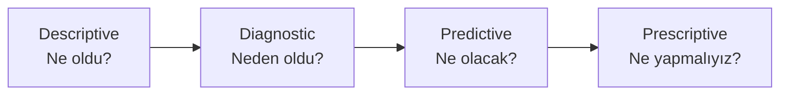

Veri analitiği denince çoğu kişinin aklına "büyük veri", "yapay zeka" gibi modern terimler gelir. Oysa konuyu basit, dört aşamalı bir hiyerarşi ile anlatmak mümkün:

1. **Tanımlayıcı (Descriptive)** — *Ne oldu?*
2. **Tanısal (Diagnostic)** — *Neden oldu?*
3. **Öngörücü (Predictive)** — *Ne olacak?*
4. **Kuralcı (Prescriptive)** — *Ne yapmalıyız?*

Bu dört basamak aslında bir mühendislik takımının veriye karşı olgunluğunu gösterir. Aşağı basamaklardakiler verinin içinde olanı sayar; yukarı basamaktakiler ise veriden çıkardığı sonuçla *karar verir*. Her basamak bir öncekinin üzerine inşa edilir.

Bu yazıda dört basamağı kısaca tanıtıp her birini hem genel mühendislik hem de benim çalıştığım aviyonik / gömülü dünyadan tanıdık örneklerle açıklayacağım.

---

## 1. Tanımlayıcı — "Ne Oldu?"

En basit ve en yaygın katman. Geçmiş veriyi özetler: ortalamalar, sayımlar, trendler, raporlar, dashboard'lar. Hiçbir yorum yapmaz, sadece anlatır.

Genel mühendislikten örnekler:

- Geçen ay kaç arıza yaşandı?
- Üretim hattının haftalık verim grafiği.
- CI sisteminde geçen sprint'te kaç test geçti, kaç test kırıldı?
- Bir sunucunun saatlik CPU kullanım grafiği.

Aviyonik / gömülü tarafından örnekler:

- Uçuş veri kaydedicisinin (FDR) inişten sonra üretilen rapor: motor sıcaklığı ortalamaları, tırmanış oranı, eşik aşımları.
- Filo bazlı arıza sayıları ve ortalama tamir süresi tabloları.
- Test ortamındaki gömülü cihazların gece boyunca üretilen sıcaklık ve akım logları.

Tanımlayıcı analitik bir başlangıçtır. Bir takım sadece bu katmanda kalırsa, neyin değiştiğini görür ama nedenini bilemez. Pek çok mühendislik organizasyonu yıllarca bu basamakta tıkanır — pano kurmak çözüm değil, sadece görmek için bir araçtır.

---

## 2. Tanısal — "Neden Oldu?"

İkinci basamak verideki bir anomalinin *kaynağını* anlamaya çalışır. Aslında mühendislik bunu hep yapar; biz buna "veri analitiği" demeyiz, "kök neden analizi" deriz — ama yaptığımız iş budur.

Genel örnekler:

- Bir ürün hattında kalite oranı düşmüş; bunu bir tedarikçi değişikliğine veya bir vardiya değişikliğine bağlamak.
- Sistemdeki bir yavaşlamanın hangi sürümle başladığını log'lara bakarak bulmak.
- Klasik "5 Why" yöntemi ile bir arızanın katmanlarını soyup gerçek sebebe ulaşmak.

Aviyonik / gömülü tarafından örnekler:

- Bir uçuş sırasında autopilot beklenmedik şekilde devre dışı kalmış; FDR verisindeki o ana ait parametrelerin hepsine birden bakıp olası nedeni bulmak.
- Test sırasında kırılan bir test case için debugger ile sistemde adım adım ilerleyip hatanın hangi koşulda tetiklendiğini bulmak.
- Filodaki bir parçanın belirli bir rotada daha sık arızalandığını fark edip nedenini araştırmak (titreşim mi, sıcaklık mı, rakım mı?).

Tanısal analitiğin asıl güçlüğü istatistik değil; **doğru soruyu doğru veriyle eşleştirmek**. Eğer veri yeterince etiketli değilse (hangi sürüm, hangi cihaz, hangi vardiya, hangi rota), drill-down yapmak imkansızdır. Bu yüzden tanısal katmana çıkmak için önce veriyi düzenli toplamak gerekir.

---

## 3. Öngörücü — "Ne Olacak?"

Üçüncü basamak geleceğe bakar. Geçmiş veriden çıkarılan modeller kullanılarak ileride ne olacağı tahmin edilir. İstatistik ve makine öğrenmesi en çok bu katmanda işin içine girer.

Genel örnekler:

- Hava durumu tahmini — klasik öngörücü analitik.
- Bir e-ticaret sitesinin önümüzdeki ay hangi ürünün ne kadar satacağını tahmin etmesi.
- Endüstriyel bir motorun titreşim verisine bakarak rulmanın ne zaman arızalanacağının önceden kestirilmesi (predictive maintenance).

Aviyonik / gömülü tarafından örnekler:

- Uçak motorlarının sensör verilerinden hangi parçanın ne zaman bakıma alınması gerektiğinin önceden hesaplanması.
- Bir cihazın geçmiş sıcaklık trendine bakarak yaz aylarında soğutmanın yeterli olup olmayacağının önceden anlaşılması.
- Filo seviyesinde, hangi uçaktan önümüzdeki üç ayda hangi sıklıkla hangi arıza beklendiğinin kestirilmesi.

Önemli bir nokta: öngörücü model tek başına yetmez. *"Bu parça 300 saat sonra arızalanacak"* yerine *"%90 ihtimalle 250–400 saat arasında arızalanacak"* demek, mühendislik kararı için çok daha değerlidir. Belirsizliği gözardı eden tahminler genellikle yanıltıcıdır.

---

## 4. Kuralcı — "Ne Yapmalıyız?"

En üst basamak. Sadece ne olacağını söylemekle kalmaz, *en iyi aksiyonun ne olduğunu* önerir. Tahmin + kısıtlar + bir optimizasyon problemi birleşir; çözücü çalıştırılır; ortaya bir karar çıkar.

Genel örnekler:

- Bir kargo şirketinin günlük teslimat rotalarını en az yakıtla planlaması.
- Bir hastanenin ameliyathane çizelgesini doktor, ekipman ve hasta kısıtlarına göre otomatik üretmesi.
- Çağrı merkezinin vardiya planlamasını talep tahminine göre optimize etmesi.

Aviyonik / gömülü tarafından örnekler:

- Bir hava şirketinin bakım planlamasını uçakların uçuş programına, hangar kapasitesine ve teknisyen vardiyalarına göre otomatik üretmesi.
- Yedek parçaların hangi havalimanında ne kadar bulundurulacağına dair optimizasyon — arıza tahmini ve lojistik maliyeti bir arada hesaplanır.
- Uçuş kontrol yazılımındaki "envelope protection" mantığı: pilotun komutu güvenli sınırların dışına çıkıyorsa sistemin otomatik müdahale etmesi. Bu da bir tür gerçek zamanlı kuralcı karardır.

Kuralcı analitik, [Yöneylem Araştırması Yöntemleri]() yazısında anlattığım klasik optimizasyon tekniklerinin pratik uygulamasıdır — lineer programlama, tam-sayı programlama, simülasyon. Konunun matematiksel temeli o yazıda; bu yazı sadece olgunluk hiyerarşisinde nereye düştüğünü gösteriyor.

---

## Basamaklar Arası Geçiş — Neden Çoğu Takım Yukarı Çıkamaz?

Sahadaki gözlem şu: pek çok mühendislik takımı tanımlayıcı katmanı kurar (panolar, raporlar) ve orada kalır. Bir adım yukarı çıkmak kolay görünür ama değildir, çünkü her basamağın altyapı gereksinimi farklıdır:

- **Tanısal** için verinin yeterince etiketli (sürüm, cihaz, koşul) toplanmış olması gerekir.
- **Öngörücü** için tutarlı, uzun süreli ve temiz bir tarihçe gerekir; ayrıca tahmin modelini üretim ortamına entegre edecek bir altyapı.
- **Kuralcı** için sistemin önerisini kabul edip uygulayabilecek (veya doğru yerlerde geçersiz kılabilecek) bir karar çerçevesi gerekir.

Yukarı çıktıkça insan kararının dozu azalır, ama insanın anlama ve denetleme yükü artar. Otomatik karar veren bir sistem yanıldığında, onu sorgulayabilen biri olmalı. Emniyet kritik mühendislikte bu denge çok hassas; bu yüzden sertifikasyon dünyası kuralcı sistemlere temkinli yaklaşır.

---

## Pratik Sonuç

Veri analitiği piramidi karmaşık görünen ama aslında basit bir cetveldir. Kendi takımınız için şu soruyu sormak yeterli:

- Geçen hafta ne oldu sorusuna kolayca cevap verebiliyor muyuz?
- Bir anomalinin nedenini panodan bulabiliyor muyuz, yoksa "şu kişi bilir" mi diyoruz?
- Önümüzdeki ay ne olacağını öngörebiliyor muyuz?
- Karar otomatik öneriden mi geliyor, yoksa toplantıda mı veriliyor?

Çoğu mühendislik takımı ilk iki basamakta olgunlaşmıştır. Üçüncü basamağa geçiş son yıllarda ucuzladı; dördüncü basamak ise hâlâ büyük ölçüde insan kararına bağlı kalıyor — emniyet kritik sistemlerde bunun böyle olması büyük ölçüde doğru tercih. Yine de bu hiyerarşiyi bilmek, hem takımın bulunduğu yeri anlamak hem de bir sonraki adımı planlamak için pratik bir araç sağlıyor.
