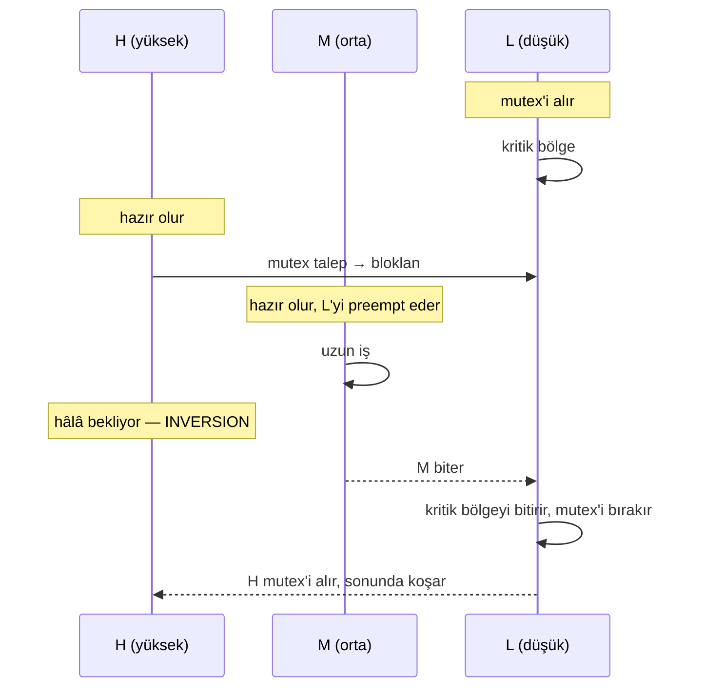

4 Temmuz 1997. Mars Pathfinder yüzeye iniyor, hava balonları söndürülüyor, kamera tripod kurulumunu tamamlıyor. NASA salonlarda kutlama yapıyor. Birkaç gün sonra ise telsizden tuhaf bir şey geliyor: araç, görünür bir nedeni olmadan kendini reset'liyor. Bilim verisi kayboluyor, görev planı yeniden hizalanmak zorunda kalıyor. Sorun bir donanım arızası değil — bir RTOS davranışı. Spesifik olarak: **priority inversion**.

Bu hikâye gömülü sistem derslerinde sık anılır, ama Türkçe kaynaklarda çoğunlukla "öncelik tersine dönmesi var, bilesin" şeklinde özetlenip geçilir. Halbuki olayın tam anatomisi — VxWorks mutex'inin hangi flag'i kapalıydı, neden reset tetiklendi, FreeRTOS'ta aynı durumu nasıl somut olarak yeniden üretebiliriz, ve **priority inheritance** ile **priority ceiling** arasındaki seçim mühendislik açısından ne demek — derli toplu bir yerde nadiren bulunur. Bu yazıda Pathfinder'ın bug'ını sökeceğiz, FreeRTOS üzerinde resetli bir minyatür örneğini koşturacağız, sonra iki klasik çözümün worst-case bloklama sürelerini matematiksel olarak karşılaştırıp aviyonik yazılım için ne anlama geldiğini konuşacağız.

---

## Priority inversion nedir, neden RTOS'larda sürpriz değil?

Klasik anlatımı üç görevle yapalım: yüksek öncelikli `H`, orta öncelikli `M`, düşük öncelikli `L`. Paylaşılan bir kaynak (örneğin bir veriyolu, bir tampon, bir konfigürasyon yapısı) `L`'nin elinde tuttuğu bir mutex ile korunuyor.

Zaman çizgisi şöyle ilerler:

1. `L` mutex'i alır, kritik bölgesine girer.
2. `H` çalışmaya hazır olur. Çekirdek `L`'yi keser, `H`'ye CPU verir. `H` mutex'i talep eder; mutex `L`'de olduğu için `H` **bloklanır**. Şimdi `L` tekrar çalışır.
3. Tam o sırada `M` çalışmaya hazır olur. `M`'nin önceliği `L`'den yüksek; çekirdek `L`'yi keser, `M`'yi koşturur.
4. `M` ne kadar uzun çalışırsa, `H` o kadar bekler. Üstelik `M`'nin mutex ile ilgisi bile yoktur — sadece `L`'den yüksek öncelikli olduğu için onu engellemektedir.

Bu son adımda olan şey priority inversion'dur: `H`, kendisinden iki öncelik aşağıdaki `M` tarafından **dolaylı olarak** geciktirilir. "İnversiyon"un adı buradan gelir; sistemin önceliklendirmesi anlık olarak tersine dönmüştür. Eğer `M` sınırsız bir süre koşarsa (örneğin uzun bir iletişim oturumu) `H` deadline'ını kaçırır.

Bu davranış bir RTOS hatası değil — kuralları doğru uygulayan her preemptive scheduler'da kaçınılmazdır. Anormal olan, mühendisin bunu fark etmeden bırakmasıdır.



---

## Pathfinder'da gerçekten ne oldu?

Pathfinder'ın araç içi bilgisayarı bir RAD6000 üzerinde **VxWorks** koşuyordu. Aracın bütün alt sistemleri (kamera, ASI/MET meteoroloji paketi, radyo, bilim veri kaydı) bir **MIL-STD-1553** veriyolu üzerinden veri paylaşıyordu. Glenn Reeves'in JPL adına yayımladığı açıklamaya göre yolu yöneten iki görev vardı:

- `bc_sched` — bir sonraki 1553 döngüsünün işlemlerini hazırlayan zamanlayıcı.
- `bc_dist` — bu döngüde okunan/yazılan veriyi alıp ilgili istemcilere dağıtan görev.

Her ikisi de yüksek öncelikteydi. Ortada bir adet "information bus" tampon yapısı vardı; tampona her yazan, küçük bir VxWorks mutex'i alıp tutuyordu. Bu mutex'in kritik özelliği şuydu: oluşturulurken `SEM_INVERSION_SAFE` opsiyonu **verilmemişti**. VxWorks'te bir mutex'in priority inheritance yapması için kurulumda açıkça `semMCreate(SEM_Q_PRIORITY | SEM_INVERSION_SAFE)` denmesi gerekir. Verilmezse mutex sıradan bir karşılıklı dışlama nesnesi gibi davranır — kuyruğu vardır ama bekleyenin önceliğini sahibe taşımaz.

Olay şu adımlarla gelişti:

1. **ASI/MET** (meteoroloji, düşük öncelik) tampona veri yazmak için mutex'i aldı.
2. Bu sırada **bc_dist** (yüksek öncelik) çalışmaya hazır oldu, aynı mutex'i istedi ve bloklandı.
3. Tam o sırada **iletişim görevi** (orta öncelik) tetiklendi. ASI/MET'ten yüksek olduğu için ASI/MET'i preempt etti ve uzunca çalıştı.
4. ASI/MET hâlâ mutex'i tutuyor; bc_dist hâlâ bekliyor. bc_dist'in döngü içinde bitmesi gereken son saniyesi geldi.
5. **bc_sched** uyandığında bc_dist'in işini tamamlamadığını gördü. Bu, sistem tarafından "yazılım kontrolden çıkmış" olarak yorumlanan bir deadline ihlaliydi. Spacecraft kendini reset'ledi.

Reset bir watchdog değildi; iş hattını koruyan zamanlayıcının kendisiydi. Mantıksal olarak doğru, mühendislik olarak ölümcül.

JPL ekibi resetleri yerdeki ikiz model üzerinde günlerce reproduce etmeye çalıştı. Sorunu yakalayan, eve gitmeyen son mühendisin VxWorks trace'lerini gece yarısı incelemesi oldu. Düzeltme olağanüstüydü: aracın çalışmakta olan firmware'ine küçük bir C programı yüklendi, program bu mutex'in flag'ini sahada değiştirip `SEM_INVERSION_SAFE`'i açtı. Bir daha reset olmadı.

> **Reeves'in dersi, aynen aktarıyorum:** *"COTS uçurmak güzel — yeter ki nasıl çalıştığını gerçekten bildiğinden emin ol."*

Burada altını çizmek istediğim şey VxWorks'ün "kötü" olduğu değil. VxWorks ne istediyseniz onu yaptı: söz konusu mutex tipi varsayılan olarak priority inheritance yapmıyor; çünkü inheritance ucuz değil, scheduler'ın her `take`/`give` çağrısında öncelik zincirlerini güncellemesi gerekir. Karar **mühendisindi** ve "performans için bırakalım kapalı" deyip geçildi. Sertifikasyon dilinde söyleyecek olursak: bir COTS bileşenin opsiyonel davranışını **gerekçelendirilmemiş** seçtiniz.

---

## İki klasik çözüm: priority inheritance vs priority ceiling

Priority inversion'a karşı literatürde iki ana protokol vardır. İkisi de Sha, Rajkumar ve Lehoczky'nin 1990 tarihli "Priority Inheritance Protocols" makalesinden gelir.

**Priority Inheritance Protocol (PIP).** Bir görev `T_L` bir mutex tutuyor ve daha yüksek öncelikli bir görev `T_H` bu mutex'i istiyorsa, `T_L`'nin önceliği geçici olarak `T_H` seviyesine yükseltilir. `T_L` kritik bölgeyi bitirip mutex'i bıraktığında önceliği eski seviyesine düşer. Mantık basittir: "mutex'i serbest bırakmadan önce yolundan çekilmeni istemiyorum, o yüzden geçici olarak senin önceliğini de yüksek sayıyorum."

**Priority Ceiling Protocol (PCP).** Her kaynağa, onu kullanabilecek **en yüksek öncelikli** görevin önceliğine eşit bir "tavan" (ceiling) atanır. Bir görev kaynağı talep ettiğinde, anlık olarak tüm kilitli kaynakların tavanlarının maksimumuna yükseltilir. Etki şu olur: bir göreve kilit verirken aslında "sen bu süre boyunca tavan kadar önceliklisin" demiş olursun.

PCP'nin iki kuvvetli garantisi vardır:

- **Tek seferlik bloklama:** Bir göreve, ömrü boyunca en fazla **bir** kritik bölge boyu bloklama yaşatır; chained blocking olmaz.
- **Deadlock-freedom:** Tavanlar üzerinden gelen sıralama, döngüsel bekleyişi yapısal olarak engeller.

PIP'in zayıf noktası tam burada görünür. İç içe kilitler (nested locks) varsa PIP zincirleme bloklamaya açıktır: yüksek öncelikli görev, sırayla birden çok düşük öncelikli kilit sahibinin arkasında bekleyebilir.

Worst-case bloklama süresi `B_H` için kabaca:

- **PIP:** `B_H ≤ min(n, m) · C_max`, burada `n` görev sayısı, `m` mutex sayısı, `C_max` en uzun kritik bölge.
- **PCP:** `B_H ≤ C_max` — tek bir kritik bölge boyu.

Pratikte fark inanılmazdır: 3 düşük öncelikli görev ve 4 mutex varsa, PIP altında worst-case 3 kritik bölge boyu, PCP altında 1 kritik bölge boyudur.

Peki neden PIP yine de yaygın? Çünkü implementasyonu basittir, deadlock'a girmeyen iyi tasarlanmış sistemlerde average-case maliyet sıfıra yakındır (çekişme yoksa öncelik hiç değişmez) ve PCP'nin gerektirdiği **statik kaynak analizi** (her kaynağı kim kullanabilir? tavanı ne?) tasarım-zamanlı bilgi ister. Dinamik olarak yüklenen modüller varsa tavanları doğru hesaplamak zorlaşır.

Karar matrisi şudur:

| Sistem | Önerilen |
|---|---|
| Çekişme nadir, statik kaynak haritası belirsiz | PIP yeterli |
| Sert deadline'lar, schedulability analizi şart, deadlock kabul edilemez | PCP (ya da varyantı SRP) |
| Saf bare-metal, scheduler yok | Disable interrupts ve kritik bölgeleri **mikrosaniyelerle** ölç |

VxWorks ve FreeRTOS **PIP** sunar. RTEMS, SRP/PCP varyantlarını da destekler. POSIX `PTHREAD_PRIO_INHERIT` ve `PTHREAD_PRIO_PROTECT` ile her ikisini de standart sayar.

---

## FreeRTOS'ta inversion'u yeniden üretmek

Şimdi Pathfinder senaryosunun küçük bir kopyasını koşturalım. FreeRTOS'ta önemli bir ayrıntı var: `xSemaphoreCreateMutex()` ile oluşturduğunuz mutex'te priority inheritance **varsayılan olarak açıktır** — yani Reeves'in karşılaştığı durumun aksine, doğru API'yi kullanırsanız iyileşmiştir. Inversion'u somut olarak görmek için bilerek **binary semaphore** kullanacağız (`xSemaphoreCreateBinary`); bu nesne tipi inheritance yapmaz, böylece patolojiyi yakalayabiliriz.

`configUSE_MUTEXES = 1` ve `configUSE_PREEMPTION = 1` olduğunu varsayıyorum. Üç görev tanımlayalım:

```c
SemaphoreHandle_t shared_sem; /* Binary — INVERSION'a izin verir */

void task_L(void *pv)            /* düşük öncelik (1) */
{
    for (;;) {
        xSemaphoreTake(shared_sem, portMAX_DELAY);
        printf("[L] kritik bölgeye girdi @ %lu\n", xTaskGetTickCount());
        busy_work_ms(200);       /* veriyolu tamponuna yaz */
        printf("[L] kritik bölgeyi bitirdi @ %lu\n", xTaskGetTickCount());
        xSemaphoreGive(shared_sem);
        vTaskDelay(pdMS_TO_TICKS(1000));
    }
}

void task_M(void *pv)            /* orta öncelik (2) */
{
    vTaskDelay(pdMS_TO_TICKS(50));   /* L'nin mutex'i almasına izin ver */
    for (;;) {
        printf("[M] iletişim oturumu başlıyor @ %lu\n", xTaskGetTickCount());
        busy_work_ms(800);            /* uzun, CPU-bound iş */
        printf("[M] iletişim oturumu bitti  @ %lu\n", xTaskGetTickCount());
        vTaskDelay(pdMS_TO_TICKS(2000));
    }
}

void task_H(void *pv)            /* yüksek öncelik (3) */
{
    vTaskDelay(pdMS_TO_TICKS(60));   /* L mutex'i, M çalışmaya başladıktan sonra */
    for (;;) {
        TickType_t t0 = xTaskGetTickCount();
        printf("[H] mutex talebi @ %lu\n", t0);
        xSemaphoreTake(shared_sem, portMAX_DELAY);
        TickType_t t1 = xTaskGetTickCount();
        printf("[H] mutex'i aldı  @ %lu  (bloklanma: %lu ms)\n",
               t1, (t1 - t0) * portTICK_PERIOD_MS);
        busy_work_ms(20);
        xSemaphoreGive(shared_sem);
        vTaskDelay(pdMS_TO_TICKS(1500));
    }
}
```

`busy_work_ms` adımı yerine bir SysTick tabanlı meşgul döngü kullanın; `vTaskDelay` koymak senaryoyu bozar çünkü görevi gönüllü olarak bloklar. Tipik çıktı şöyle olur:

```
[L] kritik bölgeye girdi @ 0
[M] iletişim oturumu başlıyor @ 50
[H] mutex talebi @ 60
[M] iletişim oturumu bitti  @ 850
[L] kritik bölgeyi bitirdi @ 1000
[H] mutex'i aldı  @ 1000  (bloklanma: 940 ms)
```

`H`'nin nominal olarak 20 ms'lik bir kritik bölge için **940 ms** beklediğine dikkat edin. Bu sürenin 800'ü doğrudan `M`'nin işine bağlıdır; `H` mutex'in açılmasını bekliyor ama mutex'in açılması `L`'nin çalışmasına, `L`'nin çalışması da `M`'nin bitmesine bağlı. Bu rakam Pathfinder'da deadline'ı patlatan davranışın esası.

Şimdi tek satır değişiklik yapalım — `xSemaphoreCreateBinary()` yerine `xSemaphoreCreateMutex()`:

```c
shared_sem = xSemaphoreCreateMutex();
```

Aynı senaryoyu tekrar koşturduğunuzda çıktı şöyle olur:

```
[L] kritik bölgeye girdi @ 0
[M] iletişim oturumu başlıyor @ 50
[H] mutex talebi @ 60
[L] kritik bölgeyi bitirdi @ 210
[H] mutex'i aldı  @ 210  (bloklanma: 150 ms)
[M] iletişim oturumu bitti  @ 1020
```

`H` artık yalnızca `L`'nin kritik bölgesinin geri kalan kısmı kadar (150 ms) bekliyor. Çünkü `H` mutex'i isteyince FreeRTOS `L`'nin önceliğini geçici olarak `H` seviyesine yükseltti; bu yükselme `L`'nin `M` tarafından preempt edilmesini engelledi, `L` çekirdeği elinde tutup kritik bölgeyi bitirdi, mutex'i bıraktı. `M` daha sonra koştu, hâlâ 790 ms işi vardı. **Priority inheritance burada görünür hale geliyor.**

İki uyarı:

1. **`xSemaphoreCreateMutex()` ile `xSemaphoreCreateBinary()`'yi bir arada gördüğünüzde dikkatli olun.** Aynı görev iki tip semaforu farklı kaynaklar için kullanıyorsa, hangisinin inheritance yaptığı kolayca akıştan kaçar. Statik analiz (örn. PC-Lint, Coverity) bu farkı yakalamaz — semantik bilgi gerektirir.
2. **Recursive ihtiyaç varsa** `xSemaphoreCreateRecursiveMutex()`. Karşılığı VxWorks'te `SEM_INVERSION_SAFE | SEM_Q_PRIORITY`'dir; FreeRTOS recursive mutex de inheritance yapar.

PCP isterseniz FreeRTOS doğrudan sunmaz; `vTaskPrioritySet` ile elle kaldırmak gerekir. Bunu yaparken `taskENTER_CRITICAL` ile kritik bölgenin kendisinin scheduler tarafından bozulmadığından emin olun.

---

## Worst-case bloklama: somut bir hesap

Pathfinder örneğini sayısallaştıralım. Üç düşük öncelikli görevin, üç ayrı mutex tutarak yüksek öncelikli `H`'yi bloklayabildiği bir sistem düşünelim:

| Görev | Öncelik | Kritik bölge | Mutex |
|---|---|---|---|
| L1 | 1 | 30 ms | A |
| L2 | 1 | 40 ms | B |
| L3 | 1 | 25 ms | C |
| H  | 3 | (hepsini gerektirebilir) | A, B, C |

**PIP altında worst-case:** `H` üç ayrı kilidi sırayla bekleyebilir → `30 + 40 + 25 = 95 ms` zincirleme blok.

**PCP altında worst-case:** Tavanlar `H` ile aynı. `H` çalıştığında en fazla bir kritik bölge zaten elinde tutuluyor olabilir → `max(30, 40, 25) = 40 ms`.

İkinci kolonun altındaki sayı, bir schedulability analizi içine konduğunda, periyodu 100 ms olan `H`'nin çizelgelenebilir olup olmadığını belirleyebilir. PIP'te `H` bloklanma + kendi yürütme süresi periyodunu aşabilir; PCP'de boğa boynuzu yarıdan iner. Bu, "Liu-Layland'tan response time analizine geçtiğinizde" mühendislik kararlarınızı belirleyen rakamdır.

Bu nedenle DO-178C DAL A sistemlerinde RTOS seçerken bakılan kriterlerden biri şudur: **kullanılan kilit protokolünün tam adı ve worst-case bloklama formülü.** "Mutex var" cevabı yeterli değil; sertifikasyon paketinin içinde formülün kanıtı da olmalı.

---

## Mühendislik çıkarımları

Pathfinder'ın bize bıraktığı dersler şunlar:

1. **Bir COTS RTOS'un varsayılanları, sizin mühendislik kararınız değildir.** VxWorks Reeves'e söyleneni yaptı. Yanlış olan, "varsayılan iyidir" varsayımıydı. Aynı tuzak FreeRTOS'ta da var: `xSemaphoreCreateBinary` ile `xSemaphoreCreateMutex` API'leri yan yana durur, isimleri benzerdir, derleyici farkı yakalamaz. Code review listenize "her kilit nesnesi için inheritance açık mı?" satırını yazın.
2. **Yer testlerinde gözlemlenen reset'leri açıklayamadan uçurmayın.** Reeves uçuş öncesinde "bir veya iki" reset olduğunu kabul ediyor. Açıklanmamış bir reset, açıklanmış bir buga eşittir — tetikleyicisini bulamadığınız her reset, "henüz tetiklenmemiş" bir bug demektir.
3. **Statik analiz size priority inversion'u söylemez.** Coverity, Polyspace, LDRA gibi araçlar veri-akışı ve undefined behavior bulur; öncelik etkileşimlerini değil. Bunu yakalayan: (a) schedulability analizi, (b) tracing ile uzun zamanlı çalıştırma (örneğin Tracealyzer, Lauterbach), (c) fault injection — kilitli iken yüksek öncelikli görevi tetikleme testleri.
4. **Worst-case formülü kontrat olmalı.** RTOS dokümantasyonunda mutex'in worst-case bloklama formülü yazmıyorsa, o RTOS sertifikasyon paketine girmemeli. PIP'te `min(n,m)·C_max`, PCP'de `C_max` — bunlar pazarlık edilemez.
5. **"Reset oluyor ama sebebini bulamıyoruz" cevabı yoktur.** Pathfinder ekibi yer modelinde tracing ile sebebi yakaladı. Sahanızda tracing yapamıyorsanız (uçan sistemde), test çevresinde **VxWorks WindView / Tracealyzer / SEGGER SystemView gibi bir araç zorunlu**. Üretilen .trc dosyaları, anomali analizinizin tek delili.

Pathfinder bug'ı 30 yıl sonra hâlâ anlatılıyor olmasının nedeni, basit bir programcı dikkatsizliği değil, bir **COTS opsiyon konfigürasyonu** sorunu olmasıdır. Aynı sınıftan hatalar bugün Linux PREEMPT_RT mutex'lerinde, Zephyr'in `K_PRIO_PREEMPT` görevlerinde, hatta C++20 `std::counting_semaphore` kullanan modern aviyonik prototiplerinde tekrar üretilebilir. Çözüm de aynı: kullandığın senkronizasyon nesnesinin önce sözleşmesini oku, sonra varsayılanına güven.

---

## Açık sorular ve ileri okuma

- **Multi-core priority inversion:** Tek çekirdek için kurulan PIP/PCP, simetrik çok-çekirdekte (ARM Cortex-A SMP gibi) doğrudan çalışmaz. MCS, FMLP, OMLP gibi protokoller bu boşluğu kapatmayı hedefliyor — aviyonikte hâlâ pratik bir çözüm olgun değil.
- **Stochastic inversion analysis:** Worst-case yerine olasılıksal sınırlar (örn. probabilistic WCET) inversion analizinde de ilgi görüyor; sertifikasyon tarafı henüz isteksiz.
- Mars 2020 Perseverance'ın iniş sonrası watchdog reset'leri de geniş şekilde tartışıldı; resmi bir priority inversion açıklaması kamuya açık olarak yayımlanmadı.

---

## Kaynaklar

- Glenn E. Reeves, *"What really happened on Mars Rover Pathfinder"*, Cornell CS614 mirror — <https://www.cs.cornell.edu/courses/cs614/1999sp/papers/pathfinder.html>
- Reeves'in 1997 tarihli orijinal e-postası (CCSU arşivi) — <https://www.cs.ccsu.edu/~pelletie/local/risks/programming-software/pathfinder.html>
- Wind River, *VxWorks `semMLib` referansı* (`SEM_INVERSION_SAFE`, `SEM_Q_PRIORITY`) — <https://www.ee.torontomu.ca/~courses/ee8205/Data-Sheets/Tornado-VxWorks/vxworks/ref/semMLib.html>
- L. Sha, R. Rajkumar, J. P. Lehoczky, *"Priority Inheritance Protocols: An Approach to Real-Time Synchronization"*, IEEE Transactions on Computers, Vol. 39, No. 9, Eylül 1990.
- FreeRTOS Kernel Documentation — *Mutexes and Priority Inheritance*: <https://www.freertos.org/Documentation/02-Kernel/02-Kernel-features/02-Queues-mutexes-and-semaphores/04-Mutexes>
- FreeRTOS API: `xSemaphoreCreateMutex` — <https://www.freertos.org/Documentation/02-Kernel/04-API-references/10-Semaphore-and-Mutexes/06-xSemaphoreCreateMutex>
- Jane W. S. Liu, *Real-Time Systems*, Prentice Hall, 2000 — Chapter 8 (Resource Access Control).
- POSIX 1003.1-2017, `pthread_mutexattr_setprotocol` — `PTHREAD_PRIO_INHERIT` ve `PTHREAD_PRIO_PROTECT`.
