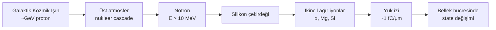
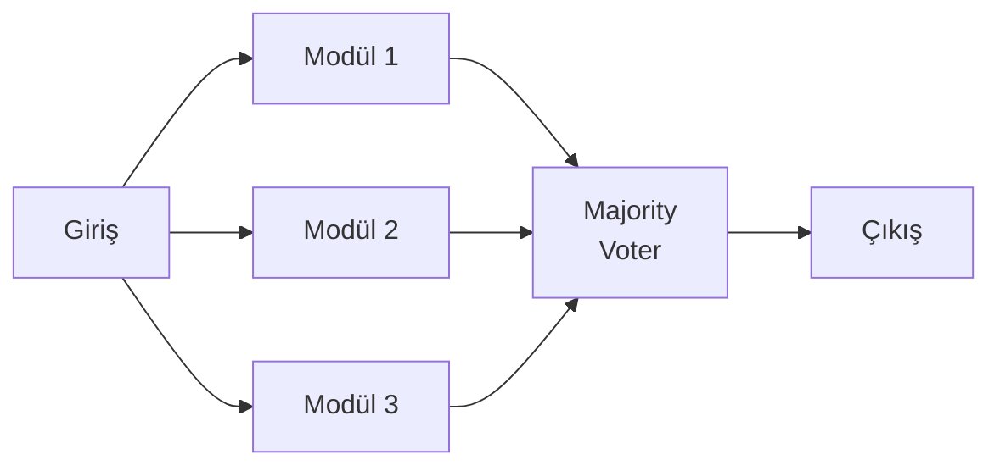

18 Mayıs 2003. Brüksel'in kuzeyindeki Schaerbeek belediyesinde elektronik oy sayım sistemi, MARIA listesinden Maria Vindevogel adlı adaya **4.096 ekstra oy** atadı. Sayı, listenin toplam tercih oyundan büyüktü; matematiksel olarak mümkün değildi. Resmi soruşturma sonucu açıktı: bir bellek hücresinde 13. konumdaki bit, 0'dan 1'e kendiliğinden döndü. 2¹² = 4096. Suçlu olarak galaktik kozmik ışın gösterildi.

Bu hikâye anekdot gibi okunur ama mesajı ciddidir: bilgisayar belleğindeki bir bit, kimse dokunmadan değişebilir. Yer seviyesinde bile. Üzerine üç defa ECC katmanı koymadığınız bir alanda. Üstelik bu olasılık, irtifa arttıkça **yüzlerce kat** büyür. Bir yolcu uçağında 12 km'de uçan bir bilgisayar, masanızdaki bilgisayardan çok daha yoğun bir parçacık banyosunun içindedir.

Bu yazıda fizikten matematiğe inip yazılım kararlarına çıkacağız: Atmosferik nötronlar belleği nasıl çevirir? Aviyonik bilgisayarlar bundan nasıl korunur? "ECC" deyip geçtiğimiz **SECDED Hamming(72,64)** kodu syndrome'ları gerçekte nasıl çözer, **3 bitlik bir hata** karşısında neden sessiz veri bozulması üretir, ve bu yüzden bellek "scrubbing" aralığı nasıl seçilir?

---

## Atmosferik nötronlar: rakamların büyüklüğü

Kozmik ışınlar atmosferin üst tabakalarındaki hava çekirdekleriyle çarpışır ve bir parçacık çağlayanı (cascade) doğurur. Yer seviyesine ulaşan en tehlikeli bileşen **yüksek enerjili nötronlardır** (E > 10 MeV). Yüksüz olduklarından elektromanyetik kalkanlar (Faraday kafesi, alüminyum gövde) bir işe yaramaz; doğrudan transistor kanalına dalarlar ve silikon çekirdekleriyle çarpışıp bir yük izi bırakırlar.

Endüstrinin bu olguyu ölçüp raporlamak için kabul ettiği referans, **JEDEC JESD89A** (2006; 2021'de JESD89B olarak revize edildi) standardıdır. JESD89A, **New York City'de, deniz seviyesinde, ortalama güneş döngüsü koşullarında ~13 n/cm²/saat** referans nötron akısını standart olarak kabul eder. Bütün toprak-seviyesi SER (Soft Error Rate) testleri bu referansa normalize edilir.

İrtifa bambaşka bir dünyadır. Aviyonik için kabul edilmiş referans **IEC TS 62396-1:2016** (Edition 2.0): *"Process management for avionics – Atmospheric radiation effects – Part 1"*. Standart, **40.000 ft / 45° enlem** koşulu için referans değer olarak **~6.000 n/cm²/saat** verir. Yani:

$$
\frac{\Phi_{40\,\text{kft}}}{\Phi_{\text{sea level}}} = \frac{6000}{13} \approx 460
$$

Ticari uçuş irtifalarında (~35 kft) sıkça alıntılanan "300×" rakamı, biraz daha düşük enlem ve irtifa kombinasyonlarına denk gelir; tüm aviyonik için "300–500× arası" pratikte güvenli bir aralıktır. Daha keskin ifade: yerde 100 yıl sonra meydana gelecek bir bit hatası, FL400'de 80 günde meydana gelir.

Bu nokta saplantı haline gelmiş bir efsaneyi de yıkar: "Aviyonik için aşırı koruma, paranoya değil mi?" Hayır. **Ölçülmüş bir fiziksel olgu** karşılığında, ortalama olarak yer ekipmanından **iki kademe büyük** soft-error oranıyla baş etmek gerekiyor.

---

## SEU, MBU, SEFI: aynı parçacığın üç yüzü

Aynı nötron darbesinin sonucu, vurduğu yere göre farklı isimler alır:

- **SEU (Single Event Upset)** — Tek bir bellek hücresinin veya flip-flop'un durumu çevrilir. Yumuşak hatadır: yeniden yazma sonrası donanım sağlıklıdır. Klasik "1'in 0 olması".
- **MBU (Multiple Bit Upset)** — Tek bir parçacık darbesinin yarattığı yük izi yeterince geniştir; **aynı mantıksal kelimede** birden fazla bitte hata oluşur. <28 nm proseslerde fiziksel hücreler arası mesafe nm mertebesindedir; tek bir 50 MeV nötronun ikincil ağır iyon izi pekâlâ 2-3 hücreyi birden vurabilir.
- **SEFI (Single Event Functional Interrupt)** — Bir kontrol veya konfigürasyon bitinin değişmesi; cihazı reset, test veya kilitli moda sokar. Veri bozulmasından farkı: cihaz **fonksiyonel olarak durur**, çoğu zaman power-cycle veya reset gerektirir.

Aviyonikte bu üçlünün her birine farklı reçete yazılır. Yazının ana iskeleti tam da bu farklılık: SEU için **ECC**, MBU için **bit interleaving + güçlendirilmiş ECC**, SEFI için **TMR ve watchdog'lar**.

---

## SECDED Hamming(72,64): "ECC" denen şey gerçekte ne yapar?

Sunucu sınıfı her DDR3/DDR4/DDR5 ECC DIMM, 64 bitlik bir veri kelimesinin yanına **8 bit parity** ekler — toplam 72 bit, dolayısıyla "72-bit veri yolu". Bu kodun resmî adı **SECDED Hamming(72,64)**: Single Error Correction, Double Error Detection. Genelde Hsiao'nun (1970) optimal varyantı uygulanır.

Mantığını matrisle anlatmak en temizidir. Bir **8×72 parity-check matrisi** $H$ tanımlanır; 64 veri biti $d$ ve 8 parity biti $p$, kod kelimesini $c = [d \;|\; p]$ oluşturur. Encode sırasında parity bitleri, tüm sütunlar üzerinden $H \cdot c^T = 0$ olacak şekilde hesaplanır (mod 2).

Decode sırasında ise okunan kelime $r$ üzerinden bir **8 bitlik syndrome** üretilir:

$$
S = H \cdot r^T \pmod{2}
$$

Üç durum vardır:

1. **$S = 0$** → Hata yok (ya da düzeltilemeyen sessiz bir 4+ hata, ki Hamming mesafesi 4 olduğundan bu çok düşük olasılıkla mümkündür).
2. **$S \neq 0$** ve genel parity uyuşmaz → **Tek bit hata.** $H$ matrisinin sütunları benzersizdir; $S$ vektörü, doğrudan hatalı bit konumunun adresidir. XOR ile düzeltilir.
3. **$S \neq 0$** ve genel parity tutarlı → **Çift bit hata, düzeltilemez.** Sistem **UE (uncorrectable error)** raporlar. Aviyonikte bu raporun gittiği yer çok kritiktir: çoğu sistemde bir hata sayacı artırılır ve eşik aşılırsa task yeniden başlatılır.

Bir SECDED kodunun matematiksel mesafesi (minimum Hamming distance) **4**'tür. Bu, kodun ne yapabileceğinin de ne yapamayacağının da sınırını çizer.

### 3-bit hatanın sessiz tuzağı

Mesafe 4 demek, kod **3 bitlik hatayı doğru tespit edemez.** Bunun nedeni geometriktir: 3 bitlik bir hata vektörü, başka bir geçerli kod kelimesinin **tek bit komşusuna** denk düşebilir. Decoder buna baktığında "tek bit hata gördüm, şu konumu düzelteyim" diyerek **dördüncü, henüz hatasız olan biti çevirir**. Hata sayısı 3'ten 4'e çıkar, üstelik **veriyi bozarak**. Bu **miscorrection** olgusudur ve donanım hiçbir uyarı vermez. Veri akar gider, yanlıştır, kimse bilmez.

Pratikte bunun olasılığı düşüktür çünkü 3 bağımsız bit hatasının aynı 64-bit kelimede biriken olasılığı zaten küçüktür. Ama "düşük" sıfır değildir; ve bu olasılık tam olarak **scrubbing** dediğimiz mekanizmanın varlık sebebidir.

### MBU artışı: işler küçüldükçe kötüleşiyor

Proses ölçüldükçe bellek hücresi alanı küçülür; tek bir hücreye düşen iyonizasyon yükü azalır, dolayısıyla cross-section da küçülür. Ama aynı zamanda **bir parçacığın aynı anda birden fazla hücreyi vurma olasılığı** artar.

Yayımlanmış karakterizasyon çalışmaları, **65 nm planar SRAM** ile **14 nm FinFET SRAM** arasında bit-başına cross-section'da **~40× azalma** ölçüyor — büyük kazanç. Ama aynı çalışmada **MBU/SEU oranı %2,2'den %7,6'ya** yükseliyor. Yani küçük süreçlerde tek-bit hatalar nadirleşiyor, ama gelen hatanın çift-bit (ve sonrasında çift-adjacent) olma olasılığı artıyor. SECDED düşük süreçlerde "yetiyor" cevabı bu yüzden eskisi kadar rahat verilemiyor.

Bunun pratik karşılığı iki çözümdür: (a) **bit interleaving** — fiziksel olarak bitişik hücreleri farklı mantıksal kelimelere dağıtmak, böylece bir MBU iki kelimede birer tek-bit hataya dönüşür; (b) **SEC-DED-DAEC** — *Double Adjacent Error Correction* genişletilmiş kod ailesi. Aynı 8 parity biti ile bitişik çift bit hatasını düzeltebilen H matrisi tasarımları akademik olarak iyi belgelenmiştir ve bazı IBM POWER, uzay sınıfı ASIC ve son nesil otomotiv SoC'lerde uygulanır. Yan etki: decode mantığı karmaşıklaşır ve miscorrection oranı bir miktar artar.

---

## Scrubbing: hatanın birikmesini engellemek

ECC'yi olduğu yerde bırakırsanız, zamanla başka bir bit daha çevrilir, başka bir bit daha. Önceki tek-bit hatayı düzeltmek için satırı okuduğunuzda hâlâ tek-bittir, sorun yok. Ama bir okuma arası geçen sürede ikinci bir bit aynı kelimede çevrildiyse SECDED hâlâ tespit eder; üçüncü bir bit çevrildiyse — bizim yukarıdaki tuzak — sessiz veri bozulması.

Çözüm: belleği proaktif olarak tarayıp, henüz tek-bit aşamasındaki hataları **biriktirmeden** düzeltmek. Bu işin adı **memory scrubbing** veya **patrol scrub**'dır. Tipik tasarım: arka planda bir motor, bellek adres uzayını sırayla okur; ECC tek bit hata tespit ederse düzeltip yeniden yazar; hiç hata yoksa sessizce devam eder.

### Scrub aralığı hesabı

"Ne sıklıkla taramalı?" sorusu ucuz değildir. Çok sık tararsanız bant genişliğini ve gücü yersiniz; çok seyrek tararsanız çift-bit birikme olasılığı tehlikeli sınırın üstüne çıkar.

Tek-bit hatalar bağımsız Poisson süreciyle modellenir. **FIT (Failures In Time)** = 10⁹ saatte 1 arıza. Bit başına SER tipik olarak FIT/Mbit cinsinden raporlanır. Bir kelime ($n$ = 64 bit) için tek bir bitin saniyede bozulma oranı $\lambda_b$ ise, kelimedeki bit başı oranı $\lambda_w = n \cdot \lambda_b$.

Scrub aralığı $T$ verildiğinde, **bir scrub aralığında** o kelimede **iki veya daha fazla bit hatası birikme** olasılığı küçük $\lambda$ için yaklaşık olarak:

$$
P_{\text{DBE}}(T) \approx \frac{(\lambda_w T)^2}{2}
$$

Sistem ömrü $L$ üzerinden beklenen DBE sayısı: $E[\text{DBE}] \approx \frac{L}{T} \cdot \frac{(\lambda_w T)^2}{2} = \frac{L \cdot \lambda_w^2 \cdot T}{2}$. Yani $L$ ve $\lambda_w$ sabitse, **DBE birikim olasılığı $T$ ile doğrusal değişir**. Scrub aralığını yarıya indirirseniz çift-bit hata olasılığı yarıya iner; on kat azaltırsanız on kat azalır. Saleh ve arkadaşlarının türetimi (arXiv 1704.03991) bu lineerliği daha sıkı bir MTTF formülüne dönüştürür:

$$
\text{MTTF}_{\text{DBE}} \approx \frac{1}{72 f} \sqrt{\frac{\pi}{2 Q}}
$$

Burada $f$ tek bitin FIT oranı, $Q$ scrubbing aralığını içeren normalizasyon faktörüdür. Pratik bir saha hesabı her zaman bu formülden değil, yukarıdaki doğrusal yaklaşımla yapılır.

Somut sayılarla bakalım. 1 Gbit DDR4'ün tipik yer-seviyesi FIT/Mbit oranını **50 FIT/Mbit** alalım (üretici raporlarında yaygın aralık). Aynı modülü 40 kft'e çıkardığımızda 460× faktörü uygulanır → **~23.000 FIT/Mbit**. 1 Gbit (1024 Mbit) için bütün modülün FIT'i:

$$
1024 \times 23\,000 = 2{,}35 \times 10^7 \text{ FIT}
$$

Yani **modülde her saat ~0,0235 yumuşak hata** beklenir. 100 ms'lik scrub aralığında bir kelimede iki bit hatasının birikme olasılığı ihmal edilebilir; ama scrub'ı saatte bir yaparsanız, her saat 0,02 olay meydana gelir ve bu olaylar arasında üst üste binme olasılığı belirgin biçimde artar.

Üretim çevresinde bu hesap için tipik referans Xilinx **SEM IP** (Soft Error Mitigation IP, PG187/PG036) ve Microchip **AN5087** (RT PolarFire EDAC + scrubbing) app note'larıdır. NASA NEPP'in **Kintex UltraScale** karakterizasyonu, SEM IP'nin tam konfigürasyon belleği taramasını **~100 ms** içinde tamamladığını raporlar. Microchip'in RT PolarFire'ında EDAC + scrub periyodu programlanabilir: tipik tasarımlarda **ms ila saniyeler arası**. Aviyonik için bu seçim tek başına bir analiz konusudur ve sertifikasyon dosyasının bir parçasıdır.

---

## TMR: yedekleme matematiği — ve voter'ın ihaneti

Bazı yerlerde ECC yetmez; en başta **mantık** ve **kontrol yolu**. SRAM'i ECC ile koruyabilirsiniz ama bir flip-flop dizisini değil. İşte **TMR (Triple Modular Redundancy)** burada devreye girer: aynı hesabı üç bağımsız modülde paralel yapıp, üç çıkıştan ikisini seçen bir **majority voter** yerleştirin. Tek bir SEU üç modülün yalnızca birini bozabilir; voter doğru cevabı verir.

Tarih bunu çoktan denedi. **Saturn V LVDC** (Launch Vehicle Digital Computer, IBM Owego) 1960'larda yedi pipeline aşamasında donanım TMR kullandı; 250 saatlik görev için hesaplanan güvenilirlik **~0,996** idi. Apollo görevleri bu güvenilirlik düzeyiyle uçtu.

**Space Shuttle GPC** (General Purpose Computer) ise sık karıştırılan bir mimariye sahiptir. Halk arasında "quad voting" denir, ama bu yanlıştır. Resmî mimari "Redundant Set + sumword comparison"dır: **4 adet IBM AP-101** senkron olarak birincil yazılımı çalıştırır, **5.'si bağımsız geliştirilmiş Backup Flight System** (BFS) yazılımını çalıştırır. Her 6,25 ms'de bir "sumword" karşılaştırması yapılır; üç ardışık uyumsuzluğun olduğu bilgisayar **arızalı ilan edilir** ve setten düşürülür. Bu N-version programming + lockstep karması, saf TMR'den daha karmaşık ve daha güvenlidir.

### Voter'ın kendisi de bir SEU hedefi

TMR'nin akademik anlatımı bir noktada saf kalır: voter mükemmel kabul edilir. Ama voter de silikondan yapılmış bir mantıktır ve SEU'ya açıktır. Tek voter'lı bir TMR mimarisi, voter çevrildiği anda **tek başarısızlık noktası** kazanır. Bu yüzden uzay-sınıfı FPGA tasarımlarında neredeyse zorunlu hale gelmiş bir desen **triplicated voters**'tır: voter da üçlenir, voter çıkışı kendi başına da çoğunluk oylamasıyla seçilir. Saf gibi görünür ama yıkıcı bir özelliği vardır: hatanın "cascade" şekilde başka bir TMR bloğuna yayılmasını engeller.

### Yazılım TMR — pratikte ne anlama gelir

Aviyonik bilgisayar yazılımının kritik bölümlerinde aynı görev üç kopyada (genellikle farklı task'lar veya çekirdeklerde) çalıştırılır; sonuçlar yazılım voter'ında karşılaştırılır. Bu, kayan nokta toplamı gibi basit bir hesapta uygulanabilir; ama **deterministik** olduğundan emin olmak gerekir (örn. floating-point flag'lerinin aynı, kütüphane sürümlerinin aynı olması). Sonuç çoğunlukla seçilir, kopyalar arası uyumsuzluk varsa **hata sayacı** artırılır. Yazılım TMR'ın pahalı tarafı bellek (üç kat) ve zamanlama (üç kopya seri çalışırsa üç katı süre)'dır; ama lockstep CPU desteklemeyen bir SoC'de SEU mitigation'ın tek yoludur.

---

## Standartlar haritası: aviyonik bunu nereye yazıyor?

Tipik bir yanılgı: "DO-178C'de SEU'yu nasıl ele alıyoruz?" Cevap: doğrudan ele almıyor. **DO-178C** (yazılım) ve **DO-254** (donanım) süreç standartlarıdır; radyasyon veya soft-error'u zorunlu kılan açık bir madde içermezler.

SEU'nun aviyonik sertifikasyon zincirine girdiği nokta sistem güvenlik değerlendirmesidir. **ARP4754A** (sistem geliştirme) ve **ARP4761** (sistem güvenlik değerlendirmesi) süreçlerinde, fonksiyonel hata oranlarını hesaplarken **bileşen seviyesinde soft-error oranı** bir girdi olarak kullanılır. Bu girdinin kaynağı **IEC TS 62396** ailesi: tam adıyla *"Process management for avionics – Atmospheric radiation effects"*. Bölüm 1 (62396-1, sürüm 2.0, 2016) atmosferik nötron etkilerini, bölüm 2 ve sonrası farklı parçacık etkilerini ve test prosedürlerini tanımlar.

Uzay tarafı çok daha sıkıdır. **ECSS-Q-ST-60-15C Rev.1** (20 Mart 2025'te yayımlanan güncel sürüm), *"Space product assurance — Radiation hardness assurance — EEE components"* — uzay-sınıfı her elektronik bileşen için bir **RHA (Radiation Hardness Assurance) program planı** zorunlu kılar. TID (Total Ionizing Dose), TNID/DD (Total Non-Ionizing Dose / Displacement Damage) ve SEE (Single Event Effects) ayrı ayrı analiz edilir.

Sertifikasyonda "biz SECDED kullanıyoruz" yetmez. Kanıt zinciri şu sırayla istenir: (1) bileşen seviyesi SEE cross-section verisi (üretici karakterizasyon raporu veya bağımsız ölçüm); (2) uçuş profili boyunca beklenen akı; (3) yumuşak hata oranı hesabı; (4) sistem güvenlik analizine etki; (5) hafifletme stratejisi (ECC + scrubbing + TMR + watchdog vb.); (6) kalan hata olasılığının kabul edilebilir sınır altında olduğunun gösterimi. Bu zincirin her halkasında ölçeklendirilebilir bir argüman vermek gerekir — ve tüm halkalar **kanıta** dayanmalıdır.

---

## Sahadan birkaç pratik tavsiye

Aviyonik veya uzay yazılımı yazıyorsanız aşağıdakileri yoğunluk sırasıyla düşünmenizi öneririm:

- **DRAM/SRAM'iniz ECC destekliyor mu, bunu BIOS/Firmware/Linux seviyesinde kapatmadığınızdan emin misiniz?** Birçok ticari sunucu kartında ECC desteklidir ama firmware "performance" modunda devre dışı bırakır. EDAC kernel modülü ile EDAC raporlarını mutlaka loglayın.
- **Scrub aralığını sertifikasyon dosyanızda gerekçeli olarak sabitleyin.** "Üretici varsayılan" cevabı yetmez; FIT × süre × kabul edilebilir UE olasılığı hesabını yazın.
- **MBU'ya karşı bit interleaving'i konfigürasyon belleği seviyesinde isteyin.** Modern FPGA'lerde bu bir tasarım parametresidir, sonradan eklenemez.
- **SEFI senaryosu için her zaman bir watchdog koyun.** SECDED hiçbir şey yapamaz, sadece donanım reset yapabilir; ve bu reset stratejisi sertifikasyon dosyasının ayrı bir bölümüdür.
- **Kritik state'i sadece RAM'de değil, paralel olarak diske/non-volatile belleğe tutun.** "Sadece sayaç" bile olsa, periyodik checksum'lu yazma SEU'dan sonra hızlı toparlanmayı sağlar.
- **Yazılım TMR'ı yalnızca gerçekten dayanıklılık istediğiniz görevlere koyun** — her şeyi üçlemek ne hesap gücü, ne bellek, ne sertifikasyon bütçesi tarafından kabul edilir.
- **Cassini SSDR'nin günde ~71 bit-flip raporlaması "uzay özel" değildir.** 1 Gbit DDR4 modülü FL400'de yıllık ~200 yumuşak hata görür. Hesaba katın.

---

## Sessiz hata neden korkutucu

Kod yazarken bir if'i ters atmak, bir tampondan dışarı yazmak, bir kilidi unutmak — hepsi tanıdığımız, izleyebildiğimiz hatalardır. Crash log, stack trace, core dump. Kozmik ışın SEU'su öyle değildir. **Hiçbir log üretmez.** ECC yoksa belleğe sızar, ECC varsa düzeltilir ama UE eşiği aşılırsa yine de cevap dönmez. Sertifikasyon dünyasının buna karşı geliştirdiği reçete tek bir araç değil; **savunma katmanları**dır: ECC + scrubbing + bit interleaving + TMR + watchdog + sumword karşılaştırması + duplicate non-volatile state. Her katmanın varlık sebebi başka bir katmanın **eksikliğidir**.

Belçika'da 2003'te bir oy fazla sayıldı ve tarihe geçti. FL400'de bir bilgisayarın "bir kez 4096 fazla hesap yaptığını" kimse fark etmemiş olabilir. Bu yazıyı kafanın arkasında bir "1'in 0 olabileceği" sezgisi bırakmak için yazdım — fiziği inkâr edip yazılımı saf kabul etmek, aviyonik mühendisliğinin en pahalı yanılgısıdır.

---

## Kaynaklar

- JEDEC, *JESD89A — Measurement and Reporting of Alpha Particle and Terrestrial Cosmic Ray-Induced Soft Errors in Semiconductor Devices*, 2006. <https://www.jedec.org/standards-documents/docs/jesd-89a>
- IEC TS 62396-1:2016, *Process management for avionics – Atmospheric radiation effects – Part 1*. <https://webstore.iec.ch/en/publication/24053>
- ECSS, *ECSS-Q-ST-60-15C Rev.1 — Space product assurance: Radiation hardness assurance — EEE components*, 20 Mart 2025. <https://ecss.nl/wp-content/uploads/2025/03/ECSS-Q-ST-60-15C-Rev.1(20March2025).pdf>
- M. Y. Hsiao, *A Class of Optimal Minimum Odd-weight-column SEC-DED Codes*, IBM J. Res. Dev., 1970.
- AMD/Xilinx, *UltraScale Architecture Soft Error Mitigation Controller v3.1 (PG187)*. <https://www.xilinx.com/support/documentation/ip_documentation/sem_ultra/v3_1/pg187-ultrascale-sem.pdf>
- Microchip, *AN5087 — RT PolarFire EDAC and Scrubbing of Fabric RAMs*. <https://ww1.microchip.com/downloads/aemDocuments/documents/FPGA/ApplicationNotes/ApplicationNotes/RT_PolarFire_EDAC_and_Scrubbing_of_Fabric_RAMs_AN5087.pdf>
- A. Saleh et al., *Architectural Techniques for Reliable Memory: A Survey*, arXiv 1704.03991. <https://arxiv.org/pdf/1704.03991>
- LANL, *Radiation Effects Testing Handbook*. <https://lansce.lanl.gov/facilities/Radiation%20Effects/_assets/Radiation-Effect-Testing-Handbook-LAUR-19-30813.pdf>
- *Electronic voting in Belgium — 2003 Schaerbeek incident*, Wikipedia. <https://en.wikipedia.org/wiki/Electronic_voting_in_Belgium>
- *Saturn V Launch Vehicle Digital Computer*, Wikipedia. <https://en.wikipedia.org/wiki/Launch_Vehicle_Digital_Computer>
- *Space Shuttle Primary Computer System*, klabs.org. <https://klabs.org/DEI/Processor/shuttle/shuttle_primary_computer_system.pdf>
- NASA, *Mars Curiosity Rover Mission Updates — Safe Mode (Feb–Mar 2013)*. <https://mars.nasa.gov/MSL/mission/mars-rover-curiosity-mission-updates/index.cfm?mu=curiosity-update-safe-mode>
- L. Adams et al., *Analysis of Single-Event Upset Rates on the Clementine and Cassini Solid-State Recorders*, 1999. <https://www.researchgate.net/publication/245438831>
