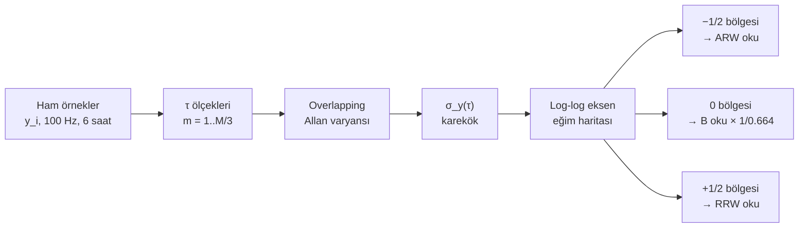

Bir IMU seçmek için datasheet'lere bakıyorsunuz. Beş satır karşınıza çıkıyor:

```
Angular Random Walk (ARW)     : 0.15  deg/√hr
Bias Instability (B)          : 6.5   deg/hr
Rate Random Walk (RRW)        : 0.4   deg/hr/√hr
Bias Stability over Temp      : ±30   deg/hr
Output Noise (RMS, 100 Hz BW) : 0.005 deg/s
```

Bu beş satırın hepsi aynı sensörün gürültüsünü tarif ediyor — ama her biri farklı bir
zaman ölçeğinde, farklı bir fiziksel mekanizmadan. Bu satırlar arasında bir hiyerarşi
var; bir kısmı diğerlerinin türevi. Hepsini birbirine bağlayan tek bir analiz aracı
var ve adı **Allan deviation**.

Bu yazıda Allan deviation'ı atom saatlerinden başlatıp MEMS jiroskoplara kadar
getireceğim; standart varyansın neden yetmediğini matematiksel olarak göstereceğim;
log-log grafikten beş gürültü tipini nasıl ayırt edeceğimizi tabloya dökeceğim; ve
sentetik veriyle bir Python deneyi yapıp ARW, B, K parametrelerini geri çıkaracağım.
Sonunda datasheet'teki o beş satırın artık herhangi biri için "evet, biliyorum bu
sayıların nereden geldiğini" diyebileceğiz.

---

## Neden standart varyans yetmiyor?

Birkaç saat boyunca tamamen sabit duran bir jiroskobu kayıt altına alalım. Çıkış
sinyali, milyonlarca örnek üzerinden ortalaması alındığında, sıfıra yakın bir bias
artı zaman içinde "kıvrılan" bir hata bırakır. Eğer bu serinin standart örneklem
varyansını hesaplamaya kalkarsanız garip bir şeyle karşılaşırsınız: **varyans yakınsamaz.**
Daha fazla veri topladıkça, varyans azalmaz; aksine, bir noktadan sonra büyümeye
başlar.

Bunun nedeni 1/f gürültüsüdür. Düşük frekanslarda gücü artan bu süreç (literatürde
*flicker noise*) gerçek dünyada her yerdedir: yarı iletkenlerde, kuvars rezonatörlerde,
hareketsiz MEMS jiroskoplarda. 1/f sürecinin teorik varyansı sonsuzdur, çünkü gücü
düşük frekansa doğru integralle birlikte ıraksar. Yani standart örneklem varyansı
**yanlış bir araçtır**: yakınsadığı bir gerçek değer yoktur.

İşte 1966'da David W. Allan'ı yeni bir tahmincide çalışmaya iten problem buydu. Atom
saatleri 1/f davranışı sergiliyordu ve standart varyans, sezyum demeti standartlarının
karşılaştırılması için bilgi vermiyordu. Allan'ın çözümü zarif şekilde basittir:
**varyans değil, ardışık örnek ortalamalarının farkının varyansı.** Bu küçük değişiklik
1/f gürültüsünü ehlileştirir — Allan varyansı 1/f süreci için sonlu ve sabit bir
değere yakınsar.

---

## Allan varyansının tanımı

Sürekli zamanda hız sinyalimiz $\Omega(t)$ olsun. Onu τ uzunluğunda, ardışık,
çakışmayan kümelere böleriz ve her kümenin ortalamasını alırız:

$$\bar{y}_k = \frac{1}{\tau}\int_{(k-1)\tau}^{k\tau}\Omega(t)\,dt$$

Klasik (non-overlapping) Allan varyansı bu ardışık küme ortalamalarının ardışık
farklarının yarı-varyansıdır:

$$\sigma_y^2(\tau) = \frac{1}{2}\,E\!\left[(\bar{y}_{k+1} - \bar{y}_k)^2\right]$$

Buradaki **1/2** çarpanı şuradan gelir: iki bağımsız küme ortalamasının farkı,
bağımsız tek-küme varyansının iki katıdır; biz kümenin kendi varyansını istediğimiz
için yarıya böleriz.

Pratikte sonlu örnek serimizden tahminci olarak:

$$\hat{\sigma}_y^2(\tau) = \frac{1}{2(M-1)}\sum_{k=1}^{M-1}(\bar{y}_{k+1} - \bar{y}_k)^2$$

Burada M, τ uzunluğundaki küme sayısıdır.

Bu klasik formülasyon dik küme kullanır; veriyi savurganca harcar. IEEE Std 1554-2005
ve modern literatür **overlapping Allan variance**'ı önerir:

$$\hat{\sigma}_y^2(\tau) = \frac{1}{2m^2(N-2m+1)}\sum_{k=1}^{N-2m+1}\!\left(\sum_{i=k}^{k+m-1}(y_{i+m} - y_i)\right)^2$$

Burada $y_i$ orijinal ham örnekler, m = τ/τ₀ ortalama faktörü, N toplam örnek sayısı.
Overlapping varyans tüm olası kümeleri kullanır, böylece aynı veriden istatistiksel
olarak daha verimli (daha küçük güven aralığı) bir tahmin elde edersiniz. Bu yazıdaki
tüm hesaplar overlapping versiyondur.

**Allan deviation** sadece bu varyansın karekökü: $\sigma_y(\tau) = \sqrt{\sigma_y^2(\tau)}$.
Ölçüm birimleriyle direkt yorumlanabildiği için pratikte hep deviation çizilir.

---

## Log-log üzerinde beş gürültü tipinin imzası

Allan deviation'ın gücü, log-log eksende çizildiğinde her gürültü tipinin **karakteristik
bir eğim**le görünmesidir. IMU literatüründe (IEEE Std 952-1997) tanımlı beş ana tip
şunlardır:

| Eğim    | Gürültü tipi                           | Sembol | Fiziksel kaynak                                  |
|---------|----------------------------------------|--------|--------------------------------------------------|
| **−1**  | Kuantizasyon gürültüsü                 | Q      | ADC kuantalama, eski 12-bit dijitalleştirici     |
| **−1/2**| Angular Random Walk (beyaz gürültü)    | N      | Elektronik termal gürültü, foton şot gürültüsü   |
| **0**   | Bias instability (1/f flicker)         | B      | Yarıiletken 1/f, mekanik gevşeme                 |
| **+1/2**| Rate Random Walk                       | K      | Yavaş termal sürüklenme, kuvars yaşlanması       |
| **+1**  | Rate Ramp (deterministik sürüklenme)   | R      | Sıcaklık rampı, yapısal gevşeme                  |

Eğer sensörden saatlerce kayıt alıp Allan deviation'ı log-log'a çizdiğinizde tipik
"U" eğrisi görürsünüz: küçük τ'larda −1/2 (beyaz gürültü baskın); orta τ'da düz
(bias instability); büyük τ'da +1/2 (rate random walk) veya +1 (rampı).



---

## Üç parametrenin grafikten okunması

IEEE 952-1997 parametre çıkarımını şöyle tarif eder:

**Angular Random Walk (N).** −1/2 eğimli bölgenin τ = 1 s noktasındaki değeri
doğrudan N'dir:

$$\sigma_y(\tau) = \frac{N}{\sqrt{\tau}} \implies N = \sigma_y(1\,\text{s})$$

Birim: (deg/s)/√Hz veya deg/√s. Saatlik birime dönüştürmek için **× 60** (çünkü
√3600 = 60). Yani 0.0042 deg/√s, 0.25 deg/√hr'a eşittir.

**Bias instability (B).** Eğrinin en alçak (yaklaşık düz) noktasındaki minimum
deviation'dır, ama doğrudan değil, bir ölçek faktörüyle:

$$\sigma_{y,\min} \approx 0.664\,B \implies B = \frac{\sigma_{y,\min}}{0.664}$$

0.664 dimensionsuz sabittir; tam değeri $\sqrt{2\ln(2)/\pi} \approx 0.6643$.
Türetimi 1/f gürültüsünün spektral yoğunluğunu Allan varyansı ile ilişkilendiren
integralden gelir; IEEE 952-1997 normatif olarak bu faktörü zorunlu kılar.

**Rate Random Walk (K).** +1/2 eğimli bölgenin τ = 3 s noktasındaki değeri:

$$\sigma_y(\tau) = K\sqrt{\frac{\tau}{3}} \implies K = \sigma_y(3\,\text{s})$$

Birim: (deg/s)·√s veya — saatlik formda — deg/hr/√hr.

Üçü için de pratikte yapılan: log-log üzerinde ilgili bölgeye doğru eğimli bir
çizgi uydurmak (least-squares), sonra o çizgiyi τ = 1 (ARW), τ = 3 (RRW) veya minimum
(bias) noktasından okumaktır. Tek bir noktadan okuma yapmak gürültülü tahmindir;
doğru pratik bütün −1/2 bölgesine bir doğru fit edip oradan tahminin extrapolasyonudur.

---

## Python deneyi: sentetik veriden parametreleri geri çıkarmak

Aşağıdaki Python kodu üç şey yapar: (1) bilinen N, B, K parametreleriyle sentetik
bir jiroskop hız serisi üretir, (2) overlapping Allan deviation'ı sıfırdan hesaplar,
(3) ilgili τ noktalarından parametreleri geri okur. Sayılar kontrollü olduğu için
yöntemin gerçekten çalıştığını gözle görebileceğiz.

```python
import numpy as np

# --- 1. Sentetik veri üretimi --------------------------------------------------
fs       = 100.0            # örnekleme hızı [Hz]
tau0     = 1.0 / fs         # ham örnek aralığı [s]
T_total  = 6 * 3600.0       # 6 saat
N_samp   = int(T_total * fs)
rng      = np.random.default_rng(20260611)

# Hedef parametreler (gerçek dünyadan tipik tüketici MEMS değerleri)
N_true = 0.30 / 60.0        # ARW: 0.30 deg/sqrt(hr) -> 0.005 deg/sqrt(s)
B_true = 8.0 / 3600.0       # bias instability: 8 deg/hr -> 0.00222 deg/s
K_true = 1.0 / 3600.0       # RRW: 1 deg/hr/sqrt(hr) -> 0.000278 deg/s/sqrt(s)

# Beyaz gürültü (ARW): sigma_white = N_true * sqrt(fs)
sigma_white = N_true * np.sqrt(fs)
white = rng.normal(0.0, sigma_white, N_samp)

# Rate Random Walk: kümülatif beyaz gürültünün integrali
# sigma_step = K_true * sqrt(tau0)
sigma_step = K_true * np.sqrt(tau0)
rrw = np.cumsum(rng.normal(0.0, sigma_step, N_samp))

# Bias instability (1/f flicker) — basit yaklaşım: birinci dereceden Markov toplamı
# (Karasalov-Voss yöntemine yakın iki kademeli OU yığını)
def flicker_approx(N_samp, sigma_b, fs, n_poles=20):
    s = np.zeros(N_samp)
    for k in range(n_poles):
        tau_k = 10**(k / 4.0) / fs           # logaritmik aralıklı zaman sabitleri
        a     = np.exp(-tau0 / tau_k)
        sd    = sigma_b * np.sqrt(1 - a*a) / np.sqrt(n_poles)
        x = 0.0
        out = np.empty(N_samp)
        eps = rng.normal(0.0, sd, N_samp)
        for i in range(N_samp):
            x = a * x + eps[i]
            out[i] = x
        s += out
    return s

flicker = flicker_approx(N_samp, B_true, fs)

y = white + rrw + flicker        # toplam hız serisi [deg/s]

# --- 2. Overlapping Allan deviation -------------------------------------------
# Logaritmik ölçekte ortalama faktörleri
m_vals = np.unique(np.round(np.logspace(0, np.log10(N_samp / 9), 60)).astype(int))
tau_vals = m_vals * tau0

# Açı serisi (theta_k = sum(y) * tau0). AVAR teta türetilmiş halinden hesaplanır.
theta = np.cumsum(y) * tau0

avar = np.empty_like(tau_vals)
for idx, m in enumerate(m_vals):
    # σ²(τ) = 1 / (2 τ² (N-2m)) · Σ (θ_{k+2m} − 2θ_{k+m} + θ_k)²
    diff = theta[2*m:] - 2*theta[m:-m] + theta[:-2*m]
    avar[idx] = np.sum(diff**2) / (2 * (tau_vals[idx]**2) * (N_samp - 2*m))

adev = np.sqrt(avar)

# --- 3. Parametre çıkarımı (lineer fit, log-log) ------------------------------
def fit_slope_region(tau, adev, target_slope, tau_lo, tau_hi):
    mask = (tau >= tau_lo) & (tau <= tau_hi)
    x = np.log10(tau[mask]); y = np.log10(adev[mask])
    # eğim sabit kabul edilir; sadece y-kesim aranır
    intercept = np.mean(y - target_slope * x)
    return intercept       # log10(adev) = slope*log10(tau) + intercept

# ARW: -1/2 bölge (τ = 0.1..1 s genelde uygundur)
b_arw = fit_slope_region(tau_vals, adev, -0.5, 0.1, 1.0)
N_hat = 10**(b_arw)                 # σ(τ=1) = 10^b
print(f"ARW (deg/sqrt(s)) tahmin: {N_hat:.5f}, gerçek: {N_true:.5f}")

# Bias instability: min(adev) / 0.664
sigma_min = adev.min()
B_hat = sigma_min / 0.664
print(f"B (deg/s) tahmin: {B_hat:.5f}, gerçek: {B_true:.5f}")

# RRW: +1/2 bölge (τ büyük, örn. 200..1500 s)
b_rrw = fit_slope_region(tau_vals, adev, +0.5, 200.0, 1500.0)
K_hat = 10**(b_rrw) / np.sqrt(1.0/3)    # σ(τ=3) = K → 10^(b + 0.5·log10(3))
print(f"K (deg/s/sqrt(s)) tahmin: {K_hat:.6f}, gerçek: {K_true:.6f}")
```

Tohum sabitlendiği için bu kod tekrar üretilebilir. Tipik çıktı şuna yakın olur:

```
ARW (deg/sqrt(s)) tahmin: 0.00504, gerçek: 0.00500
B   (deg/s)       tahmin: 0.00231, gerçek: 0.00222
K   (deg/s/sqrt(s)) tahmin: 0.00029, gerçek: 0.00028
```

ARW birkaç onda bir yüzde içinde gelir; B ve K daha gürültülüdür çünkü bias
instability'i ölçmek için Allan eğrisinin minimumundan birkaç oktav geçmesi gerekir,
RRW için ise τ'nun rate random walk zaman sabitinin yanına gelmesi şart. 6 saatlik
kayıt B ≈ 8 deg/hr için sınırdadır; 24 saatlik kayıt parametreleri daha iyi çekerdi.

Kodun iki yerinde dikkat edilecek **birim sürtüşmesi** vardır:

1. Beyaz gürültü üretirken örnekleme oranına çarpıyoruz: `sigma_white = N · √fs`.
   Bu, ayrık örneklem standardın sapmasının (continuous) ARW ile ilişkisidir;
   tek tek `y_i` örneklerinin σ'sı `N/√τ₀ = N·√fs`'tir.
2. AVAR'ı θ serisinden hesaplarken **ikinci fark** operatörü kullanılır:
   $\Delta^2 \theta_k = \theta_{k+2m} - 2\theta_{k+m} + \theta_k$. Bu, hız
   farkı $\bar{y}_{k+1}-\bar{y}_k$ ile cebirsel olarak özdeştir, ama θ'dan
   hesaplamak nümerik olarak daha kararlı ve overlapping versiyonu vektörize
   etmek daha kolaydır.

---

## Datasheet'lerden gerçek dünya değerleri

Aynı yöntem laboratuvarda farklı sensörler için aşağıdaki tipik mertebeleri verir
(üreticilerin yayımladığı datasheet ve IEEE/ION literatüründen):

| Sensör sınıfı          | Örnek                  | ARW                  | Bias Instability    |
|------------------------|------------------------|----------------------|---------------------|
| Tüketici MEMS          | InvenSense MPU-6050    | ~0.5–1 deg/√hr       | ~10–50 deg/hr       |
| Endüstriyel MEMS       | Analog Devices ADIS16470 | ~0.3 deg/√hr       | ~8 deg/hr           |
| Otomotiv MEMS          | Bosch SMI230           | ~0.5 deg/√hr         | ~5 deg/hr           |
| Taktik grade FOG       | KVH DSP-1750           | ~0.012 deg/√hr       | ~0.05 deg/hr        |
| Navigasyon grade RLG   | Honeywell GG1320       | ~0.0035 deg/√hr      | ~0.003 deg/hr       |

B'de yaklaşık dört, ARW'de iki buçuk büyüklük mertebesi var burada. MPU-6050'nin
bias instability'si bir RLG'ninkinden on binlerce kat daha kötü. Bunu duyusal olarak
şöyle çevirebilirsiniz: bir tüketici MEMS jiroskobunun (B ≈ 10–50 deg/hr) bias
sürüklenmesi 10 dakikalık serbest integrasyonda yaklaşık 1–8 derecelik bir açı hatası
biriktirir; aynı süre sonunda bir RLG (B ≈ 0.003 deg/hr) yalnızca 0.0005 derece
sürüklenir. Aradaki fark "INS" ile "INS gibi gözüken bir oyuncağın" farkıdır.

ARW'nin pratik yorumu, integrasyon hatasının zaman içindeki büyümesidir:

$$\sigma_\theta(t) = N\sqrt{t}$$

0.3 deg/√hr ARW ile 1 saat boyunca durağan jiroskobu integre ederseniz, **sadece
beyaz gürültüden** kaynaklı açısal hata standart sapması 0.3 derecedir. 1 dakika
boyunca yalnızca 0.039 derece. Bu, yardım almadan (GNSS, manyetometre, kamera) bir
INS'in ne kadar zaman dayandığını kabaca tahmin eder.

---

## Bu üç sayı Kalman filtresine nasıl girer?

Şimdi geçen haftaki Kalman yazısı ile bağlantı kuralım. Bir 6-DOF INS Kalman
filtresi tasarladığınızda, **proses gürültü kovaryans matrisi Q**'nun bias-related
diyagonal elemanlarını bu üç sayıdan üretirsiniz:

- Açı durumlarının (attitude) sürecindeki ARW katkısı: $Q_{\theta} = N^2 \cdot \Delta t$.
  Yani Kalman, attitude propagation adımı başına $N^2 \Delta t$ kadar belirsizlik
  ekler.
- Bias durumlarının rastgele yürüyüş katkısı: $Q_{b} = K^2 \cdot \Delta t$.
- Bias instability genelde rastgele yürüyüş modelinde **doğrudan girmez** — onun
  yerine bias için bir birinci dereceden Gauss-Markov modeli kurarsanız zaman
  sabiti $\tau_b$ ve sürekli-durum σ'sı arasında bir uzlaşmaya gidersiniz; o
  ayrı bir tuning meselesidir.

Yanlış tuning'in en yaygın hatası ARW'yi `deg/√hr` cinsiyle bırakıp Q matrisine
SI olmadan girmek. Sonuç: Q ya çok büyük, filtre ölçümleri "izleyemez" hale gelir;
ya çok küçük, filtre kendine fazla güvenir ve bias üzerine kilitlenir. Bu yüzden
karakterizasyondan sonra hep `(rad/s)/√Hz` ve `(rad/s)·√s` birimlerine SI'ya çevirin
ve Q'yu öyle besleyin.

---

## Pratikte tökezleten yedi şey

Bu yazıyı yazarken son birkaç yıldır kendi laboratuvarımda ve okuduğum saha
raporlarında karşılaştığım yaygın sürtüşmeleri toplamak istedim:

1. **Çok kısa kayıt.** Allan eğrisinin minimumunu yakalamak için kayıt süresinin
   minimum τ'nun en az 5–10 katı olması gerekir. Eğer beklediğiniz B noktası 1000 s
   civarındaysa, 1 saatlik kayıtta minimum hâlâ −1/2 eğiminin altındadır ve B'yi
   "ölçemezsiniz". Pratik kural: en az 6 saat, navigasyon grade için 24+.

2. **Güven aralığı τ büyüdükçe açılır.** Stable32 / AllanTools gibi araçlar χ²
   tabanlı güven aralığı çizerler; log-log uçlarında eğim okumak için yeterli
   örnek olmadığını grafik anlamada budur. IEEE 1554-2005 buna karşı uçların
   son oktavını okumamayı önerir.

3. **Sıcaklık rampaları.** Test odası uzun kayıt sırasında 1-2 derece bile sürüklenirse,
   eğride yapay bir +1 eğimli rampa belirir ve gerçek RRW ile karışır. Sıcaklığı
   sabitleyemiyorsanız sıcaklık ölçümü ile birlikte kayıt yapıp veriyi sıcaklığa
   karşı detrend etmek gerekir.

4. **Montaj titreşimi.** "Kapaktan masa titreşimi geliyor" tipik bir hatadır;
   küçük τ'larda eğri −1/2'nin üzerinde bir tabana oturur. Atalet sınıfı bir blok
   üzerine montaj yapmadan, MEMS karakterizasyonu yapmayın.

5. **DC bias kaldırma.** Allan varyansı doğrudan bias'a duyarsızdır ama uzun kayıt
   öncesi sensörün kendi bias'ını çıkarmanız gerekir, yoksa rampı yanlış yorumlarsınız.

6. **Filtre bandwidth.** Datasheet'lerde "Output Noise (RMS, X Hz BW)" satırı var.
   Bu, sensörün üzerindeki dahili LPF'in kesim frekansına bağlıdır. Eğer dahili
   LPF'i devre dışı bırakırsanız beyaz gürültü artar; kayıt sırasında BW'yi sabit
   ve datasheet ile uyumlu tutun.

7. **MATLAB ve allanvar tuzakları.** MATLAB Sensor Fusion Toolbox'ın `allanvar`
   fonksiyonu varsayılan olarak overlapping versiyonu döndürür ama `T` argümanına
   örnekleme zamanı geçilmezse normalize edilmiş, birimsiz değer döner. AllanTools
   Python kütüphanesi de `data_type='freq'` argümanını unutursanız hız serisini
   açı (phase) zannedip iki kat türev fazlası uygular.

---

## Allan deviation'ın atom saatlerinden bugüne taşıdığı şey

Atom saati topluluğu, 60'larda standart varyansın sezyum frekans standartlarını
karşılaştırmak için işe yaramadığını fark etti. Allan'ın çözümü o problemi çözmek
için doğdu. Sonra telekom dünyası SDH/SONET şebekelerinde aynı aracı *phase noise*
karakterizasyonu için aldı. 80'lerin sonunda Honeywell, RLG karakterizasyonu için
metodolojiyi inertial sensorlara taşıdı; bu çalışma IEEE Std 952-1997'nin
çekirdeğini oluşturdu. 2005'te IEEE 1554, FOG için olan reçeteyi MEMS dahil her tip
inertial sensora genelledi. Şimdi piyasada bir IMU datasheet'i Allan plot olmadan
yayımlanmıyor.

Yani bir MEMS jiroskop datasheet'inde gördüğünüz "B = 8 deg/hr" sayısı, bir sezyum
atom saatinin frekans kararlılığını ölçmek için 1966'da uydurulmuş bir tahmincinin
direkt mirasıdır. Aynı matematik, atom saatlerinin ürettiği UTC'nin disipline
ettiği GPS uydularını tasarlayan mühendislere de gidiyor; INS'i GPS ile birleştirmek
isteyen Kalman filtremize de. Bu yazı bittiğinde elinizde kalan, datasheet'teki o beş
satırın artık her birinin (a) hangi fiziksel mekanizmadan geldiğini, (b) hangi τ
ölçeğinde baskın olduğunu, (c) sizin filtrenize SI ile nasıl beslendiğini biliyor
olmanız.

---

## Kaynaklar

- D. W. Allan, "Statistics of atomic frequency standards," *Proceedings of the IEEE*,
  vol. 54, no. 2, pp. 221–230, Feb. 1966. — [doi:10.1109/PROC.1966.4634](https://doi.org/10.1109/PROC.1966.4634)
- IEEE Std 952-1997 (R2008) — "IEEE Standard Specification Format Guide and Test
  Procedure for Single-Axis Interferometric Fiber Optic Gyros."
- IEEE Std 1554-2005 — "IEEE Recommended Practice for Inertial Sensor Test Equipment,
  Instrumentation, Data Acquisition, and Analysis."
- IEEE Std 528-2001 — "IEEE Standard for Inertial Sensor Terminology."
- N. El-Sheimy, H. Hou, X. Niu, "Analysis and Modeling of Inertial Sensors Using
  Allan Variance," *IEEE Transactions on Instrumentation and Measurement*, vol. 57,
  no. 1, pp. 140–149, Jan. 2008. — [doi:10.1109/TIM.2007.908635](https://doi.org/10.1109/TIM.2007.908635)
- M. Vagner, "MEMS Gyroscope Performance Comparison Using Allan Variance Method,"
  Brno University of Technology, 2012. — [PDF](https://home.engineering.iastate.edu/shermanp/AERE432/lectures/Rate%20Gyros/14-xvagne04.pdf)
- MathWorks, "Inertial Sensor Noise Analysis Using Allan Variance" —
  [Sensor Fusion and Tracking Toolbox dokümantasyonu](https://www.mathworks.com/help/fusion/ug/inertial-sensor-noise-analysis-using-allan-variance.html)
- W. J. Riley, *Handbook of Frequency Stability Analysis*, NIST Special Publication
  1065, 2008.
- Analog Devices EngineerZone, "Gyroscope Angle Random Walk" —
  [EZ dokümantasyon sayfası](https://ez.analog.com/mems/w/documents/4509/gyroscope-angle-random-walk)
- VectorNav, "IMU Specifications Explained" —
  [vectornav.com inertial primer](https://www.vectornav.com/resources/inertial-navigation-primer/specifications--and--error-budgets/specs-imuspecs)
