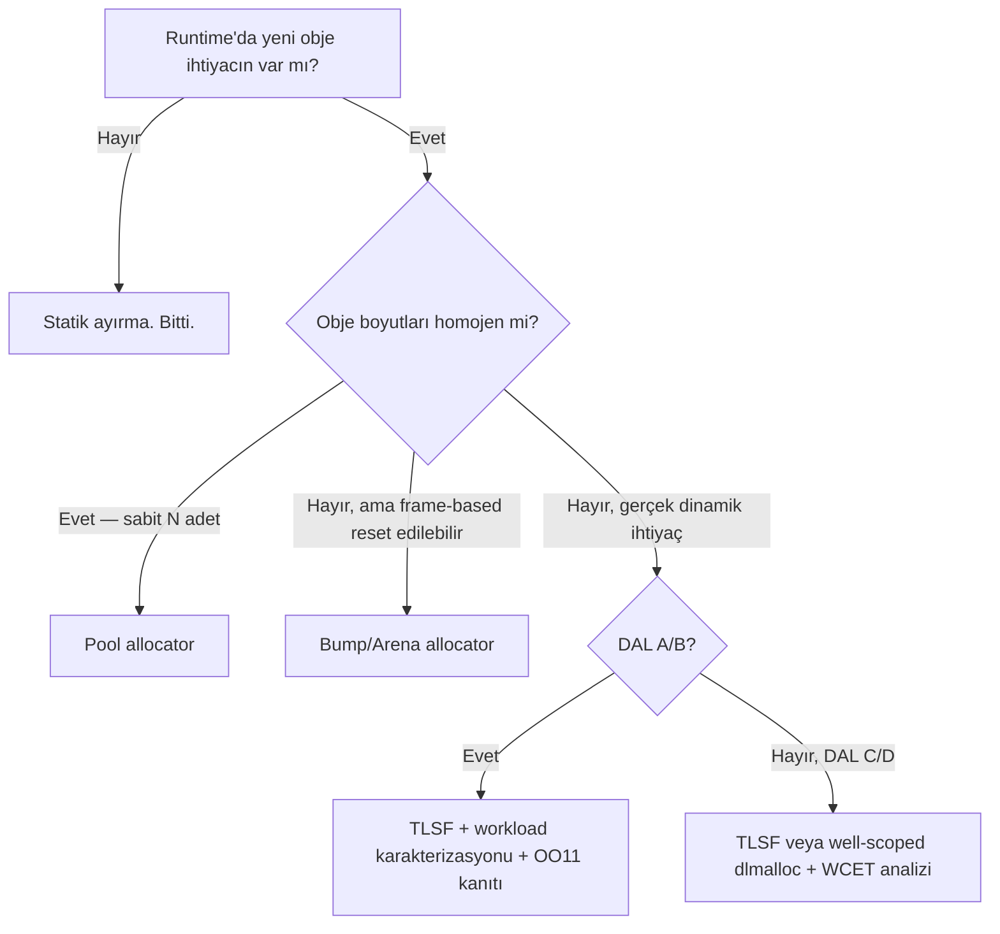

Aviyonikte çalışan hemen herkes bu cümleyi bir noktada duymuştur: "DAL A'da `malloc` yasak." Ben de duydum, ben de söyledim. Sonra bir gün bir sertifikasyon başvurusunda "yasak" kelimesinin standardın hiçbir yerinde geçmediğini fark ettim ve "yasağın" aslında neye dayandığını yeniden okumak zorunda kaldım.

Sonuç kısaca şu: **DO-178C dinamik bellek ayırmayı yasaklamaz.** Kısıtlayıcı olan şey DO-178C'nin robustness ve worst-case execution time (WCET) beklentileriyle DO-332'nin (OOP supplement) altı ilave dinamik bellek objektifi. Bu objektifleri sağlayan bir allocator — pool, bump/arena, TLSF, hatta karefully-designed slab — teoride DAL A'ya kadar çıkabilir. Ama pratikte "statik ayır, hiç uğraşma" o kadar ucuz bir çıkış yolu ki mühendisler kısayolu ezberledi, gerekçeyi unuttu.

Bu yazıda üç şey yapmak istiyorum: (1) DO-178C ve DO-332'nin dinamik bellek konusunda **aslında** ne dediğini kaynağa dokunarak göstermek, (2) TLSF'nin neden gerçekten O(1) olduğunu bitmap seviyesinde açmak, (3) proje başında hangi allocator'ın hangi maliyetle geldiğini gösteren bir karar çerçevesi çıkarmak.

---

## Efsane — ve efsanenin doğru olan kısmı

"DAL A'da malloc yasak" cümlesi bir kısayoldur. Kısayolun altındaki gerçek gereksinim şu:

> Yazılımın çalışma zamanı davranışı — yürütme süresi, bellek kullanımı, hata modları — sınırlı, önceden belirlenebilir ve doğrulanabilir olmalı.

Standart `malloc`'u tek başına yasaklamaz; **davranışını doğrulayamadığın bir allocator'ı** yasaklar. `glibc`'in `ptmalloc2`'si veya Windows'un HeapAlloc'u bu bar'ı geçemez çünkü:
- Alloc/free süresi allocation history'sine bağlı (bounded değil).
- Fragmentation davranışı analitik olarak tahmin edilemez.
- Failure modu spesifikasyonlu değil.

`ptmalloc` yerine, davranışı bir teorem gibi ispatlanmış bir allocator koyarsan (örn. TLSF) — ve o allocator'ı doğrulayabilirsen — aynı "malloc" adlı fonksiyon aviyonik projede rahatça yerini bulur.

---

## DO-178C ne diyor?

DO-178C (2011) dinamik bellek yönetimi başlıklı bir alt-bölüm içermez. Konu iki farklı yerden dolaylı olarak dokunulur:

**§6.3.4 — Reviews and Analyses of Source Code.** Kaynak kod incelemeleri arasında "algoritma doğruluğu", "veri kullanımı" ve "stack kullanımı" gibi maddeler var. Heap kullanımı da örtük olarak buraya girer: "kaynak kod bellek kullanımı gereksinimleriyle uyumlu mu?" sorusu sertifikasyon otoritesinin sorabileceği bir sorudur.

**§6.4.2.2 — Robustness Test Cases.** Yazılımın anormal koşullar altında "no untoward behavior" göstermesi istenir. Heap tükenmesi, malloc başarısızlığı, çift-free — bunların hepsi robustness envelope'una girer.

Ama **hiçbir DO-178C paragrafı**, "heap kullanmayacaksın" veya "dynamic allocation runtime'da yapılmayacak" demez. Bu yorum, uygulayıcıların ve otoritelerin standardı taşıması gereken kanıt yüküyle birleştirdiği zaman ortaya çıkan pratik bir karardır.

---

## DO-332 — asıl bar burada

DO-332/ED-217 (2011), DO-178C'nin object-oriented ve related techniques supplement'idir. "Related techniques" kısmında **dynamic memory management** özel bir başlıkla ele alınır ve **iki yeni verification objectifi** eklenir (DAL A/B için):

| Obj | Tanım |
|---|---|
| **OO10** | Local type consistency verified. |
| **OO11** | Dynamic memory management is robust — yani aşağıdaki yedi zaafiyet somut olarak ele alınmış ve kanıtlanmıştır. |

OO11'in doğrudan hedef aldığı yedi endişe DO-332 §OO.D.1.6'da listelenir:

| # | Endişe (İng.) | Ne demek? |
|---|---|---|
| 1 | Ambiguous references | Aynı bellek adresine birden fazla live pointer işaret ediyor; hangisinin sahip olduğu belirsiz. |
| 2 | Fragmentation starvation | Toplam boş bellek yeterli ama istenen boyutta sürekli blok bulunamıyor. |
| 3 | Deallocation starvation | Serbest bırakılması gereken bellek uzun süre canlı obje tarafından tutuluyor. |
| 4 | Heap memory exhaustion | Worst-case ihtiyaç heap boyutunu aşabiliyor. |
| 5 | Premature deallocation | Hâlâ kullanımda olan bellek serbest bırakılıyor (use-after-free). |
| 6 | Lost updates / stale references | Bellek yeniden ayrılınca eski referans üzerinden yapılan değişiklik yeni objeye "bulaşıyor". |
| 7 | Unbounded allocation/deallocation time | Alloc/free süresi worst-case sınırlanamıyor. |

Bu yedi maddenin altını çizmek lazım çünkü **allocator seçim tartışması aslında tam olarak bu listeyi hangi mekanizmayla karşıladığını göstermeye indirgeniyor.** Statik ayırma birçoğunu triviyal olarak "yok" hâline getirir. Pool allocator #2, #4 ve #7'yi ölçülü bir gerekçeyle karşılar. TLSF #7'yi bir teorem olarak, #2'yi ise deneysel bir bound ile karşılar. Genel amaçlı `dlmalloc`/`ptmalloc` maddelerin çoğunu **karşılayamaz** — dahili state history'ye bağlı olduğu için.

---

## Seçenek 1 — Statik ayırma: en kolay çıkış

Compile-time'da global bir bellek bloğu ayırıp runtime'da hiç `malloc` çağırmamak. NASA/JPL'nin *Rules for Developing Safety-Critical Code* dokümanının 3. maddesi tam da bunu söyler:

> Do not use dynamic memory allocation after task initialization.

Yedi endişeye karşı davranışı:

| # | Endişe | Statik allocation'da |
|---|---|---|
| 1 | Ambiguous references | Yok — her buffer'ın tek sahibi var, compile-time'da belli. |
| 2 | Fragmentation starvation | Yok — hiç fragmentation yok. |
| 3 | Deallocation starvation | Yok — hiç dealloc yok. |
| 4 | Heap exhaustion | `sizeof` ile compile-time'da kanıtlanır. |
| 5 | Premature deallocation | Yok. |
| 6 | Stale references | Yok (buffer başka nesneye "dönüşmüyor"). |
| 7 | Unbounded time | Ayırma yok, süre sıfır. |

Bedel? Esneklik: worst-case senaryo için ayrılan bellek average-case'de büyük ölçüde israf olur. Küçük gömülü sistemlerde bu kabul edilebilir bir maliyet, büyük IMA (Integrated Modular Avionics) partition'larında değil.

---

## Seçenek 2 — Pool (fixed-block) allocator

Sabit boyutlu N adet bloğun linked list olarak tutulduğu bir arena. `alloc` = "listenin başını çıkar", `free` = "listenin başına ekle". Her iki işlem de gerçek anlamda O(1) — sadece pointer atama.

```c
typedef struct block { struct block *next; } block_t;

static uint8_t   pool[POOL_N][BLOCK_SIZE];
static block_t  *free_list;

void pool_init(void) {
    free_list = NULL;
    for (size_t i = 0; i < POOL_N; ++i) {
        block_t *b = (block_t *)pool[i];
        b->next = free_list;
        free_list = b;
    }
}

void *pool_alloc(void) {
    if (!free_list) return NULL;   /* deterministik: worst-case = POOL_N */
    block_t *b = free_list;
    free_list = b->next;
    return b;
}

void pool_free(void *p) {
    block_t *b = (block_t *)p;
    b->next = free_list;
    free_list = b;
}
```

Yedi endişeyi nasıl karşılıyor?

- **#4 Heap exhaustion**: POOL_N seçimi, uygulamanın canlı obje sayısının worst-case üst sınırıyla eşleşmeli. Bu üst sınırı **kanıtlayabilirsen** obj karşılanır. Bu bir analiz meselesidir — allocator'ın değil, mimari tasarımın vaadidir.
- **#2 Fragmentation**: External frag yok (tüm bloklar aynı boy). Internal frag = ortalama request size × (BLOCK_SIZE - request) / BLOCK_SIZE — hesabı elle yapılır.
- **#7 Unbounded time**: `alloc` = 3 assembly instruction. Kanıtı `objdump` çıktısını incelemek kadar basit.
- **#1, #5, #6**: Bu allocator ambiguous reference yaratmaz; ama caller `free`'den sonra pointer'ı kullanırsa **use-after-free** hâlâ mümkün. Bunu allocator değil, çağıran kod garantiler.

Pool'un tek kısıtı homojenlik. Farklı boylara ihtiyacın varsa **birden fazla pool** açarsın (size class'ları). İşin ilginç kısmı: bu tam olarak `slab` allocator fikridir ve tam olarak da TLSF'nin FL/SL katmanlarının kavramsal atasıdır.

---

## Seçenek 3 — TLSF: gerçekten O(1) genel-amaçlı allocator

Sabit-boyutlu pool'un aksine TLSF (Two-Level Segregated Fit; Masmano, Ripoll, Crespo, Real; ECRTS 2004) **değişken boyutlu** ayırmayı worst-case O(1)'de yapar. Aviyonikte gerçekten dinamik ihtiyaç varsa — genellikle network stack, IPC bufferları, log kuyrukları — kabul edilebilir tek "genel amaçlı" allocator odur.

### Fikir

Serbest bloklar, boyuta göre iki seviyeli bir bitmap içinde indekslenir:
- **First Level (FL)**: power-of-2 sınıfları. FL_i sınıfı `[2^i, 2^(i+1))` aralığındaki blokları temsil eder.
- **Second Level (SL)**: her FL sınıfı, `2^SLI` eşit lineer alt-sınıfa bölünür. Tipik SLI=5 → her FL 32 alt-sınıfa parçalanır.

Her sınıf için ayrı bir **serbest blok listesi** tutulur ve her seviye için birer bitmap işaretler: "hangi sınıflarda blok var?"

```
fl_bitmap  : uint32_t                (32 FL sınıfı için 1 bit)
sl_bitmap  : uint32_t[32]            (her FL için 32 SL için 1 bit)
free_list  : block_t *[32][32]       (herbir sınıfın listesi)
```

### Neden O(1)?

`alloc(size)` şu adımları izler:

1. Talep edilen boyuttan FL/SL indeksini hesapla:
   ```c
   fl = fls(size);                          /* find-last-set — tek CPU çevrimi */
   sl = (size >> (fl - SLI)) - (1 << SLI);  /* aritmetik: sabit çevrim */
   ```
2. `sl_bitmap[fl]`'i bu SL'den itibaren maskele; ilk 1 biti bul:
   ```c
   uint32_t mask = sl_bitmap[fl] & (~0u << sl);
   if (mask) { sl2 = ffs(mask); fl2 = fl; }
   ```
3. Yoksa, `fl_bitmap`'te bir üst FL'ye çık:
   ```c
   else {
       uint32_t mask2 = fl_bitmap & (~0u << (fl + 1));
       fl2 = ffs(mask2);              /* yine tek çevrim */
       sl2 = ffs(sl_bitmap[fl2]);
   }
   ```
4. `free_list[fl2][sl2]` listesinin başındaki bloğu çıkar, gerekirse parçala, parçayı uygun sınıfın listesine iade et.

Toplam iş: iki bitmap taraması + bir bağlı liste head pop + (opsiyonel) split. Hepsi sabit sayıda çevrim; ne heap büyüklüğüne, ne allocation geçmişine bağlı. Original ECRTS 2004 makalesi Pentium 4 üzerinde worst-case'in ~200 instruction'ın altında kaldığını ölçmüştür.

`ffs` (find first set) ve `fls` (find last set) modern mimarilerde birer instruction'a düşer: x86'da `bsf`/`tzcnt`/`bsr`, ARM'da `clz` (ve `rbit` + `clz` kombinasyonu ile ffs). Cortex-A9'da `clz` tek çevrimlik; Cortex-M3/M4 gibi Thumb-2 çekirdeklerinde `__CLZ` ve `__RBIT` intrinsic'leri mevcut.

### Peki fragmentation?

Bu TLSF'nin en tartışılan tarafı. Paper, TLSF'nin internal fragmentation'ının bir "good fit" allocator'ından biraz daha iyi olduğunu deneysel olarak gösterir. **Teorik worst-case internal fragmentation** paper §3'te verilir:

$$\text{worst-case int. frag.} \approx \frac{\text{max\_block\_size}}{2^{\text{SLI}}}$$

Örnek: 4 MB max block, SLI=5 → worst-case internal frag ≈ 128 KB. Büyük bloklarda bu, ayrılan bellek boyutunun ~%3'ü mertebesinde bir over-allocation demektir; küçük bloklarda ise oransal olarak daha belirgindir.

**External fragmentation** teorik bir bound'a sahip değildir (bu genel dinamik allocation için bilinen bir sonuçtur; Robson 1977 bound'u herhangi bir online allocator için worst-case fragmentation'ın $O(M \log n)$ olduğunu söyler). TLSF'nin savunması: pratikte, tipik iş yükleriyle, best-fit kadar iyi ya da daha iyi davranır ve deneysel bound'u belirli değerlerin altında kalır. Sertifikasyonda bu, "workload karakterizasyonu + istatistiksel test kanıtı" olarak sunulur — allocator'ın matematiksel garantisi değil.

### Yedi endişeyle skoru

| # | Endişe | TLSF davranışı |
|---|---|---|
| 1 | Ambiguous references | Allocator yaratmaz. |
| 2 | Fragmentation starvation | External bound yok — workload bazında kanıt gerekir. |
| 3 | Deallocation starvation | Uygulama davranışı — allocator sorumluluğu değil. |
| 4 | Heap exhaustion | Heap boyutu compile-time'da sabittir; worst-case live set analiz edilmeli. |
| 5 | Premature deallocation | Caller sorumluluğu. |
| 6 | Stale references | Caller sorumluluğu. |
| 7 | Unbounded time | **Kanıtlı O(1).** İşte TLSF'nin ana katkısı. |

Yani TLSF #7'yi kesin bir teoremle, #2'yi deneysel bir bound ile karşılar. Diğerleri hâlâ uygulamanın konusu.

---

## Seçenek 4 — Bump (arena) allocator

Fikir daha da basit: bir arena'nın "üst noktası"nı tutan tek bir pointer. `alloc(n)`, pointer'ı `n` ilerletip önceki değerini döndürür. `free` **yoktur** — arena bütününde reset edilir.

```c
static uint8_t  arena[ARENA_SIZE];
static size_t   top;

void *arena_alloc(size_t n) {
    n = (n + 7u) & ~7u;                 /* 8-byte align */
    if (top + n > ARENA_SIZE) return NULL;
    void *p = &arena[top];
    top += n;
    return p;
}

void arena_reset(void) { top = 0; }
```

Aviyonikteki en yaygın kullanım: **frame-based** çalışan sistemlerde her frame'in başında reset. Örneğin cyclic executive'de 20 ms'lik minor frame'de tüm geçici bufferlar arena'dan alınır, frame sonunda arena reset olur. `free` yok → #1, #2, #3, #5, #6 zaten yok. Worst-case alloc süresi bir integer toplama + bir karşılaştırma → #7 çözüldü. #4 arena boyutunun frame içi worst-case bellek talebini karşıladığının statik olarak kanıtlanmasına indirgenir.

Bu allocator'ın "havacılık dostu" bir başka özelliği var: **kanıt yükü çok düşük.** Kodun tamamı 10 satır, davranışı `objdump` ile birebir doğrulanabilir. Küçük yardımcı işlemlerde (log formatting, mesaj oluşturma, geçici parse buffer'ları) statik allocation'dan sonra en pragmatik seçim.

---

## Karar çerçevesi — hangisi ne zaman?

Aşağıdaki karar akışı, bir alt-sistem tasarımı sırasında sorulan sorulara pratik cevaplardır:



Bu ağacın üstündeki iki dal (statik + pool) sertifikasyonda **matematiksel kanıt** çıkarır; alttaki iki dal (arena + TLSF) **allocator davranışının analizi + workload karakterizasyonu** ister. Kanıt yükünün maliyet farkı büyüktür — genelde 3-5 kat daha fazla verification effort. Bu nedenle mimari erken kararlar önemlidir: heap ihtiyacını modüller arasında konsolide edip mümkün olduğunca üst dallara çıkmak sertifikasyon bütçesini doğrudan küçültür.

---

## Bir küçük deney önerisi

Bu iddiaları evinizde test edebilirsiniz. Cortex-A9 tabanlı bir board (örn. Zynq-7000) veya Renode simülasyonu ile:

1. **Pool** ve **TLSF** implementasyonlarını aynı workload ile çalıştır.
2. Her `alloc`/`free` etrafında `DWT->CYCCNT` (veya ARM PMU cycle counter) okuyup delta biriktir.
3. Aynı rastgele (ama sabit seed ile deterministik) allocation trace'i, farklı fragmentation seviyelerinde çalıştır.
4. Worst-case cycle sayısını histogram olarak çiz.

Beklenen sonuç: pool sabit, TLSF hafif bir varyansla ama sınırlı, `dlmalloc` (referans için, doğrulanamaz bir baseline olarak) fragmentation arttıkça patlar. Renode makinesinde tekrar üretilebilir bir setup, DAL A dosyasına doğrudan "workload characterization" kanıtı olarak eklenecek türden bir çıktıdır.

Bu deneyi ben de yapmak istiyorum; bir sonraki yazılardan biri bu kurulumu ve gerçek ölçümlerini paylaşacak.

---

## Sonuç

"DAL A'da malloc yasak" cümlesi, "davranışını doğrulayamadığın bir allocator'ı kullanma" cümlesinin bozulmuş bir versiyonudur. DO-178C bu doğrulama beklentisini örtük olarak koyar; DO-332 ise özellikle dinamik bellek için yedi somut endişe ve iki objektif tanımlayarak barı belirginleştirir. Bu barı geçebilen allocator'lar vardır: statik ayırma triviyal olarak geçer, pool küçük bir kanıt yüküyle geçer, bump/arena frame-based tasarımlarda çok temiz geçer, TLSF ise gerçek dinamik ihtiyacın olduğu yerde matematiksel bir O(1) garantisiyle geçer.

Kısayolun kendisi bir sertifikasyon aracı değildir; **gerekçesini bilerek** kısayola sarılmak ise bir mimari disiplindir. Bir sonraki tasarım toplantısında "malloc kullanamayız çünkü DO-178C" derken bir saniye durup "aslında hangi objektifi karşılayamayız?" diye sormaya değer. Cevap çoğu zaman "OO11'i", ve o zaman tartışma "allocator'ı değiştir mi, mimariyi değiştir mi?" diye açılır.

---

## Kaynaklar

- RTCA/DO-178C, *Software Considerations in Airborne Systems and Equipment Certification*, RTCA Inc., 2011. §6.3.4 (Reviews and Analyses of Source Code), §6.4.2.2 (Robustness Test Cases).
- RTCA/DO-332 / EUROCAE ED-217, *Object-Oriented Technology and Related Techniques Supplement to DO-178C and DO-278A*, 2011. §OO.D.1.6 (Dynamic Memory Management), Table A-7 (Obj. OO10, OO11).
- Masmano, M., Ripoll, I., Crespo, A., Real, J., *TLSF: A New Dynamic Memory Allocator for Real-Time Systems*, 16th Euromicro Conference on Real-Time Systems (ECRTS'04), 2004.
- Masmano, M., Ripoll, I., Real, J., Crespo, A., *Implementation of a constant-time dynamic storage allocator*, Software: Practice and Experience, 38(10), 2008.
- Holzmann, G. J., *The Power of 10: Rules for Developing Safety-Critical Code*, IEEE Computer, June 2006 (Rule 3 — no dynamic allocation after initialization). Ayrıca *JPL Institutional Coding Standard for the C Programming Language*, 2009.
- Robson, J. M., *Worst Case Fragmentation of First Fit and Best Fit Storage Allocation Strategies*, The Computer Journal, 20(3), 1977. (Genel dinamik allocation için worst-case external fragmentation bound.)
- TLSF referans C implementasyonu: <https://github.com/mattconte/tlsf>
- TLSF BSD implementasyonu (temizlenmiş, embedded-friendly fork): <https://github.com/sysprog21/tlsf-bsd>
- Rapita Systems, *DO-332 (Object-Oriented Technology)*: <https://www.rapitasystems.com/do-332>
